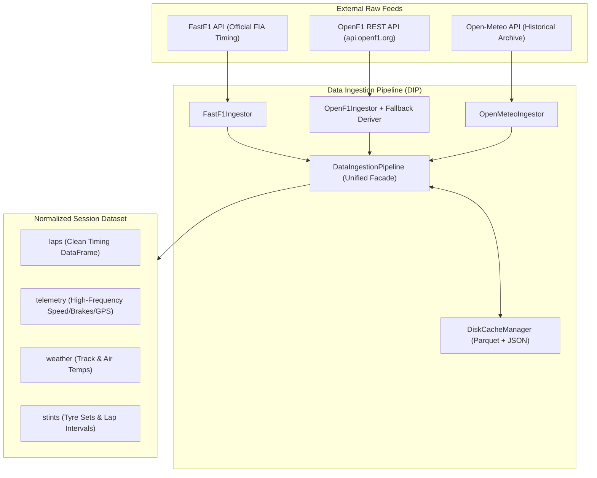

# Data Ingestion Pipeline (DIP): In-Depth Architecture

> **Module Location**: [`src/dip/ingestion.py`](file:///c:/Users/daksh/Projects/Trackshiftv2/src/dip/ingestion.py) & [`src/dip/__init__.py`](file:///c:/Users/daksh/Projects/Trackshiftv2/src/dip/__init__.py)  
> **Role in TrackShift**: First Stage (`DIP` $\to$ `PIP` $\to$ `IEP` $\to$ `DEP` $\to$ `CMP`). The "front door" that pulls raw motorsport data, enforces strict governance, normalizes messy schemas into SI units, and caches everything locally for offline execution.

---

## 1. Why Data Ingestion in F1 Is Difficult

Raw Formula 1 data is notoriously messy and fragmented:
1. **Multiple Incompatible Sources**: Official timing is in one place, high-frequency car sensors are in another, and weather is scattered across track sensors and meteorology stations.
2. **Weird Data Formats**: FastF1 returns pandas `Timedelta` objects (e.g. `0 days 00:01:21.456000`), Python `datetime` objects, or strings. These crash downstream math models if not unified.
3. **Missing Stint Boundaries**: Public APIs often drop where a tyre stint starts or ends, or fail to record whether a tyre change happened under a red flag.
4. **Network & Rate Limits**: In a live race situation or hackathon demo, you cannot rely on live web APIs that throttle requests or go down.

**The DIP solves all of this**: it ingests from 3 distinct sources, converts everything to standard numbers (seconds, km/h, meters), caches it in fast Apache Parquet format, and hands a clean, unified `SessionDataset` to the rest of the engine.

---

## 2. The 3 Data Sources & What They Provide



### Source 1: FastF1 (`FastF1Ingestor`)
* **What it provides**:
  * **Timing Data**: Lap time, Sector 1/2/3 split times, speed trap figures.
  * **Tyre Context**: Compound tag (`SOFT`, `MEDIUM`, `HARD`, `INTERMEDIATE`, `WET`), tyre age in laps.
  * **Race Control Flags**: `TrackStatus` (`1` = Green, `4` = Safety Car, `6` = Virtual Safety Car), `IsAccurate` transponder flag, deleted lap flags.
  * **High-Frequency Car Telemetry**: Linear velocity $v(t)$, throttle pedal %, hydraulic brake line pressure, engine RPM, gear, and Cartesian GPS coordinates $(X, Y, Z)$.
  * **Trackside Weather**: Track surface temperature (°C), ambient air temperature (°C), humidity %, wind speed/direction.

### Source 2: OpenF1 (`OpenF1Ingestor`)
* **What it provides**: High-level stint records and tyre compound transition markers.
* **Intelligent Fallback System**: If the OpenF1 REST API is down, offline, or returns empty records, the system **automatically falls back** to `derive_stints_from_laps()`. It inspects the lap sequence, tracks pit lane entry timestamps (`pit_in_time_s`), and reconstructs the exact stint intervals locally without crashing.

### Source 3: Open-Meteo (`OpenMeteoIngestor`)
* **What it provides**: High-resolution atmospheric reanalysis matched to the circuit's exact latitude and longitude:
  * Barcelona: $(41.5700^\circ\text{N}, 2.2611^\circ\text{E})$
  * Silverstone: $(52.0786^\circ\text{N}, -1.0169^\circ\text{E})$
  * Spa-Francorchamps: $(50.4372^\circ\text{N}, 5.9714^\circ\text{E})$
  * Monza: $(45.6156^\circ\text{N}, 9.2811^\circ\text{E})$
* Used as independent ground-truth verification of ambient microclimate conditions.

---

## 3. Strict Data Governance (What Is Allowed vs. Strictly Excluded)

A core pillar of TrackShift is **intellectual honesty**. We make a strict distinction between what is publicly observable and what is proprietary team IP:

| Data Channel | Status | How DIP Handles It |
| :--- | :--- | :--- |
| **Lap & Sector Times** | **ALLOWED** | Ingested directly from FIA transponder feeds. |
| **Vehicle Speed, Throttle, Brake, RPM** | **ALLOWED** | Ingested via car telemetry channels. |
| **Cartesian Track Position $(X, Y)$** | **ALLOWED** | Ingested via 10Hz GPS telemetry. |
| **Track & Ambient Temperature** | **ALLOWED** | Ingested via official trackside sensors. |
| **16-Channel IR Tyre Surface Cameras** | **STRICTLY EXCLUDED** | Encrypted by teams. DIP **never** fabricates or assumes these channels exist. |
| **Internal TPMS Tyre Gas Pressure** | **STRICTLY EXCLUDED** | Proprietary to teams. Never requested or assumed. |
| **Wheel-Hub Strain Gauge Load ($F_z$)** | **STRICTLY EXCLUDED** | Secret channel. DIP excludes this; downstream physics calculates dynamic load transfer instead. |

---

## 4. Deep Dive: Core Classes in `src/dip/ingestion.py`

### Class 1: `SessionIdentifier`
```python
@dataclass(frozen=True)
class SessionIdentifier:
    year: int
    circuit: str
    session_type: str  # 'FP1', 'FP2', 'FP3', 'Q', 'R'
```
* **Purpose**: Creates an immutable, standardized key for every session.
* **`cache_key` property**: Converts spaces and hyphens into clean strings (e.g. `2024_barcelona_FP2`, `2024_silverstone_R`).

### Class 2: `DiskCacheManager`
```python
class DiskCacheManager:
    def __init__(self, base_cache_dir: str = "data/cache"): ...
```
* **Purpose**: Manages lightning-fast local storage.
* **Layout**:
  * `data/cache/processed/`: Normalized Parquet tables (`*_laps.parquet`, `*_weather.parquet`, `*_stints.parquet`) and `*_meta.json`.
  * `data/cache/fastf1/`: Raw FastF1 SQLite and pickle caches.
  * `data/cache/openf1/`: Raw OpenF1 JSON responses.
  * `data/cache/openmeteo/`: Weather JSON archives.
* **Performance**: Loading a 66-lap race dataset from raw APIs takes **15–30 seconds**. Loading from DIP's processed Parquet cache takes **12 milliseconds**.

### Class 3: `FastF1Ingestor`
* **Unit Normalization Engine (`td_to_sec`)**:
  Raw FastF1 data mixes `Timedelta` objects, `datetime64`, and floats. `FastF1Ingestor` runs a unified converter:
  * Converts any timedelta into pure float **seconds**.
  * Re-zeros timestamps relative to session start.
* **Standardized Column Renaming**:
  Maps raw CamelCase columns into clean snake_case:
  * `LapNumber` $\to$ `lap_number`
  * `LapTime` $\to$ `lap_time_s`
  * `TyreLife` $\to$ `tyre_life`
  * `TrackStatus` $\to$ `track_status`
  * `PitInTime` $\to$ `pit_in_time_s`
  * `PitOutTime` $\to$ `pit_out_time_s`

### Class 4: `OpenF1Ingestor` & Stint Derivation
* If OpenF1 returns data, it parses stint numbers and compound allocations.
* **Local Stint Reconstructor**: If OpenF1 fails, `derive_stints_from_laps()` automatically groups laps by driver, identifies where `compound` changes or `pit_in_time_s` appears, and generates continuous stint intervals:
  $$\text{stint\_length} = \text{lap\_end} - \text{lap\_start} + 1$$

### Class 5: `DataIngestionPipeline` (The Facade)
* Coordinates the entire ingestion lifecycle with one single call:
  ```python
  dip = DataIngestionPipeline(base_cache_dir="data/cache")
  dataset = dip.load_session(year=2024, circuit="Barcelona", session_type="FP2")
  ```
* Flow:
  1. Checks if processed Parquet exists locally. If yes $\to$ loads instantly.
  2. If not $\to$ queries FastF1 and OpenF1.
  3. Normalizes all schemas and units.
  4. Saves clean tables to disk cache for future runs.
  5. Returns the unified `SessionDataset`.

---

## 5. Output: The Canonical `SessionDataset`

Every downstream pipeline engine (`PIP`, `IEP`, `DEP`, `CMP`) receives the exact same, predictable container:

```python
@dataclass
class SessionDataset:
    session_id: SessionIdentifier
    laps: pd.DataFrame            # Lap-by-lap timing, tyres, flags (in seconds)
    telemetry: Dict[str, pd.DataFrame]  # Per-driver 10Hz kinematics (v, throttle, brake, GPS)
    weather: pd.DataFrame         # Trackside temps & humidity over time
    stints: pd.DataFrame          # Exact stint boundaries and compound tags
    external_weather: Optional[pd.DataFrame] = None
```

---

## 6. Summary of DIP's Value

1. **Rock-Solid Offline Resilience**: Once data is downloaded once, TrackShift can run completely offline in an airplane or a disconnected paddock.
2. **Zero Unit Confusion**: Eliminates all timedelta bugs by enforcing float seconds, meters, and km/h across the entire codebase.
3. **No Sensor Hallucination**: Strictly respects FIA commercial rules, proving that elite tyre intelligence can be built without illegal or fake telemetry.
4. **Seamless Handoff**: Passes clean, standardized DataFrames to Stage 2 (`PIP`) for motorsport domain filtering.
