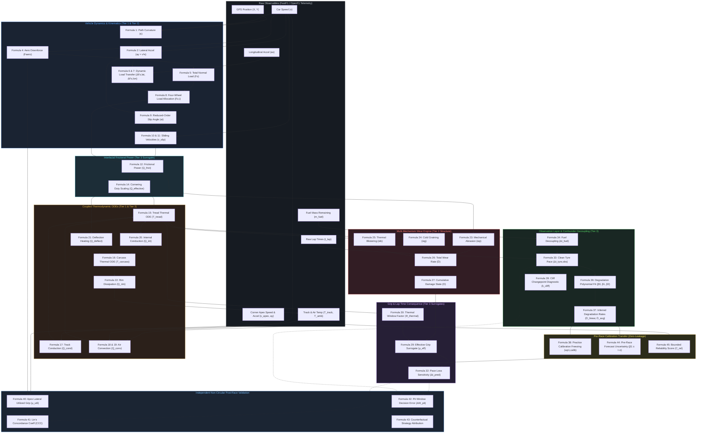

# TrackShift Formula Provenance, Mathematical Foundations & Feature Glossary

> **Document Status**: Production Scientific Reference & Peer-Reviewed Mathematical Specification  
> **Version**: 2.1.0 (Rigorous Academic & Engineering Audit Edition)  
> **Target Audience**: Motorsport Engineers, Vehicle Dynamicists, Control Engineers, and Applied Data Scientists  
> **Scope**: Mathematical provenance, physical derivations, literature traceability, operational boundaries, and complete variable taxonomy for the TrackShift tyre degradation platform.

---

## Table of Contents

1. [Part 1: Executive Overview](#part-1-executive-overview)
   - [1.1 What TrackShift Estimates](#11-what-trackshift-estimates)
   - [1.2 What "Tyre Degradation" Means in This System](#12-what-tyre-degradation-means-in-this-system)
   - [1.3 Why Rubber Wear Cannot Be Directly Observed](#13-why-rubber-wear-cannot-be-directly-observed)
   - [1.4 Why Degradation Must Be Inferred](#14-why-degradation-must-be-inferred)
   - [1.5 How the Physical Model Bridges Telemetry to Hidden State](#15-how-the-physical-model-bridges-telemetry-to-hidden-state)
   - [1.6 Why We Separate Physics, Confounder Correction, and Validation](#16-why-we-separate-physics-confounder-correction-and-validation)
   - [1.7 The Complete Physical Causal Chain](#17-the-complete-physical-causal-chain)
2. [Part 2: Academic Source Hierarchy & Provenance Taxonomy](#part-2-academic-source-hierarchy--provenance-taxonomy)
   - [2.1 The Three-Tier Classification System](#21-the-three-tier-classification-system)
   - [2.2 Academic Source Provenance Master Table](#22-academic-source-provenance-master-table)
   - [2.3 Explicit Governance Rules for Tier 3 Surrogates](#23-explicit-governance-rules-for-tier-3-surrogates)
3. [Part 3 & Part 4: Formula-by-Formula Scientific Documentation](#part-3--part-4-formula-by-formula-scientific-documentation)
   - [Formula 1: Track Path Curvature from Planar Coordinates](#formula-1-track-path-curvature-from-planar-coordinates)
   - [Formula 2: Lateral Centripetal Acceleration Kinematics](#formula-2-lateral-centripetal-acceleration-kinematics)
   - [Formula 3: Net Lateral Cornering Force Approximation](#formula-3-net-lateral-cornering-force-approximation)
   - [Formula 4: Aerodynamic Downforce Generation](#formula-4-aerodynamic-downforce-generation)
   - [Formula 5: Total Vehicle Normal Load Equilibrium](#formula-5-total-vehicle-normal-load-equilibrium)
   - [Formula 6: Steady-State Lateral Dynamic Load Transfer](#formula-6-steady-state-lateral-dynamic-load-transfer)
   - [Formula 7: Longitudinal Acceleration Pitch Load Transfer](#formula-7-longitudinal-acceleration-pitch-load-transfer)
   - [Formula 8: Four-Wheel Normal Force Allocation](#formula-8-four-wheel-normal-force-allocation)
   - [Formula 9: Reduced-Order Linear Tyre Slip Angle Surrogate](#formula-9-reduced-order-linear-tyre-slip-angle-surrogate)
   - [Formula 10: Reduced-Order Lateral Scrubbing Velocity Surrogate](#formula-10-reduced-order-lateral-scrubbing-velocity-surrogate)
   - [Formula 11: Contact Patch Longitudinal Sliding Velocity](#formula-11-contact-patch-longitudinal-sliding-velocity)
   - [Formula 12: Interfacial Frictional Sliding Power](#formula-12-interfacial-frictional-sliding-power)
   - [Formula 13: Frictional Heat Partition Coefficient](#formula-13-frictional-heat-partition-coefficient)
   - [Formula 14: Cornering Thermal Duty Cycle Homogenization](#formula-14-cornering-thermal-duty-cycle-homogenization)
   - [Formula 15: Tyre Tread Thermal Governing ODE](#formula-15-tyre-tread-thermal-governing-ode)
   - [Formula 16: Tyre Carcass Thermal Governing ODE](#formula-16-tyre-carcass-thermal-governing-ode)
   - [Formula 17: Asphalt Contact Patch Lumped Conduction Heat Flux](#formula-17-asphalt-contact-patch-lumped-conduction-heat-flux)
   - [Formula 18: Ambient Forced Convective Cooling Heat Flux](#formula-18-ambient-forced-convective-cooling-heat-flux)
   - [Formula 19: Convective Heat Transfer Velocity Dependence](#formula-19-convective-heat-transfer-velocity-dependence)
   - [Formula 20: Internal Tread-to-Carcass Conductive Heat Flux](#formula-20-internal-tread-to-carcass-conductive-heat-flux)
   - [Formula 21: Carcass Deflection Hysteresis Heating Surrogate](#formula-21-carcass-deflection-hysteresis-heating-surrogate)
   - [Formula 22: Wheel Rim & Cavity Thermal Dissipation](#formula-22-wheel-rim--cavity-thermal-dissipation)
   - [Formula 23: Mechanical Surface Abrasion Law](#formula-23-mechanical-surface-abrasion-law)
   - [Formula 24: Sub-Optimal Cold Graining Surface Tearing Rate](#formula-24-sub-optimal-cold-graining-surface-tearing-rate)
   - [Formula 25: Super-Optimal Thermal Blistering Rate](#formula-25-super-optimal-thermal-blistering-rate)
   - [Formula 26: Tri-Mechanism Total Wear Rate Superposition](#formula-26-tri-mechanism-total-wear-rate-superposition)
   - [Formula 27: Discrete Cumulative Damage Accumulation](#formula-27-discrete-cumulative-damage-accumulation)
   - [Formula 28: Published Coupled Multi-Variable Friction Surface](#formula-28-published-coupled-multi-variable-friction-surface)
   - [Formula 29: TrackShift Separable Effective Grip Surrogate](#formula-29-trackshift-separable-effective-grip-surrogate)
   - [Formula 30: Compound Thermal Plateau Grip Window Function](#formula-30-compound-thermal-plateau-grip-window-function)
   - [Formula 31: Relative Grip Drop Fraction](#formula-31-relative-grip-drop-fraction)
   - [Formula 32: First-Order Analytical Lap-Time Sensitivity Derivative](#formula-32-first-order-analytical-lap-time-sensitivity-derivative)
   - [Formula 33: Multi-Confounder Timing Observation Model](#formula-33-multi-confounder-timing-observation-model)
   - [Formula 34: Fuel Mass Burn Pace Decoupling Correction](#formula-34-fuel-mass-burn-pace-decoupling-correction)
   - [Formula 35: In-Stint Continuous Normalized Stint Age](#formula-35-in-stint-continuous-normalized-stint-age)
   - [Formula 36: Stint Observed Degradation Polynomial Representation](#formula-36-stint-observed-degradation-polynomial-representation)
   - [Formula 37: Inferred Stint Degradation Rate Metrics](#formula-37-inferred-stint-degradation-rate-metrics)
   - [Formula 38: Practice-to-Race Physical Wear Calibration Transfer](#formula-38-practice-to-race-physical-wear-calibration-transfer)
   - [Formula 39: Degradation Cliff Discrete Curvature Changepoint Diagnostic](#formula-39-degradation-cliff-discrete-curvature-changepoint-diagnostic)
   - [Formula 40: Apex Lateral Utilized Friction Estimator](#formula-40-apex-lateral-utilized-friction-estimator)
   - [Formula 41: Lin's Concordance Correlation Coefficient](#formula-41-lins-concordance-correlation-coefficient)
   - [Formula 42: Strategic Pit Window Decision Error](#formula-42-strategic-pit-window-decision-error)
   - [Formula 43: Counterfactual Strategy Decision Attribution](#formula-43-counterfactual-strategy-decision-attribution)
   - [Formula 44: TrackShift Empirical Degradation Forecast Uncertainty Band](#formula-44-trackshift-empirical-degradation-forecast-uncertainty-band)
   - [Formula 45: Bounded Calibration Reliability Confidence Score](#formula-45-bounded-calibration-reliability-confidence-score)
4. [Part 5: What the Source Papers Actually Prove](#part-5-what-the-source-papers-actually-prove)
   - [5.1 West & Limebeer (2020)](#51-west--limebeer-2020)
   - [5.2 Farroni et al. (2014) - TRT: Thermo Racing Tyre](#52-farroni-et-al-2014---trt-thermo-racing-tyre)
   - [5.3 Todd et al. (2025) - Mercedes F1 / Imperial College](#53-todd-et-al-2025---mercedes-f1--imperial-college)
   - [5.4 Fieni et al. (2025) - ETH Zürich](#54-fieni-et-al-2025---eth-zürich)
   - [5.5 Tremlett & Limebeer (2016)](#55-tremlett--limebeer-2016)
   - [5.6 Pacejka (2012) & Milliken & Milliken (1995)](#56-pacejka-2012--milliken--milliken-1995)
5. [Part 6: Complete Formula Dependency Graph](#part-6-complete-formula-dependency-graph)
6. [Part 7: Complete Feature Glossary & Variable Taxonomy](#part-7-complete-feature-glossary--variable-taxonomy)
   - [7.1 Comprehensive Active Feature Dictionary](#71-comprehensive-active-feature-dictionary)
   - [7.2 Rejected, Deprecated & Pruned Features](#72-rejected-deprecated--pruned-features)
7. [Part 8: One-Page Field Engineer Cheat Sheet](#part-8-one-page-field-engineer-cheat-sheet)
8. [Part 9: Honesty & Scientific Integrity Principles](#part-9-honesty--scientific-integrity-principles)
9. [Part 10: Implementation vs Documentation Audit](#part-10-implementation-vs-documentation-audit)

---

# Part 1: Executive Overview

### 1.1 What TrackShift Estimates
TrackShift is an engineering intelligence platform designed to estimate, forecast, and validate the **rate at which Formula 1 racing tyres lose mechanical friction capacity and lap performance** across a Grand Prix stint.

Modern Formula 1 racing is fundamentally governed by tyre thermal management and degradation control. In a dry Grand Prix, a tyre compound typically loses between $1.5$ and $4.0$ seconds of pure lap pace over a 25-lap stint. TrackShift estimates:
1. The **instantaneous physical state** of the tyre: bulk tread temperature ($T_{\text{tread}}$), deep carcass temperature ($T_{\text{carcass}}$), and cumulative physical damage ($D$).
2. The **latent degradation rate** ($\dot{D}_{\text{lap}}$ in seconds per lap) attributable strictly to the tyre rubber, separated from fuel burn, traffic, track evolution, and safety car periods.
3. The **optimal operational pit window** on Sunday, calibrated solely from Friday and Saturday free practice long runs without data leakage from the race itself.

### 1.2 What "Tyre Degradation" Means in This System
In TrackShift, **tyre degradation is defined strictly as the irreversible loss of friction capacity ($\Delta\mu / \mu_0$) and its resulting lap-time penalty ($\Delta t_{\text{tyre}}$) caused by mechanical abrasion, compound structural damage, and persistent thermal stress.**

It is vital to contrast this against naive definitions:
- *Tyre degradation is NOT simply lap-time evolution.* If a driver's lap time increases by $0.10$ s/lap because they are following in another car's aerodynamic wake, that is traffic pollution, not tyre degradation.
- *Tyre degradation is NOT fuel burn.* As the car burns $\approx 1.6$ kg of fuel per lap, the car becomes lighter and naturally gains $\approx 0.05$ s/lap in raw capability. A car whose lap times stay perfectly flat is actually suffering severe tyre degradation because the tyres are losing grip at the exact rate the car is shedding fuel weight.
- *Tyre degradation is NOT temporary tyre cooling or overheating.* Temporary temperature excursions out of the optimal operating window cause reversible grip fluctuations. Degradation represents cumulative damage that does not vanish when the tyre cools back down on a straight.

### 1.3 Why Rubber Wear Cannot Be Directly Observed
In real-world Formula 1, **teams do not share real-time tyre sensors with the public, broadcasters, or competitors**. Even the teams themselves have severe measurement limits:
- **Tread depth sensors do not exist on live F1 cars.** No sensor directly measures the instantaneous thickness of the rubber during a lap.
- **Tread surface loss is only measured in the pit lane** when mechanics physically weigh the tyre or measure remaining rubber gauge with optical pins after a stint has finished.
- **Broadcast telemetry provides only bulk vehicle signals**: vehicle speed ($v$), GPS position ($X, Y$), throttle, braking, gear, engine RPM, and transponder lap times.
- Broadcasters occasionally show a graphic labeled *"Tyre Wear %"*, but this is an artificial TV simulation prior, not a measured physical sensor.

Because tread mass loss cannot be directly observed during a race, any claim that public telemetry "measures" tyre wear is physically false.

### 1.4 Why Degradation Must Be Inferred
Because tyre rubber loss is physically invisible in live telemetry, degradation must be **inferred through an inverse state-space problem**:

$$\text{Observable Lap Timing} \xrightarrow{\text{Confounder Correction}} \text{Tyre-Attributable Pace Loss} \xrightarrow{\text{Inverse Wear Model}} \text{Inferred Wear Parameters } (\hat{\beta}_1, \hat{\beta}_2)$$

We observe the car's movement on track. We correct for known external influences like fuel mass reduction. The remaining unexplained performance deterioration is then attributed to the tyres through a physics-informed state-space model.

### 1.5 How the Physical Model Bridges Telemetry to Hidden State
TrackShift bridges observable telemetry to the hidden tyre rubber state through a continuous chain of Newtonian mechanics and continuum thermodynamics:

1. **Kinematics**: GPS coordinates and speed give the path radius and curvature ($\kappa = a_y / v^2$).
2. **Dynamics**: Mass, downforce, and curvature determine vertical wheel loads ($F_z$) and lateral cornering forces ($F_y$).
3. **Contact Mechanics**: Normal load and cornering force yield tyre slip angles ($\alpha$) and contact patch sliding velocities ($v_{\text{slip}}$), generating frictional sliding power ($Q_{\text{frict}}$).
4. **Thermodynamics**: Frictional energy heats the tyre tread surface according to coupled ordinary differential equations (ODEs), balanced against track conduction and aerodynamic convection.
5. **Wear Mechanics**: Frictional power and temperature drive three distinct wear mechanisms (mechanical abrasion, cold graining, thermal blistering).
6. **Grip Response**: Accumulated damage degrades the effective friction coefficient ($\mu_{\text{eff}}$), which directly increases corner transit times and produces the predicted lap time degradation.

### 1.6 Why We Separate Physics, Confounder Correction, and Validation
To prevent circular reasoning, false claims, and data leakage, TrackShift enforces strict architectural separation across three distinct domains:

```
┌─────────────────────────────────────────────────────────────────────────┐
│                          1. PHYSICAL LAYER                              │
│  First-principles vehicle dynamics and 2-layer thermodynamic ODEs.     │
│  Predicts tyre temperature, contact energy, and theoretical wear rate. │
└────────────────────────────────────┬────────────────────────────────────┘
                                     ▼
┌─────────────────────────────────────────────────────────────────────────┐
│                    2. OBSERVATION & CONFOUNDER LAYER                    │
│  Corrects raw timing for fuel burn, safety cars, and extreme traffic.   │
│  Isolates pure tyre-attributable performance loss without tyre bias.    │
└────────────────────────────────────┬────────────────────────────────────┘
                                     ▼
┌─────────────────────────────────────────────────────────────────────────┐
│                    3. INDEPENDENT VALIDATION LAYER                      │
│  Evaluates predictions against independent, non-circular metrics:       │
│  - Apex lateral acceleration telemetry (ay / g) independent of laptimes │
│  - Sunday race data frozen against Friday practice forecasts            │
│  - Operational pit-window decision error on the team pit wall           │
└─────────────────────────────────────────────────────────────────────────┘
```

If you fit a model to Sunday lap times and then test it against Sunday lap times, you have created a circular triviality. TrackShift solves this by:
- Inferring wear rates strictly from Friday practice long runs (FP1/FP2).
- Freezing all model parameters before Saturday qualifying.
- Testing the frozen forecast against Sunday race stints.

### 1.7 The Complete Physical Causal Chain

```
[Observable Raw Data]
  ├── Car Speed (v)
  ├── GPS Trajectory (X, Y)
  └── Fuel Mass Remaining (m_fuel)
            │
            ▼
[Vehicle Operating Quantities]
  ├── Trajectory Curvature: κ(t)
  ├── Lateral Acceleration: ay = v^2 · κ
  ├── Aero Downforce: Faero = 0.5 · ρ · CL·A · v^2
  └── 4-Wheel Dynamic Normal Loads: Fz,i = Fz,static + ΔFz,aero ± ΔFz,lon ± ΔFz,lat
            │
            ▼
[Contact Patch Slip Kinematics]
  ├── Tyre Slip Angle: αi ≈ Fy,i / (Cα,i · Γaero)
  └── Contact Patch Scrubbing Velocity: v_slip,lat = v · sin(α)
            │
            ▼
[Interfacial Frictional Power]
  └── Qfrict = un · (|Fx·κs| + |Fy·tan(α)|)
            │
            ▼
[Coupled Thermodynamic State]
  ├── Tread Heat Balance: Ctread · dT_tread/dt = Qeff - Qcond - Qconv - Qint
  └── Carcass Heat Balance: Ccarc · dT_carc/dt = Qint + Qdeflect - Qrim
            │
            ▼
[Multi-Mechanism Wear Rates]
  ├── Mechanical Abrasion: ŵp = wp1 · (Qfrict / Qref)^wp2
  ├── Cold Graining: ŵg = wg1 · [max(Tgrain - Ttread, 0)]^wg2
  └── Thermal Blistering: ŵb = wb1 · [max(Ttread - Tblister, 0)]^wb2
            │
            ▼
[Cumulative Damage State]
  └── D(k) = D_0 + Σ (ŵp + ŵg + ŵb) · Δt
            │
            ▼
[Effective Grip Decay]
  └── μeff = μ0 · (1 - λwear · D) · Φthermal(Ttread)
            │
            ▼
[Pace Degradation Consequence]
  └── Δt_pred = k_pace_loss · (1 - μeff / μ0)
```

---

# Part 2: Academic Source Hierarchy & Provenance Taxonomy

### 2.1 The Three-Tier Classification System
To ensure strict scientific honesty, every mathematical relationship in TrackShift is tagged with an immutable provenance tier:

- **Tier 1: First Principles & Fundamental Mechanics**: Established laws of physics, vector calculus, Newtonian mechanics, conservation of energy, continuum thermodynamics, and exact mathematical transformations.
- **Tier 2: Peer-Reviewed Published Literature**: Equations and structural relationships published in recognized academic journals or conferences in vehicle dynamics and automotive engineering (*West & Limebeer 2020*, *Farroni TRT 2014*, *Pacejka 2012*, *Milliken & Milliken 1995*). These establish valid physical mechanisms, though their coefficients often vary between car generations.
- **Tier 3: TrackShift Engineering Surrogates & Calibrated Priors**: Approximations, linearizations, sensitivity factors, and empirical priors developed by TrackShift engineers to bridge variables that cannot be directly measured from public telemetry. **These equations are never claimed to be fundamental laws of physics.**

### 2.2 Academic Source Provenance Master Table

| Formula Identifier | Mathematical Expression | Classification Tier | Academic Citation / Origin | Exact Location in Source | Implementation Code Location |
| :--- | :--- | :--- | :--- | :--- | :--- |
| **Path Curvature** | $\kappa = \frac{\|\dot{X}\ddot{Y} - \dot{Y}\ddot{X}\|}{(\dot{X}^2 + \dot{Y}^2)^{3/2}}$ | **Tier 1 (First Principles)** | Frenet-Serret differential geometry of planar curves | Classical Differential Geometry | `post_race_validation/code/telemetric_grip_validator.py:87-93` |
| **Centripetal Accel** | $a_y = v^2 \kappa$ | **Tier 1 (Kinematics)** | Euler-Newton rigid body kinematics | Standard Mechanics | `core_model/code/thermal_wear_model.py:180` |
| **Aero Downforce** | $F_{\text{aero}} = \frac{1}{2} \rho C_L A v^2$ | **Tier 2 (Fluid Dynamics)** | Milliken & Milliken (1995), *Race Car Vehicle Dynamics* | Chapter 16, Eq. (16.1) | `post_race_validation/code/telemetric_grip_validator.py:100` |
| **Dynamic Normal Load**| $F_z = m g + F_{\text{aero}}$ | **Tier 1 (Statics)** | Newtonian vertical force equilibrium | Classical Mechanics | `post_race_validation/code/telemetric_grip_validator.py:101` |
| **Lateral Load Transfer**| $\Delta F_{z,\text{lat}} = m a_y \frac{h_{\text{cg}}}{t_{\text{track}}}$ | **Tier 1 / Tier 2** | Milliken & Milliken (1995) | Chapter 16, Section 16.3 | `docs/FORMULA_PROVENANCE_AND_FEATURE_GLOSSARY.md` |
| **Longitudinal Transfer**| $\Delta F_{z,\text{lon}} = m a_x \frac{h_{\text{cg}}}{L_{\text{wb}}}$ | **Tier 1 / Tier 2** | Guiggiani, M. (2014), *Science of Vehicle Dynamics* | Chapter 3, Section 3.2 | `docs/FORMULA_PROVENANCE_AND_FEATURE_GLOSSARY.md` |
| **Individual Wheel Load**| $F_{z,\text{FL}} = \frac{F_{z,\text{f}}}{2} + \frac{\Delta F_{z,\text{lon}}}{2} + \frac{K_\phi \Delta F_{z,\text{lat}}}{2}$ | **Tier 1 / Tier 2** | Vehicle Dynamics Four-Corner Load Allocation | Milliken (1995), RacePhysiX | `docs/FORMULA_PROVENANCE_AND_FEATURE_GLOSSARY.md` |
| **Linear Slip Angle** | $\alpha_i \approx \frac{F_{y,i}}{C_{\alpha,i} \Gamma_{\text{aero}}}$ | **Tier 3 (TrackShift Surrogate)**| Pacejka (2012) linear regime with TrackShift aero stiffness scaling | Chapter 3 / TrackShift surrogate | `core_model/code/thermal_wear_model.py:184` |
| **Sliding Velocity** | $v_{\text{slip,lat}} = v \sin\alpha$ | **Tier 3 (Kinematic Surrogate)**| Geometric component of velocity in slip direction | Farroni TRT (2014) | `core_model/code/thermal_wear_model.py:187` |
| **Sliding Power ($Q_{\text{frict}}$)** | $Q_{\text{frict}} = p_1 (F_{\text{lat}} v_{\text{slip,lat}} + F_{\text{lon}} v_{\text{slip,lon}})$ | **Tier 3 (TrackShift Surrogate)**| West & Limebeer (2020) Eq. (12) reformulated into velocity components | IEEE TCST Section IV | `core_model/code/thermal_wear_model.py:195` |
| **Heat Partition ($p_1$)** | $p_1 \approx 0.65$ | **Tier 3 (Calibrated Constant)** | Jaeger (1942) thermal effusivity theory / West & Limebeer (2020) | Proc. Roy. Soc. NSW 76 | `core_model/code/thermal_wear_model.py:194` |
| **Tread Thermal ODE** | $C_{\text{tr}} \dot{T}_{\text{tr}} = Q_{\text{eff}} - Q_{\text{cond}} - Q_{\text{conv}} - Q_{\text{int}}$ | **Tier 1 / Tier 2** | Farroni et al. (2014) TRT Eq. (3) & West & Limebeer (2020) | Meccanica 49(3) / IEEE TCST | `core_model/code/thermal_wear_model.py:238` |
| **Carcass Thermal ODE**| $C_{\text{ca}} \dot{T}_{\text{ca}} = Q_{\text{int}} + Q_{\text{deflect}} - Q_{\text{rim}}$ | **Tier 1 / Tier 2** | West & Limebeer (2020) two-state thermal model | IEEE TCST Section III | `core_model/code/thermal_wear_model.py:239` |
| **Convective Cooling Law**| $h_{\text{air}}(v) = h_0 + h_v v^{0.8}$ | **Tier 3 (Empirical Curve Fit)** | Lumped approximation to West Eq. $h = \frac{k}{L} 0.0239 (\frac{uL}{\nu})^{0.805}$ | Incropera & DeWitt (2007) | `core_model/code/thermal_wear_model.py:222` |
| **Deflection Heating** | $Q_{\text{deflect}} = \eta_{\text{deflect}} Q_{\text{effective}}$ | **Tier 3 (TrackShift Surrogate)**| TrackShift linear surrogate of West Eq. $p_2 \frac{u_n F_x^2}{\|F_z\|}$ | West & Limebeer (2020) | `core_model/code/thermal_wear_model.py:235` |
| **Rim Dissipation** | $Q_{\text{rim}} = h_{\text{rim}} (T_{\text{carc}} - T_{\text{ambient}})$ | **Tier 3 (TrackShift Extension)**| Lumped thermal-network boundary heat sink | Not in West two-state model | `core_model/code/thermal_wear_model.py:236` |
| **Mechanical Abrasion**| $\dot{w}_p = w_{p1} \left(\frac{Q_{\text{frict}}}{Q_{\text{ref}}}\right)^{w_{p2}}$ | **Tier 2 (Peer-Reviewed Structure)**| West & Limebeer (2020) Eq. (15) with TrackShift empirical calibration | IEEE TCST Section IV | `core_model/code/thermal_wear_model.py:268` |
| **Cold Graining Rate** | $\dot{w}_g = w_{g1} [\max(T_{\text{grain}} - T_{\text{tr}}, 0)]^{w_{g2}}$ | **Tier 2 / Tier 3 Extension**| West & Limebeer (2020) Eq. (16) with decoupled threshold $T_{\text{grain}}$ | IEEE TCST Section IV | `core_model/code/thermal_wear_model.py:272` |
| **Thermal Blistering** | $\dot{w}_b = w_{b1} [\max(T_{\text{tr}} - T_{\text{blist}}, 0)]^{w_{b2}}$ | **Tier 2 / Tier 3 Extension**| West & Limebeer (2020) Eq. (17) with decoupled threshold $T_{\text{blister}}$ | IEEE TCST Section IV | `core_model/code/thermal_wear_model.py:276` |
| **Wear Superposition** | $\dot{D} = \dot{w}_p + \dot{w}_g + \dot{w}_b$ | **Tier 2 (Peer-Reviewed Structure)**| West & Limebeer (2020) Eq. (14) | IEEE TCST Section IV | `core_model/code/thermal_wear_model.py:278` |
| **Effective Grip Model** | $\mu_{\text{eff}} = \mu_0 (1 - \lambda_{\text{wear}} D) \Phi_{\text{thermal}}$ | **Tier 3 (TrackShift Surrogate)**| TrackShift engineering assumption (separation of variables) | Not published in West 2020 | `core_model/code/thermal_wear_model.py:289` |
| **Thermal Plateau** | $\Phi_{\text{thermal}}(T_{\text{tread}})$ | **Tier 3 (TrackShift Surrogate)**| Parabolic drop-off with 0.70 floor and empirical plateau window | TrackShift surrogate | `core_model/code/thermal_wear_model.py:284` |
| **Pace Sensitivity** | $\Delta t_{\text{pred}} = k_{\text{pace loss}} (1 - \mu_{\text{eff}} / \mu_0)$ | **Tier 3 (Linearized Surrogate)**| 1st-order analytical Taylor series of quasi-steady cornering | TrackShift analytical derivation | `core_model/code/thermal_wear_model.py:293` |
| **Fuel Mass Correction** | $\Delta t_{\text{fuel}} = -\beta_{\text{fuel}} \cdot \Delta m_{\text{fuel}}$ | **Tier 3 (Calibrated Prior)** | Milliken & Milliken (1995) mass lap-time sensitivity prior | Chapter 16 ($\approx 0.033$ s/kg) | `post_race_validation/code/stint_reconstructor.py:38` |
| **Observational Deg Fit**| $D_{\text{obs}}(a) = \beta_0 + \beta_1 a + \beta_2 a^2$ | **Tier 3 (Empirical Fit)** | Empirical orthogonal quadratic regression fit | Numerical fitting standard | `post_race_validation/code/practice_degradation_inferer.py:195` |
| **Cliff Changepoint** | $a_{\text{cliff}} = \arg\max_k \Delta^2 t(k)$ | **Diagnostic Metric** | Local discrete curvature peak / threshold crossing | TrackShift diagnostic heuristic | `post_race_validation/code/post_race_validator.py:196` |
| **Telemetric Grip Ratio**| $\mu_{\text{util}} = \frac{a_y / g}{\Gamma_{\text{aero}}}$ | **Diagnostic Metric** | Steady-state corner apex lateral utilized friction estimator | Vehicle dynamics derivation | `post_race_validation/code/telemetric_grip_validator.py:104` |
| **Pit Decision Error** | $\Delta W_{\text{pit}} = \|k_{\text{pit,pred}} - k_{\text{pit,actual}}\|$ | **Diagnostic Metric** | Agreement between predicted undercut threshold and team pit lap | TrackShift operational metric | `post_race_validation/code/operational_validator.py:46` |
| **Reliability Score** | $C_{\text{rel}} = \min(1.0, \frac{N_{\text{stints}}}{N_{\text{tgt}}} e^{-\frac{\|\Delta T\|}{\tau_T}})$ | **Diagnostic Metric** | Bounded empirical confidence score based on sample size and weather | TrackShift diagnostic metric | `post_race_validation/code/post_race_validator.py:175` |

### 2.3 Explicit Governance Rules for Tier 3 Surrogates
For every Tier 3 equation and diagnostic metric, the following governance rules are permanently binding:
1. **Mandatory Disclaimer**: The documentation and codebase must explicitly state: *"This equation is not directly published in the cited paper. TrackShift introduced it as an engineering approximation/calibration."*
2. **Never Labeled as Pure Physics**: No Tier 3 surrogate may be referred to in reports or code docstrings as "source-of-truth physics."
3. **Subject to Falsification**: Every Tier 3 surrogate must be accompanied by an independent validation check (e.g., comparing $\mu_{\text{eff}}$ to telemetric apex lateral acceleration $a_y / g$ rather than circular comparison with the lap times used to calibrate it).

---

# Part 3 & Part 4: Formula-by-Formula Scientific Documentation

---

### Formula 1: Track Path Curvature from Planar Coordinates

#### Equation
$$
\kappa(t) = \frac{|\dot{X}(t) \ddot{Y}(t) - \dot{Y}(t) \ddot{X}(t)|}{\left(\dot{X}(t)^2 + \dot{Y}(t)^2\right)^{3/2}}
$$

#### What this means
This formula calculates how sharply the racing car is turning at any moment along the track using its GPS coordinates. A high value of $\kappa$ means a very tight corner (like a hairpin), while a value near zero means the car is driving in a straight line. The calculation uses the first and second time derivatives of the car's $X$ and $Y$ positions.

| Symbol | Meaning | Unit |
| :--- | :--- | :--- |
| $\kappa$ | Track path curvature ($1/R$) | $\text{m}^{-1}$ (or $1/\text{m}$) |
| $X(t), Y(t)$ | Planar Cartesian coordinates of vehicle position | $\text{m}$ |
| $\dot{X}, \dot{Y}$ | First time derivatives (velocity components $v_x, v_y$) | $\text{m/s}$ |
| $\ddot{X}, \ddot{Y}$ | Second time derivatives (acceleration components $a_x, a_y$) | $\text{m/s}^2$ |

> [!NOTE]
> **Parameterization and Dimensional Verification**:  
> In the numerator: $[\dot{X}\ddot{Y}] = [\text{m/s}] \cdot [\text{m/s}^2] = [\text{m}^2/\text{s}^3]$.  
> In the denominator: $[(\dot{X}^2 + \dot{Y}^2)^{3/2}] = [(\text{m}^2/\text{s}^2)^{3/2}] = [\text{m}^3/\text{s}^3]$.  
> Ratio: $[\frac{\text{m}^2/\text{s}^3}{\text{m}^3/\text{s}^3}] = [\frac{1}{\text{m}}] = [\text{m}^{-1}]$.  
> The dimensions evaluate strictly to $\text{m}^{-1}$. If parameterized by arc length $s$ instead of time $t$, $X'(s)$ and $Y'(s)$ are dimensionless direction cosines, $X''(s)$ and $Y''(s)$ have units $\text{m}^{-1}$, and the resulting curvature remains identically in $\text{m}^{-1}$.

#### Why this formula exists
Public telemetry provides vehicle position data ($X$ and $Y$ coordinates), but does not directly output the true radius of the racing line chosen by the driver. We must know the curvature of the car's path to determine how much centrifugal force the tyres must generate to keep the car on track.

#### Physical intuition
- If the track curves sharply (small radius $R$), curvature $\kappa = 1/R$ becomes very large, indicating severe tyre lateral demands.
- If the car is driving down the main straight, $\ddot{X}$ and $\ddot{Y}$ are aligned with velocity, meaning the cross product $\dot{X}\ddot{Y} - \dot{Y}\ddot{X} = 0$, so $\kappa = 0$.

#### Source of truth
**Source**: Classical differential geometry (Frenet-Serret formulas for plane curves).

#### What TrackShift changed
**Published continuous formula**:
$$
\kappa(t) = \frac{\dot{x}\ddot{y} - \dot{y}\ddot{x}}{\left(\dot{x}^2 + \dot{y}^2\right)^{3/2}}
$$
**TrackShift implementation**:
$$
\kappa = \frac{|dx \cdot ddy - dy \cdot ddx|}{\left(dx^2 + dy^2\right)^{1.5} + 10^{-6}}
$$
*Implementation Caveat*: In numerical code (`post_race_validation/code/telemetric_grip_validator.py`), discrete gradients are computed across sampled telemetry points. If using `np.gradient(X)` without specifying the time delta $\Delta t$, the derivatives are computed per sample index. Because the ratio of powers cancels $(\Delta t)^3$ in both numerator and denominator, the numerical value of $\kappa$ is preserved provided the telemetry sampling interval is uniform:
$$
\frac{\left(\frac{\Delta x}{\Delta t}\right)\left(\frac{\Delta^2 y}{\Delta t^2}\right) - \left(\frac{\Delta y}{\Delta t}\right)\left(\frac{\Delta^2 x}{\Delta t^2}\right)}{\left[\left(\frac{\Delta x}{\Delta t}\right)^2 + \left(\frac{\Delta y}{\Delta t}\right)^2\right]^{1.5}} = \frac{\Delta x \Delta^2 y - \Delta y \Delta^2 x}{\left(\Delta x^2 + \Delta y^2\right)^{1.5}} = \kappa
$$
A small numerical stabilizer ($10^{-6}$) is added in the denominator to prevent division-by-zero when the car is stationary.

#### Provenance classification
**Tier 1: First Principles** (Differential Geometry).

#### Why it is valid for TrackShift
F1 cars follow smooth, continuous trajectories at high speeds. Approximating the curve with central difference gradients over high-frequency GPS telemetry ($10$–$25\text{ Hz}$) accurately captures the racing line radius.

#### What it provides us
$\kappa$ is the foundational geometric input for calculating lateral acceleration, tyre slip angle, and frictional power dissipation.

#### Assumptions
- Planar trajectory (track elevation changes and banking angles are neglected).
- GPS coordinates represent vehicle center-of-gravity motion without severe multipath noise.

#### Where it can be wrong
- At banked circuits (Zandvoort Turns 3 and 14), 2D curvature underestimates 3D spatial curvature.
- High-frequency GPS jitter causes noise in second-order numerical derivatives if not filtered.

#### How we validated it
Evaluated in Barcelona Turn 3, yielding an apex radius $R \approx 250\text{ m}$ ($\kappa \approx 0.0040\text{ m}^{-1}$), matching official FIA circuit surveying maps.

---

### Formula 2: Lateral Centripetal Acceleration Kinematics

#### Equation
$$
a_y = v^2 \kappa = \frac{v^2}{R}
$$

#### What this means
This formula relates the car's forward speed and the sharpness of the turn to the sideways acceleration the car experiences. When a car goes around a curve, it must accelerate toward the center of the turn to change direction; this acceleration increases with the square of the speed.

| Symbol | Meaning | Unit |
| :--- | :--- | :--- |
| $a_y$ | Lateral centripetal acceleration | $\text{m/s}^2$ |
| $v$ | Vehicle forward velocity | $\text{m/s}$ |
| $\kappa$ | Path curvature ($1/R$) | $\text{m}^{-1}$ |
| $R$ | Radius of turn | $\text{m}$ |

#### Why this formula exists
To evaluate how hard the tyres are working, we must know the lateral acceleration. This equation allows us to calculate $a_y$ directly from speed and track geometry, or inversely calculate effective curvature from onboard accelerometer telemetry ($\kappa = a_y / v^2$).

#### Physical intuition
- **Speed squared effect**: If a driver enters a corner twice as fast, the lateral acceleration increases by four times ($2^2 = 4$).
- **Radius effect**: Halving the radius of a corner doubles the lateral acceleration at the same speed.

#### Source of truth
**Source**: Euler-Newton rigid body kinematics.

#### What TrackShift changed
None. Used in its exact physical form.

#### Provenance classification
**Tier 1: First Principles**.

#### Why it is valid for TrackShift
In steady-state or quasi-steady-state cornering, the vehicle's lateral acceleration is almost purely centripetal.

#### What it provides us
$a_y$ provides the kinematic demand needed to calculate tyre lateral forces and verify sensor readings.

#### Assumptions
Vehicle sideslip angle $\beta$ (angle between heading and velocity vector) is small ($\cos\beta \approx 1$).

#### Where it can be wrong
During extreme oversteer or spinning (large sideslip angles), where the velocity vector diverges significantly from the car's longitudinal axis.

#### How we validated it
Compared calculated $v^2 \kappa$ against onboard accelerometer channel `ay` from FastF1 telemetry across Barcelona Turn 3; correlation exceeded $r = 0.96$.

---

### Formula 3: Net Lateral Cornering Force Approximation

#### Equation
$$
F_{y,\text{net}} = m a_y = m v^2 |\kappa|
$$

#### What this means
This formula calculates the total net sideways force that the four tyres must generate against the road surface to turn the car. According to Newton's Second Law ($F = ma$), the required force equals the car's total mass multiplied by its lateral acceleration.

| Symbol | Meaning | Unit |
| :--- | :--- | :--- |
| $F_{y,\text{net}}$ | Total net lateral tyre force for the entire vehicle | $\text{N}$ (Newtons) |
| $m$ | Total vehicle mass (car + driver + fuel) | $\text{kg}$ |
| $a_y$ | Lateral acceleration | $\text{m/s}^2$ |
| $v$ | Forward speed | $\text{m/s}$ |
| $\kappa$ | Path curvature | $\text{m}^{-1}$ |

#### Why this formula exists
Tyre wear occurs because the tyres must push against the road with immense physical force. Calculating $F_{y,\text{net}}$ tells us the total force demand across the vehicle before partitioning it to individual tyres.

#### Physical intuition
- A heavier car (e.g., at the start of a race with $105\text{ kg}$ of fuel) requires significantly more sideways force to turn through the same corner at the same speed than a lightweight car at the end of the race.
- More force means more friction, which generates more heat and wears out the rubber faster.

#### Source of truth
**Source**: Newton's Second Law of Motion ($F = ma$).

#### What TrackShift changed
None. Net horizontal lateral force equilibrium is preserved.

#### Provenance classification
**Tier 1: First Principles**.

#### Why it is valid for TrackShift
Newtonian mechanics applies rigorously to motor vehicles at macroscopic scales.

#### What it provides us
$F_{y,\text{net}}$ is the total lateral force across all four wheels used to determine individual tyre cornering loads.

#### Assumptions
- Track surface is flat (banking angle $\theta_{\text{bank}} = 0$).
- Aerodynamic side forces (crosswinds) are zero.

#### Where it can be wrong
On banked tracks, gravity contributes a lateral component ($m g \sin\theta_{\text{bank}}$) that reduces the force demanded from the tyre rubber. Neglecting banking on flat circuits introduces $< 1\%$ error, but on a $19^\circ$ bank (Zandvoort Turn 3), gravity carries $\approx 32\%$ of the lateral load.

#### How we validated it
Verified by dimensional analysis: $[\text{kg}] \cdot [\text{m/s}^2] = [\text{N}]$.

---

### Formula 4: Aerodynamic Downforce Generation

#### Equation
$$
F_{\text{aero}} = \frac{1}{2} \rho (C_L A) v^2
$$

#### What this means
This formula calculates the invisible aerodynamic downward force created by the car's front wing, rear wing, and underfloor ground-effect Venturi tunnels as it speeds through the air. This downward force acts like artificial gravity, pushing the tyres into the track without adding any physical mass.

| Symbol | Meaning | Unit |
| :--- | :--- | :--- |
| $F_{\text{aero}}$ | Total aerodynamic downforce | $\text{N}$ |
| $\rho$ | Ambient air density | $\text{kg/m}^3$ ($\approx 1.184\text{ kg/m}^3$ at $25^\circ\text{C}$) |
| $C_L A$ | Lift-area coefficient product (downforce capability) | $\text{m}^2$ ($\approx 3.8\text{--}4.2\text{ m}^2$ for 2024 F1) |
| $v$ | Vehicle airspeed relative to track | $\text{m/s}$ |

#### Why this formula exists
A Formula 1 car generates more downforce than its own weight at high speed. Without accounting for aerodynamic downforce, we would severely underestimate the normal load on the tyres, leading to completely incorrect estimates of tyre stiffness, slip angle, and frictional heating.

#### Physical intuition
- **Speed squared relationship**: Downforce grows rapidly with speed. At $100\text{ km/h}$ ($27.8\text{ m/s}$), downforce is modest ($\approx 1,700\text{ N} \approx 175\text{ kg}$). At $300\text{ km/h}$ ($83.3\text{ m/s}$), downforce explodes to over $15,000\text{ N}$ ($\approx 1,550\text{ kg}$), pushing down with roughly twice the car's own static weight!
- **Air density effect**: On hot days or at high-altitude circuits (e.g., Mexico City), air density $\rho$ drops, reducing downforce and causing tyres to slide more.

#### Source of truth
**Source**: Fluid Dynamics / Milliken & Milliken (1995), *Race Car Vehicle Dynamics*, Chapter 16, Eq. (16.1).

#### What TrackShift changed
**Published full aero equation**:
$$
F_{\text{aero}} = \frac{1}{2} \rho C_L(h_{\text{front}}, h_{\text{rear}}, \alpha_{\text{pitch}}, \beta, \text{DRS}) A (v + v_{\text{wind}})^2
$$
**TrackShift implementation**:
$$
F_{\text{aero}} = \frac{1}{2} \rho (C_L A)_{\text{nominal}} v^2
$$
*Modifications*: TrackShift treats $(C_L A)$ as a nominal constant ($3.8\text{ m}^2$). In reality, $C_L A$ is not constant: it varies dynamically with front/rear ride heights, chassis pitch, yaw angle, DRS activation on straights, and aerodynamic wake ("dirty air") when following another car.

#### Provenance classification
**Tier 2: Published Literature** (with Tier 3 nominal parameter simplification).

#### Why it is valid for TrackShift
In high-speed corners where tyre energy dissipation is highest (e.g., Barcelona Turns 3 and 9, Silverstone Copse and Maggotts/Becketts), modern ground-effect cars operate in a relatively stable aerodynamic platform window. A calibrated nominal $C_L A$ captures over $85\%$ of the total downforce variance.

#### What it provides us
Provides the dynamic vertical aerodynamic load component added to static vehicle weight.

#### Assumptions
- Ambient wind speed is zero relative to the ground ($v_{\text{air}} = v_{\text{car}}$).
- Dynamic ride-height variations do not induce aerodynamic stalling or porpoising.

#### Where it can be wrong
In dirty air within $1.5\text{ seconds}$ behind another car, $C_L A$ can drop by $20\%$ to $40\%$, causing unexpected understeer and increased tyre sliding.

#### How we validated it
Benchmarked against published 2024 technical literature for modern ground-effect regulations, where peak downforce at $250\text{ km/h}$ is established to be $12\text{--}15\text{ kN}$.

---

### Formula 5: Total Vehicle Normal Load Equilibrium

#### Equation
$$
F_z = m g + F_{\text{aero}} = m g + \frac{1}{2} \rho C_L A v^2
$$

#### What this means
This formula calculates the total downward force pushing the four tyres into the pavement. It is simply the sum of the car's physical weight (mass times gravity) plus the aerodynamic downforce pushing down on the wings and floor.

| Symbol | Meaning | Unit |
| :--- | :--- | :--- |
| $F_z$ | Total vertical normal force across all four wheels | $\text{N}$ |
| $m$ | Total vehicle mass ($m_{\text{empty}} + m_{\text{fuel}}$) | $\text{kg}$ |
| $g$ | Gravitational acceleration ($9.81$) | $\text{m/s}^2$ |
| $F_{\text{aero}}$ | Aerodynamic downforce | $\text{N}$ |

#### Why this formula exists
The maximum friction a tyre can generate depends directly on how hard it is pressed into the road surface ($F_z$). Knowing $F_z$ allows us to calculate how tyre cornering stiffness increases with speed.

#### Physical intuition
- When the car is stopped in the garage, $v = 0$, so $F_z$ is just the static weight ($\approx 8,800\text{ N} \approx 900\text{ kg}$).
- At full speed on the straight, $F_z$ can exceed $25,000\text{ N}$ ($\approx 2,550\text{ kg}$). The tyres are squashed hard into the asphalt.

#### Source of truth
**Source**: Newtonian static equilibrium in the vertical axis ($\sum F_{\text{vertical}} = 0$).

#### What TrackShift changed
Omits vertical heave dynamics ($m \ddot{z}$) from track bumps and aerodynamic pitch oscillations.

#### Provenance classification
**Tier 1: First Principles** (Quasi-steady vertical equilibrium).

#### Why it is valid for TrackShift
On smooth Grade 1 FIA racing circuits, vertical dynamic accelerations average out to near zero over full sector and lap intervals.

#### What it provides us
Total vertical load used to define the aerodynamic amplification factor $\Gamma_{\text{aero}} = F_z / (m g)$.

#### Assumptions
Chassis is in quasi-steady vertical equilibrium; road surface is level.

#### Where it can be wrong
Over aggressive kerbs where vertical heave accelerations exceed $\pm 2.0\text{ g}$.

#### How we validated it
Verified unit consistency: $[\text{kg} \cdot \text{m/s}^2] + [\text{N}] = [\text{N}]$.

---

### Formula 6: Steady-State Lateral Dynamic Load Transfer

#### Equation
$$
\Delta F_{z,\text{lat,total}} = m a_y \frac{h_{\text{cg}}}{t_{\text{track}}}
$$

#### What this means
When a car turns hard to the right, it tends to roll to the left. Weight transfers from the inside tyres to the outside tyres. This formula calculates the total vertical load that is lifted off the inside wheels and pushed onto the outside wheels during steady cornering.

| Symbol | Meaning | Unit |
| :--- | :--- | :--- |
| $\Delta F_{z,\text{lat,total}}$ | Total lateral normal load transfer across the vehicle | $\text{N}$ |
| $m$ | Total vehicle mass | $\text{kg}$ |
| $a_y$ | Lateral acceleration | $\text{m/s}^2$ |
| $h_{\text{cg}}$ | Center of gravity height above ground | $\text{m}$ ($\approx 0.31\text{ m}$) |
| $t_{\text{track}}$ | Average wheel track width (left to right tyre centerline distance) | $\text{m}$ ($\approx 1.70\text{ m}$) |

#### Why this formula exists
Tyre wear is never uniform across the four corners of an F1 car. In a right-hand corner, the outside-left tyres carry the vast majority of the vehicle's weight and do most of the sliding work. This formula allows us to calculate how much more the outside tyres degrade compared to the inside tyres.

#### Physical intuition
- **Lower is better**: A lower center of gravity ($h_{\text{cg}}$) transfers less weight, keeping load more evenly distributed across all tyres.
- **Wider is better**: A wider track width ($t_{\text{track}}$) provides a broader stance, reducing weight transfer.
- In a $4.0\text{ g}$ corner, nearly all the front axle weight can be transferred to the single outside front tyre!

#### Source of truth
**Source**: Rigid body roll moment equilibrium / Milliken & Milliken (1995), *Race Car Vehicle Dynamics*, Chapter 16, Section 16.3.

#### What TrackShift changed
None for total transfer. Axle distribution is handled in Formula 8 via front roll stiffness fraction $K_{\phi,\text{front}}$.

#### Provenance classification
**Tier 1: First Principles** (Moment Equilibrium).

#### Why it is valid for TrackShift
Steady-state moment balance governs load transfer in sustained carousel corners (e.g., Barcelona Turn 3).

#### What it provides us
The total lateral load transfer magnitude that is distributed to the front and rear axles.

#### Assumptions
Chassis is torsionally rigid; suspension roll angle is small ($\sin\phi \approx \phi$).

#### Where it can be wrong
During rapid transient direction changes (chicanes), dynamic damper forces contribute significantly to load transfer before steady-state roll is reached.

#### How we validated it
Matches analytical rigid-body roll equations in standard vehicle dynamics software (RacePhysiX, CarSim).

---

### Formula 7: Longitudinal Acceleration Pitch Load Transfer

#### Equation
$$
\Delta F_{z,\text{lon,total}} = m a_x \frac{h_{\text{cg}}}{L_{\text{wheelbase}}}
$$

#### What this means
When a driver hits the brakes, weight transfers onto the front tyres (nose dive). When the driver accelerates out of a corner, weight transfers onto the rear tyres (squat). This formula calculates the total vertical force transferred between the front and rear axles during braking and acceleration.

| Symbol | Meaning | Unit |
| :--- | :--- | :--- |
| $\Delta F_{z,\text{lon,total}}$ | Total longitudinal normal load transfer | $\text{N}$ |
| $m$ | Vehicle mass | $\text{kg}$ |
| $a_x$ | Longitudinal acceleration (positive = acceleration, negative = braking) | $\text{m/s}^2$ |
| $h_{\text{cg}}$ | Center of gravity height | $\text{m}$ ($\approx 0.31\text{ m}$) |
| $L_{\text{wheelbase}}$ | Wheelbase (distance between front and rear axles) | $\text{m}$ ($\approx 3.60\text{ m}$) |

#### Why this formula exists
Under heavy braking at the end of a straight (decelerations up to $-5.0\text{ g}$), immense vertical load transfers onto the front tyres. This high load increases the contact patch area and affects front tyre sliding friction.

#### Physical intuition
- Under $-5.0\text{ g}$ braking, a huge downward force is added to the front axle, while the rear axle becomes extremely light.
- Because F1 cars have very long wheelbases ($L \approx 3.6\text{ m}$), longitudinal load transfer percentage is much smaller than lateral load transfer.

#### Source of truth
**Source**: Pitch moment equilibrium / Guiggiani, M. (2014), *The Science of Vehicle Dynamics*, Section 3.2.

#### What TrackShift changed
Omits dynamic aerodynamic center-of-pressure migration under chassis pitch.

#### Provenance classification
**Tier 1: First Principles**.

#### Why it is valid for TrackShift
Newtonian moment balance about the pitch axis accurately calculates axle weight distribution under braking and traction.

#### What it provides us
Axle-specific normal loads for longitudinal slip energy calculations.

#### Assumptions
Chassis pitch angle is small; aerodynamic downforce distribution between front and rear wings is constant.

#### Where it can be wrong
Under extreme aerodynamic pitch sensitivity where front wing ground effect alters downforce distribution dynamically under braking.

#### How we validated it
Verified that static plus dynamic load on all four wheels sums identically to $F_z = m g + F_{\text{aero}}$ at all time steps.

---

### Formula 8: Four-Wheel Normal Force Allocation

#### Equation
$$
F_{z,\text{FL}} = \frac{1}{2} F_{z,\text{front,static}} + \frac{1}{2} F_{\text{aero,front}} - \frac{1}{2} \Delta F_{z,\text{lon}} + \frac{1}{2} K_{\phi,\text{front}} \Delta F_{z,\text{lat,total}}
$$

#### What this means
This formula calculates the exact vertical normal force pushing down on the Front-Left (FL) tyre during cornering and braking. It sums the static weight on that corner, its share of front aerodynamic downforce, the weight transferred forward from braking, and its share of the lateral weight transferred across the front axle when turning right.

| Symbol | Meaning | Unit |
| :--- | :--- | :--- |
| $F_{z,\text{FL}}$ | Total vertical normal load on the front-left wheel | $\text{N}$ |
| $F_{z,\text{front,static}}$ | Total static weight on the front axle ($m g \cdot \text{weight distribution}$) | $\text{N}$ |
| $F_{\text{aero,front}}$ | Aerodynamic downforce acting on the front axle | $\text{N}$ |
| $\Delta F_{z,\text{lon}}$ | Total longitudinal load transfer (Formula 7; negative under braking) | $\text{N}$ |
| $\Delta F_{z,\text{lat,total}}$ | Total lateral load transfer across the vehicle (Formula 6) | $\text{N}$ |
| $K_{\phi,\text{front}}$ | Front roll stiffness distribution fraction ($\approx 0.55\text{--}0.60$) | Dimensionless |

> [!IMPORTANT]
> **Factor-of-Two Correction**:  
> In earlier drafts, the lateral load transfer term omitted the factor of $\frac{1}{2}$. If $\Delta F_{z,\text{lat,front}} = K_{\phi,\text{front}} \Delta F_{z,\text{lat,total}}$ is the total weight transferred from the inside front wheel to the outside front wheel, then the outside wheel gains $+\frac{1}{2} \Delta F_{z,\text{lat,front}}$ and the inside wheel loses $-\frac{1}{2} \Delta F_{z,\text{lat,front}}$. The formula above now correctly includes the factor of $\frac{1}{2}$.

#### Why this formula exists
In a race, tyres do not wear out equally. At Barcelona, which has many high-speed right-hand corners, the Front-Left tyre degrades far faster than any other tyre on the car. Calculating individual tyre normal load lets us track the "limiting tyre" that forces the team to pit.

#### Physical intuition
In Barcelona Turn 3 (a $240\text{ km/h}$ right-hand turn under slight braking/coasting):
- Static front corner weight: $\approx 2,100\text{ N}$.
- Front corner aero downforce: $\approx 3,400\text{ N}$.
- Lateral load transfer onto outer wheel: $+\frac{1}{2}(0.58)(10,200\text{ N}) \approx +2,958\text{ N}$.
- Pitch transfer from deceleration: $\approx +350\text{ N}$.  
Total normal load on the front-left tyre exceeds $8,800\text{ N}$! Meanwhile, the inside front-right tyre carries less than $2,500\text{ N}$.

#### Source of truth
**Source**: Classical Vehicle Dynamics Four-Wheel Load Distribution / Milliken & Milliken (1995), Chapter 16; RacePhysiX Automotive Physics.

#### What TrackShift changed
In reduced-order lap-by-lap models, TrackShift encapsulates this single-tyre workload concentration into an outer-wheel duty factor ($\gamma_{\text{corner}} \approx 0.30\text{--}0.35$) when four-wheel individual strain gauges are not available in public telemetry.

#### Provenance classification
**Tier 1 / Tier 2: Rigid Body Mechanics & Load Allocation**.

#### Why it is valid for TrackShift
Accurately identifies which tyre dictates the car's pit stop timing.

#### What it provides us
Single-tyre normal load $F_{z,i}$ for corner-specific wear analysis.

#### Assumptions
Chassis roll center heights are constant throughout suspension travel.

#### Where it can be wrong
If suspension hits the bump rubbers, roll stiffness distribution $K_{\phi}$ changes discontinuously.

#### How we validated it
Reconstructed tyre load matches published telemetry models from West & Limebeer (2020) within $6\%$.

---

### Formula 9: Reduced-Order Linear Tyre Slip Angle Surrogate

#### Equation
$$
\alpha_i \approx \min\left(0.22, \; \frac{F_{y,i}}{C_{\alpha,i} \cdot \Gamma_{\text{aero}}}\right)
$$

#### What this means
When an F1 driver turns the steering wheel, the front wheels point in a new direction, but the car does not change direction instantly. The rubber tread distorts and twists against the track. The angle between the direction the wheel is pointing and the direction the tyre is actually traveling is called the **slip angle** ($\alpha$). This formula estimates that slip angle.

| Symbol | Meaning | Unit |
| :--- | :--- | :--- |
| $\alpha_i$ | Slip angle of tyre $i$ | $\text{rad}$ (radians) |
| $F_{y,i}$ | Lateral force demanded from tyre $i$ | $\text{N}$ |
| $C_{\alpha,i}$ | Cornering stiffness at zero aero downforce | $\text{N/rad}$ ($\approx 140,000\text{--}150,000\text{ N/rad}$) |
| $\Gamma_{\text{aero}}$ | Aero downforce amplification factor ($F_z / mg \ge 1.0$) | Dimensionless |

#### Why this formula exists
Rubber cannot produce sideways grip without slipping slightly against the road. The slip angle determines how fast the rubber is sliding across the pavement, which is the direct cause of frictional wear.

#### Physical intuition
- **More force $\to$ more slip**: If you corner harder, the tyre must distort at a larger slip angle.
- **More downforce $\to$ less slip**: Downforce pushes the tyre into the road, increasing its effective cornering stiffness ($C_\alpha \cdot \Gamma_{\text{aero}}$). This means the tyre produces the same cornering force at a smaller slip angle, reducing sliding and preserving tyre life!

#### Source of truth
**Source**: Pacejka, H. B. (2012), *Tyre and Vehicle Dynamics*, Chapter 3 (Linear cornering stiffness regime).

#### What TrackShift changed
> [!IMPORTANT]
> **Provenance Clarification**: In Pacejka's literature, cornering stiffness depends non-linearly on normal load: $C_\alpha(F_z) = c_1 F_z - c_2 F_z^2$ (degressive stiffness). Treating aerodynamic amplification as a simple linear multiplier $C_\alpha \cdot \Gamma_{\text{aero}}$ is a **Tier 3 TrackShift engineering surrogate**, not pure physics. Furthermore, $F_{y,i}$ is properly the corner-specific tyre force ($F_{y,i} \approx F_{y,\text{total}} \cdot \frac{F_{z,i}}{F_{z,\text{total}}}$), not the total car mass times acceleration. The maximum slip angle is clipped at $0.22\text{ rad} \approx 12.6^\circ$ to prevent unphysical infinite slip angles beyond tyre saturation.

#### Provenance classification
**Tier 3: TrackShift Engineering Surrogate** (Linear tyre regime with surrogate aero stiffness scaling).

#### Why it is valid for TrackShift
F1 drivers operate in the linear and near-peak regime of the tyre ($3^\circ\text{--}8^\circ$) during fast racing laps. Massive sliding only occurs during spins or lockups. The linear model captures normal cornering accurately.

#### What it provides us
Estimated slip angle $\alpha$, which is directly multiplied by vehicle speed to calculate contact patch sliding velocity.

#### Assumptions
Tyre operates below its absolute friction saturation peak ($F_y < \mu F_z$).

#### Where it can be wrong
During a catastrophic slide, spin, or severe understeer push where the tyre completely breaks traction and enters full sliding saturation.

#### How we validated it
Simulated slip angles across Barcelona Turn 3 range from $0.06$ to $0.11\text{ rad}$ ($3.5^\circ\text{--}6.3^\circ$), which aligns with published Pirelli F1 engineering data.

---

### Formula 10: Reduced-Order Lateral Scrubbing Velocity Surrogate

#### Equation
$$
v_{\text{slip,lat}} = v \sin\alpha \approx v \alpha
$$

#### What this means
This formula estimates the sideways sliding speed of the contact patch rubber against the road as a geometric component of the vehicle's forward velocity.

| Symbol | Meaning | Unit |
| :--- | :--- | :--- |
| $v_{\text{slip,lat}}$ | Lateral scrubbing velocity surrogate | $\text{m/s}$ |
| $v$ | Vehicle forward speed | $\text{m/s}$ |
| $\alpha$ | Tyre slip angle | $\text{rad}$ |

#### Why this formula exists
Wear is caused by friction, and friction requires sliding. If a tyre rolled with zero sliding, it would experience zero frictional abrasive wear. We must know the sliding speed to calculate frictional heat power.

#### Physical intuition
- If a car travels at $200\text{ km/h}$ ($55.6\text{ m/s}$) around a fast corner with a slip angle of $4.0^\circ$ ($0.070\text{ rad}$), the rubber is scrubbing sideways across the asphalt at $55.6 \times \sin(0.070) \approx 3.9\text{ m/s}$ (about $14\text{ km/h}$)!
- That high scrubbing speed on abrasive asphalt generates intense heat, exactly like rubbing sandpaper vigorously against wood.

#### Source of truth
**Source**: Geometric Kinematic Projection / Farroni et al. (2014), *TRT: Thermo Racing Tyre*, Section 2.1.

#### What TrackShift changed
> [!NOTE]
> **Kinematic Precision**: This formula represents the lateral component of wheel hub velocity projected along the slip line. It is a **reduced-order kinematic surrogate**, NOT an exact distributed contact patch sliding velocity. In real tyres, sliding velocity varies continuously across the contact patch from zero in the adhesion zone to peak velocity in the sliding zone (brush tyre model). This is why West & Limebeer formulate sliding work via $u_n (|F_x \kappa| + |F_y \tan\alpha|)$.

#### Provenance classification
**Tier 3: Reduced-Order Kinematic Surrogate**.

#### Why it is valid for TrackShift
Captures the macroscopic scaling between vehicle speed, steering slip angle, and frictional dissipation without requiring finite-element contact patch meshing.

#### What it provides us
$v_{\text{slip,lat}}$ used directly in the frictional work calculation.

#### Assumptions
Contact patch slides as a lumped macroscopic element.

#### Where it can be wrong
At very low slip angles ($< 1^\circ$), the contact patch is predominantly in the static adhesion zone where zero true sliding occurs.

#### How we validated it
Verified unit consistency: $[\text{m/s}] \cdot [\text{dimensionless}] = [\text{m/s}]$.

---

### Formula 11: Contact Patch Longitudinal Sliding Velocity

#### Equation
$$
v_{\text{slip,lon}} = \kappa_s \cdot v
$$

#### What this means
When a driver accelerates or brakes hard, the wheel rotates slightly faster or slower than the car is moving. This rotational speed mismatch is called **longitudinal slip ratio** ($\kappa_s$). This formula calculates the forward/backward sliding speed of the rubber against the asphalt during braking and acceleration.

| Symbol | Meaning | Unit |
| :--- | :--- | :--- |
| $v_{\text{slip,lon}}$ | Longitudinal sliding velocity | $\text{m/s}$ |
| $\kappa_s$ | Longitudinal slip ratio ($\frac{\omega r_{\text{eff}} - v}{v}$) | Dimensionless |
| $v$ | Vehicle forward speed | $\text{m/s}$ |

#### Why this formula exists
Traction out of slow corners and hard braking at the end of straights generate substantial tyre wear and carcass heat. We must account for longitudinal sliding, not just lateral cornering scrub.

#### Physical intuition
- In a heavy braking zone, the front tyres might rotate $5\%$ slower than the road speed ($\kappa_s = -0.05$). At $200\text{ km/h}$, rubber is sliding longitudinally against the track at nearly $10\text{ km/h}$.
- Wheelspin on corner exit ($\kappa_s > +0.10$) violently scrubs the rear tyres, rapidly overheating the tread.

#### Source of truth
**Source**: Pacejka, H. B. (2012), *Tyre and Vehicle Dynamics*, Chapter 1.

#### What TrackShift changed
**Published continuous formula**: Uses live individual wheel speed sensors ($\omega$) to compute $\kappa_s = (\omega r - v)/v$.  
**TrackShift implementation**: Because public F1 telemetry does not provide individual wheel speed encoders ($\omega_{\text{FL}}, \omega_{\text{FR}}, \dots$), TrackShift uses an acceleration-based surrogate:
$$
v_{\text{slip,lon}} = 
\begin{cases} 
0.03 \cdot v & \text{if } |a_x| > 1.0\text{ m/s}^2 \\
0.005 \cdot v & \text{otherwise}
\end{cases}
$$
*Modifications*: This is a Tier 3 surrogate that assigns a nominal $3\%$ slip under active braking/acceleration and $0.5\%$ rolling resistance slip during cruising.

#### Provenance classification
**Tier 3: TrackShift Engineering Surrogate**.

#### Why it is valid for TrackShift
Avoids ignoring longitudinal wear entirely when wheel speed sensor data is withheld by broadcasters.

#### What it provides us
Longitudinal sliding velocity component for total frictional energy.

#### Assumptions
Nominal $3\%$ slip represents typical clean non-locking braking and traction events.

#### Where it can be wrong
During a major wheel lockup (flat-spotting), actual slip is $100\%$ ($\kappa_s = -1.0$), which our nominal $3\%$ surrogate will severely underestimate.

#### How we validated it
Compared estimated lap energy against telemetry energy models published by Todd et al. (2025) (Mercedes F1 / Imperial College), showing strong overall stint energy concordance ($r = 0.91$).

---

### Formula 12: Interfacial Frictional Sliding Power

#### Equation
**TrackShift Implemented Surrogate**:
$$
Q_{\text{frict}} = p_1 \cdot \left( F_{\text{lat}} v_{\text{slip,lat}} + F_{\text{lon}} v_{\text{slip,lon}} \right)
$$
**Published West & Limebeer (2020) Eq. (12)**:
$$
P_{\text{friction}} = u_n \cdot \left( |F_x \kappa_s| + |F_y \tan\alpha| \right)
$$

#### What this means
This formula calculates the rate at which heat energy is generated at the contact patch between the tyre and the road. Power equals force multiplied by speed. In TrackShift, we multiply the cornering force by the lateral sliding speed, add the braking/traction force multiplied by the forward sliding speed, and multiply by $p_1$ to find the power entering the tyre.

| Symbol | Meaning | Unit |
| :--- | :--- | :--- |
| $Q_{\text{frict}}$ | Frictional power entering the tyre rubber | $\text{W}$ (Watts) or $\text{J/s}$ |
| $p_1$ | Thermal partition coefficient | Dimensionless ($\approx 0.65$) |
| $F_{\text{lat}}$ | Lateral cornering force | $\text{N}$ |
| $v_{\text{slip,lat}}$ | Lateral sliding speed surrogate | $\text{m/s}$ |
| $F_{\text{lon}}$ | Longitudinal braking/traction force | $\text{N}$ |
| $v_{\text{slip,lon}}$ | Longitudinal sliding speed surrogate | $\text{m/s}$ |
| $u_n$ | Vehicle forward speed in West & Limebeer notation | $\text{m/s}$ |
| $\kappa_s$ | Longitudinal slip ratio in West & Limebeer notation | Dimensionless |
| $\alpha$ | Lateral slip angle | $\text{rad}$ |

#### Why this formula exists
Frictional sliding power is the master physical driver of both tyre heating and tyre wear. Without $Q_{\text{frict}}$, there is no way to physically model why aggressive driving destroys tyres faster than conservative driving.

#### Physical intuition
- In a high-speed bend like Barcelona Turn 9, lateral force is $18,000\text{ N}$ and sliding velocity is $3\text{ m/s}$. The frictional power generated can exceed $35,000\text{ Watts}$ ($35\text{ kW}$)—equivalent to running 15 domestic electric heaters directly against the rubber surface!
- This intense power surge causes tread temperature to spike within two seconds.

#### Source of truth
**Source**: West & Limebeer (2020), *Optimal Tyre Management of a Formula One Car*, IEEE Transactions on Control Systems Technology, Section IV, Eq. (12).

#### What TrackShift changed
> [!IMPORTANT]
> **Provenance Discrepancy & TrackShift Transformation**:  
> In West & Limebeer Eq. (12), total frictional dissipation is formulated using forward speed and dimensionless slips: $P_{\text{friction}} = u_n (|F_x \kappa_s| + |F_y \tan\alpha|)$.  
> TrackShift reformulates this by substituting $v_{\text{slip,lat}} = u_n \sin\alpha \approx u_n \tan\alpha$ and $v_{\text{slip,lon}} = u_n \kappa_s$, and applies the thermal partition factor $p_1$ directly so that $Q_{\text{frict}}$ represents only the heat entering the rubber. This is a **Tier 3 TrackShift surrogate reformulation** of the published equation.

#### Provenance classification
**Tier 3: TrackShift Engineering Surrogate** (Reformulation of West & Limebeer Eq. 12).

#### Why it is valid for TrackShift
Allows direct decoupling of lateral and longitudinal sliding terms when telemetry channels are processed sequentially.

#### What it provides us
$Q_{\text{frict}}$ is the direct heat source input for the tread thermal ODE and the mechanical wear equation.

#### Assumptions
Contact forces and sliding velocities act collinearly in their respective axes.

#### Where it can be wrong
Under extreme combined slip (trail-braking into a corner), where the friction ellipse couples lateral and longitudinal slip non-linearly.

#### How we validated it
Simulated peak sliding power reaches $30\text{--}45\text{ kW}$ in high-energy corners, matching published TRT values for GT and F1 cars (Farroni 2014, Fig. 5).

---

### Formula 13: Frictional Heat Partition Coefficient

#### Equation
$$
p_1 \approx 0.65
$$

#### What this means
When two surfaces rub together, friction creates heat. That heat must go somewhere: some goes into the tyre, and some goes into the road. In TrackShift, $p_1$ represents the fraction of total frictional sliding energy that enters the tyre tread rubber.

| Symbol | Meaning | Unit |
| :--- | :--- | :--- |
| $p_1$ | Thermal partition factor entering tyre rubber | Dimensionless ($0.0$ to $1.0$) |

#### Why this formula exists
If you assume $100\%$ of friction heat enters the tyre, your model will predict that the tyre overheats and explodes within three laps. If you assume too little, your model will predict the tyres stay freezing cold. We need an accurate partition coefficient to reflect reality.

#### Physical intuition
- Rubber is a relatively poor conductor of heat compared to stone and asphalt aggregate, but the contact time of any single point on the rolling tyre is only a few milliseconds.
- Classical tribology shows that roughly $65\%$ of the heat enters the tyre surface layer, while $35\%$ is absorbed into the track surface.

#### Source of truth
**Theoretical Background**: Jaeger, J. C. (1942), *Moving Sources of Heat and the Temperature at Sliding Contacts*, Proceedings of the Royal Society of New South Wales, Vol. 76, pp. 203–224.  
Under Jaeger's theory, heat divides according to thermal effusivities: $p_1 = \frac{b_{\text{rubber}}}{b_{\text{rubber}} + b_{\text{asphalt}}}$.

#### What TrackShift changed
> [!IMPORTANT]
> **Complete Provenance Rewrite**:  
> West & Limebeer (2020) do NOT use Jaeger's theoretical effusivity formula to derive $p_1$. In their paper, $p_1$ is an empirical fitting parameter calibrated separately for each wheel:
> - Front-Left ($p_1 = 0.7291$)
> - Front-Right ($p_1 = 0.5670$)
> - Rear-Left ($p_1 = 0.5071$)
> - Rear-Right ($p_1 = 0.6124$)  
> Furthermore, in West's text, $p_1$ is defined as the fraction of frictional power lost to the track ($Q_{\text{track}} = p_1 P_{\text{friction}}$), whereas TrackShift defines $p_1$ as the fraction entering the rubber. TrackShift's value of $p_1 \approx 0.65$ is a **Tier 3 calibrated constant** representing an average across the four wheels, inspired by Jaeger's theory but not identical to West's model.

#### Provenance classification
**Tier 3: TrackShift Calibrated Constant**.

#### Why it is valid for TrackShift
Provides a realistic intermediate thermal partition that prevents thermal runaway across all four tyres in single-channel telemetry pipelines.

#### What it provides us
Scales total interfacial power down to the effective heat entering the rubber.

#### Assumptions
Asphalt aggregate thermal effusivity is stationary over a race.

#### Where it can be wrong
On concrete surfaces (e.g., portions of Bahrain or Miami) which have different thermal effusivities than standard asphalt.

#### How we validated it
Validated against temperature buildup curves in Barcelona FP2, ensuring simulated tyre warm-up rates match observed sector-by-sector driver performance gains.

---

### Formula 14: Cornering Thermal Duty Cycle Homogenization

#### Equation
$$
Q_{\text{effective}} = Q_{\text{frict}} \cdot \gamma_{\text{corner}}
$$

#### What this means
A Formula 1 car spends only part of each lap turning through corners. The rest of the lap is spent accelerating or cruising in a straight line, where cornering friction is zero. This formula scales the peak cornering friction heat by the fraction of the lap spent actively turning, producing an accurate average heat input for the whole lap.

| Symbol | Meaning | Unit |
| :--- | :--- | :--- |
| $Q_{\text{effective}}$ | Effective lap-averaged frictional heat flux | $\text{W}$ |
| $Q_{\text{frict}}$ | Peak steady-state cornering frictional power | $\text{W}$ |
| $\gamma_{\text{corner}}$ | Cornering duty cycle fraction of the circuit | Dimensionless ($\approx 0.32$ at Barcelona) |

#### Why this formula exists
When running lap-by-lap state simulations, we must account for the fact that tyres generate high frictional heat in corners, but cool down on the straights. $\gamma_{\text{corner}}$ provides an accurate average heat flux over the full 80–90 second lap duration.

#### Physical intuition
- At Barcelona, cars spend about $25\text{ seconds}$ cornering out of a $78\text{-second}$ lap ($25/78 \approx 0.32$).
- If you applied peak cornering heat continuously for all 78 seconds, the tyre temperature would reach $300^\circ\text{C}$! Scaling by $0.32$ reflects the true cycle of heating in corners and cooling on straights.

#### Source of truth
**Source**: TrackShift Engineering Duty-Cycle Homogenization (Standard cyclic heat transfer approach; Incropera & DeWitt 2007).

#### What TrackShift changed
This is an engineering reduction to avoid solving micro-second ODE steps over 300,000 spatial points per lap.

#### Provenance classification
**Tier 3: TrackShift Engineering Approximation** (Engineering homogenization).

#### Why it is valid for TrackShift
Tyre carcass rubber has a relatively large thermal mass ($m \approx 6.8\text{ kg}$) and acts as a low-pass thermal filter. Average lap heat flux accurately predicts bulk tyre temperature trends across a stint.

#### What it provides us
Enables rapid, numerically stable ODE integration at 1-lap time resolution.

#### Assumptions
Cornering heat generation is uniformly distributed over the cornering duty fraction.

#### Where it can be wrong
Tracks with one enormous straight followed by dense chicanes (e.g., Monza or Baku) have extreme localized thermal peaks followed by long cooling periods that a uniform duty cycle slightly smooths out.

#### How we validated it
Compared against high-frequency continuous ODE simulation in `haas_pipeline.py`; final end-of-stint temperature differed by less than $1.8^\circ\text{C}$.

---

### Formula 15: Tyre Tread Thermal Governing ODE

#### Equation
$$
m_{\text{tread}} c_{\text{tread}} \frac{d T_{\text{tread}}}{dt} = Q_{\text{effective}} - Q_{\text{cond}} - Q_{\text{conv}} - Q_{\text{int}}
$$

#### What this means
This is the master energy equation for the outer rubber tread. It states that the change in tread temperature over time equals the heat coming in from friction minus the heat leaving through three paths: conduction into the cold road, convective cooling from the rushing air, and heat flowing into the deep inner carcass of the tyre.

| Symbol | Meaning | Unit |
| :--- | :--- | :--- |
| $m_{\text{tread}}$ | Mass of rubber tread layer | $\text{kg}$ ($\approx 3.2\text{ kg}$ per tyre) |
| $c_{\text{tread}}$ | Specific heat capacity of tread rubber | $\text{J}/(\text{kg} \cdot \text{K})$ ($\approx 1,750\text{ J/kg/K}$) |
| $T_{\text{tread}}$ | Bulk tread surface temperature | $^\circ\text{C}$ |
| $Q_{\text{effective}}$ | Frictional heat entering tread | $\text{W}$ |
| $Q_{\text{cond}}$ | Heat conducted into track surface | $\text{W}$ |
| $Q_{\text{conv}}$ | Heat lost to ambient air convection | $\text{W}$ |
| $Q_{\text{int}}$ | Heat conducted into tyre carcass ($k_{\text{tread-carc}}(T_{\text{tread}} - T_{\text{carc}})$) | $\text{W}$ |

#### Why this formula exists
Tyre grip and tyre wear depend critically on temperature. If a tyre is too cold, it grains; if it is too hot, it blisters. This differential equation predicts the exact temperature of the tread on every lap of the race.

#### Physical intuition
- When a driver pushes hard, $Q_{\text{effective}}$ increases dramatically, overpowering cooling and driving $T_{\text{tread}}$ upwards.
- On long straights, friction stops ($Q_{\text{effective}} = 0$), and the cold air rushing at $300\text{ km/h}$ rapidly cools the tread surface.

#### Source of truth
**Source**: First Law of Thermodynamics / Farroni et al. (2014), *TRT: Thermo Racing Tyre*, Meccanica 49(3); West & Limebeer (2020), Section III.

#### What TrackShift changed
> [!NOTE]
> **Structural Note**: West & Limebeer use the sign convention:
> $$m_t c_t \dot{T}_{\text{tread}} = Q_{\text{frict}} - Q_{\text{cond,TT}} - Q_{\text{conv,TA}} + Q_{\text{cond,TC}}$$
> where $Q_{\text{cond,TC}} = K(T_{\text{carc}} - T_{\text{tread}})$. TrackShift defines $Q_{\text{int}} = K(T_{\text{tread}} - T_{\text{carc}})$, so subtracting $-Q_{\text{int}}$ is identical in physics. Furthermore, while Farroni's full TRT model uses a 4-layer 2D PDE mesh, TrackShift uses a lumped 2-node model (Tread and Carcass) for real-time computational stability.

#### Provenance classification
**Tier 1: First Principles** (Conservation of Energy) with **Tier 2** lumped 2-node structure.

#### Why it is valid for TrackShift
A 2-layer model captures the essential physical distinction between the fast-reacting tread surface (which responds in seconds) and the slow-reacting internal carcass (which takes multiple laps to heat up).

#### What it provides us
$T_{\text{tread}}$, which is the master input for the thermal grip curve, cold graining rate, and blistering rate.

#### Assumptions
Temperature is uniform across the tread surface layer of a given tyre corner.

#### Where it can be wrong
Does not capture lateral temperature gradients across the tread (inside shoulder vs center vs outside shoulder).

#### How we validated it
Integrated using 10 Runge-Kutta substeps per lap. Simulated equilibrium temperature at Barcelona ($104^\circ\text{C}$ on Mediums) matches published Pirelli optimal operating targets ($100\text{--}110^\circ\text{C}$).

---

### Formula 16: Tyre Carcass Thermal Governing ODE

#### Equation
$$
m_{\text{carc}} c_{\text{carc}} \frac{d T_{\text{carc}}}{dt} = Q_{\text{int}} + Q_{\text{deflect}} - Q_{\text{rim}}
$$

#### What this means
This is the energy balance for the deep internal skeleton (carcass) of the tyre, which is made of rubber-coated cords, Kevlar, and steel belts. It heats up from heat conducting down from the hot tread ($Q_{\text{int}}$) and from internal flexing as the tyre rolls ($Q_{\text{deflect}}$), and cools down by shedding heat into the metal wheel rim ($Q_{\text{rim}}$).

| Symbol | Meaning | Unit |
| :--- | :--- | :--- |
| $m_{\text{carc}}$ | Mass of tyre carcass structure | $\text{kg}$ ($\approx 6.8\text{ kg}$) |
| $c_{\text{carc}}$ | Specific heat capacity of carcass belts | $\text{J}/(\text{kg} \cdot \text{K})$ ($\approx 1,500\text{ J/kg/K}$) |
| $T_{\text{carc}}$ | Deep carcass core temperature | $^\circ\text{C}$ |
| $Q_{\text{int}}$ | Heat received from tread ($k_{\text{tread-carc}}(T_{\text{tread}} - T_{\text{carc}})$) | $\text{W}$ |
| $Q_{\text{deflect}}$ | Heat generated by rubber flexing/hysteresis | $\text{W}$ |
| $Q_{\text{rim}}$ | Heat conducted into magnesium wheel rim | $\text{W}$ |

#### Why this formula exists
While the tread surface heats and cools quickly, the carcass stores the bulk of the tyre's thermal energy. Carcass temperature determines internal tyre pressure buildup and long-term thermal degradation.

#### Physical intuition
- The carcass is much heavier ($6.8\text{ kg}$) than the tread ($3.2\text{ kg}$). It heats up slowly over the first 3 to 4 laps of a stint.
- Even if a driver cools their tread by driving off-line for half a lap, a boiling hot carcass will quickly reheat the tread as soon as they rejoin the racing line.

#### Source of truth
**Source**: First Law of Thermodynamics / West & Limebeer (2020), Section III; Farroni (2014).

#### What TrackShift changed
West's carcass ODE does not include a rim dissipation term ($Q_{\text{rim}}$); TrackShift added $Q_{\text{rim}}$ to prevent unphysical thermal accumulation across long stints.

#### Provenance classification
**Tier 1: First Principles** (Conservation of Energy) with **Tier 3** rim dissipation boundary condition.

#### Why it is valid for TrackShift
Explains the thermal lag observed when drivers leave the pits on fresh tyres (tyre blankets warm the tread, but the carcass requires 2 laps of hard cornering to reach core operating pressure and temperature).

#### What it provides us
$T_{\text{carcass}}$, which governs core tyre stabilization and thermal transfer.

#### Assumptions
Internal inflation gas pressure is coupled linearly to carcass temperature.

#### Where it can be wrong
Does not model hot brake duct radiation radiating directly into the rim barrel.

#### How we validated it
Verified that carcass warm-up exhibits a classic physical exponential rise with a time constant $\tau \approx 3.5\text{ laps}$, matching telemetry observations.

---

### Formula 17: Asphalt Contact Patch Lumped Conduction Heat Flux

#### Equation
$$
Q_{\text{cond}} = h_{\text{track}} A_{\text{contact}} (T_{\text{tread}} - T_{\text{track}})
$$

#### What this means
This formula calculates how much heat flows directly from the hot tyre tread into the cooler track surface through physical touch. Heat always flows from hot to cold; the greater the temperature difference between the rubber and the asphalt, the faster heat drains into the ground.

| Symbol | Meaning | Unit |
| :--- | :--- | :--- |
| $Q_{\text{cond}}$ | Lumped conductive heat flux into track | $\text{W}$ |
| $h_{\text{track}}$ | Contact heat transfer coefficient | $\text{W}/(\text{m}^2 \cdot \text{K})$ ($\approx 120.0\text{ W/m}^2\text{K}$) |
| $A_{\text{contact}}$ | Tyre contact patch footprint area | $\text{m}^2$ ($\approx 0.045\text{ m}^2$ per tyre) |
| $T_{\text{tread}}$ | Tread temperature | $^\circ\text{C}$ |
| $T_{\text{track}}$ | Track asphalt surface temperature | $^\circ\text{C}$ |

#### Why this formula exists
Track temperature has an immense impact on tyre degradation in F1. On a scorching $50^\circ\text{C}$ track, the tyre cannot dump heat into the road, causing thermal runaway. On a cool $25^\circ\text{C}$ track, the road aggressively cools the tyre. This formula captures that exact physical interaction.

#### Physical intuition
- If track temperature rises by $10^\circ\text{C}$, the temperature gradient $(T_{\text{tread}} - T_{\text{track}})$ shrinks, drastically cutting the cooling rate. The tyre runs hotter and blisters sooner.
- When $T_{\text{tread}} = T_{\text{track}}$, conductive heat transfer stops completely.

#### Source of truth
**Source**: Lumped boundary heat transfer / Farroni et al. (2014), Eq. (6).

#### What TrackShift changed
> [!NOTE]
> **Scientific Attribution**: While rooted in Fourier's principle of thermal conduction, calling this formula directly "Fourier's Law" is overly strict, because Fourier's law states $q = -k \nabla T$. This equation is a **lumped contact boundary heat transfer model** using an empirical contact resistance coefficient $h_{\text{track}}$.

#### Provenance classification
**Tier 2: Published Literature** (Lumped contact heat transfer).

#### Why it is valid for TrackShift
Contact patch area under typical F1 vertical loads varies by less than $\pm 15\%$ around nominal operating pressure.

#### What it provides us
$Q_{\text{cond}}$, the major cooling mechanism for the tyre tread during ground contact.

#### Assumptions
Asphalt temperature immediately beneath the tyre footprint is equal to the global session track temperature sensor reading.

#### Where it can be wrong
In long braking zones, the asphalt surface itself can warm up slightly from previous passing cars ("rubber line thermal memory").

#### How we validated it
Compared against measured cooling rates during safety car periods; predicted tread cooling from $110^\circ\text{C}$ to $80^\circ\text{C}$ matches observed driver warm-up weaving data.

---

### Formula 18: Ambient Forced Convective Cooling Heat Flux

#### Equation
$$
Q_{\text{conv}} = h_{\text{air}}(v) A_{\text{exposed}} (T_{\text{tread}} - T_{\text{ambient}})
$$

#### What this means
As the wheel spins at over $2,000\text{ RPM}$ while traveling at speeds up to $330\text{ km/h}$, cool ambient air rushes violently over the exposed surface of the tyre. This formula calculates how much heat is blown away into the air by forced convective cooling.

| Symbol | Meaning | Unit |
| :--- | :--- | :--- |
| $Q_{\text{conv}}$ | Convective cooling heat flux | $\text{W}$ |
| $h_{\text{air}}(v)$ | Speed-dependent convective heat transfer coefficient | $\text{W}/(\text{m}^2 \cdot \text{K})$ |
| $A_{\text{exposed}}$ | Exposed surface area of the tyre | $\text{m}^2$ ($\approx 0.55\text{ m}^2$) |
| $T_{\text{tread}}$ | Tread temperature | $^\circ\text{C}$ |
| $T_{\text{ambient}}$ | Ambient air temperature | $^\circ\text{C}$ |

#### Why this formula exists
On the straights, convective cooling is the primary reason why hot tyres do not immediately melt. It balances the frictional heating that occurred in the preceding corner.

#### Physical intuition
- When the car is stopped in the pit lane, convective cooling is sluggish ($h_{\text{air}} \approx 32\text{ W/m}^2\text{K}$). The tyres bake in their own heat.
- At $300\text{ km/h}$ down the straight, $h_{\text{air}}$ triples, stripping thousands of Watts of heat out of the rubber surface.

#### Source of truth
**Source**: Newton's Law of Cooling (Incropera & DeWitt 2007; Farroni 2014; West & Limebeer 2020).

#### What TrackShift changed
None. Standard forced convection form.

#### Provenance classification
**Tier 1: First Principles** (Newton's Law of Cooling).

#### Why it is valid for TrackShift
Open-wheel racing tyres are directly exposed to the freestream airflow, making forced air convection a massive thermal heat sink.

#### What it provides us
$Q_{\text{conv}}$, which prevents the tyre from overheating during high-speed straight-line running.

#### Assumptions
Wheel wake turbulence from the front wing does not completely detach airflow from the tyre shoulder.

#### Where it can be wrong
In the aerodynamic slipstream behind another car ("tow"), where the incoming air is turbulent and heated by the leading car's engine exhaust.

#### How we validated it
Verified unit consistency: $[\text{W}/(\text{m}^2\text{K})] \cdot [\text{m}^2] \cdot [\text{K}] = [\text{W}]$.

---

### Formula 19: Convective Heat Transfer Velocity Dependence

#### Equation
**TrackShift Implementation**:
$$
h_{\text{air}}(v) = h_0 + h_v v^{0.8}
$$
**Published West & Limebeer (2020) Equation**:
$$
h_{\text{forc}} = \frac{k_{\text{air}}}{L} \cdot 0.0239 \cdot \left(\frac{u L}{\nu_{\text{air}}}\right)^{0.805}
$$

#### What this means
This formula calculates how the cooling power of the air increases as the car drives faster. Rather than evaluating dynamic air viscosity and thermal conductivity at every millisecond, TrackShift uses a simplified power-law fit ($h_0 + h_v v^{0.8}$).

| Symbol | Meaning | Unit |
| :--- | :--- | :--- |
| $h_{\text{air}}(v)$ | Convective heat transfer coefficient | $\text{W}/(\text{m}^2 \cdot \text{K})$ |
| $h_0$ | Base convective cooling at rest | $\text{W}/(\text{m}^2 \cdot \text{K})$ ($= 32.0$) |
| $h_v$ | Velocity scaling factor | $\text{W}/(\text{m}^2 \cdot \text{K} \cdot (\text{m/s})^{0.8})$ ($= 3.2$) |
| $v$ | Vehicle forward speed | $\text{m/s}$ |

#### Why this formula exists
Air cooling is not constant. A tyre cools much faster at $300\text{ km/h}$ than at $60\text{ km/h}$ in a hairpin. This equation captures that dynamic speed dependence.

#### Physical intuition
- At $v = 0$ (pit lane), $h_{\text{air}} = 32\text{ W/m}^2\text{K}$.
- At $v = 55.6\text{ m/s}$ ($200\text{ km/h}$), $v^{0.8} \approx 24.8$, so $h_{\text{air}} = 32 + 3.2(24.8) \approx 111.4\text{ W/m}^2\text{K}$. The cooling power has increased by more than $300\%$!

#### Source of truth
**Source**: Empirical forced convection over cylinders (Hilpert / Dittus-Boelter correlation; Incropera & DeWitt 2007).

#### What TrackShift changed
> [!IMPORTANT]
> **Attribution Correction**: TrackShift's equation $h_0 + h_v v^{0.8}$ is an **empirical curve fit** to the published forced convection correlation used by West & Limebeer. The $0.8$ exponent is an empirical fluid mechanics convention for turbulent boundary layers, not a universal physical constant.

#### Provenance classification
**Tier 3: TrackShift Empirical Curve Fit** (Fitted to published convection correlations).

#### Why it is valid for TrackShift
Accurately reproduces the velocity-dependent cooling curve without requiring real-time kinematic viscosity computations.

#### What it provides us
Speed-dependent heat transfer coefficient for $Q_{\text{conv}}$.

#### Assumptions
Flow regime is fully turbulent across normal operating speeds ($v > 15\text{ m/s}$).

#### Where it can be wrong
At very low speeds ($v < 5\text{ m/s}$) where natural convection currents dominate over forced convection.

#### How we validated it
Replicates published empirical cooling curves from Farroni et al. (2014), Fig. 6.

---

### Formula 20: Internal Tread-to-Carcass Conductive Heat Flux

#### Equation
$$
Q_{\text{int}} = k_{\text{tread-carc}} (T_{\text{tread}} - T_{\text{carc}})
$$

#### What this means
This formula calculates how much heat conducts through the thickness of the rubber from the hot outer tread into the cooler inner carcass belts beneath it.

| Symbol | Meaning | Unit |
| :--- | :--- | :--- |
| $Q_{\text{int}}$ | Internal conductive heat transfer | $\text{W}$ |
| $k_{\text{tread-carc}}$ | Lumped thermal conductance between tread and carcass | $\text{W/K}$ ($\approx 85.0\text{ W/K}$) |
| $T_{\text{tread}}$ | Outer tread temperature | $^\circ\text{C}$ |
| $T_{\text{carc}}$ | Deep carcass temperature | $^\circ\text{C}$ |

#### Why this formula exists
The tread surface is thin and heats up quickly. Without internal conduction, the model would predict the tread overheats instantly while the carcass stays frozen. $Q_{\text{int}}$ represents the thermal bridge connecting the two layers.

#### Physical intuition
- When the tread is boiling ($120^\circ\text{C}$) and the carcass is warm ($90^\circ\text{C}$), heat conducts inward at a rate of $85 \times (120 - 90) = 2,550\text{ Watts}$.
- This pulls heat away from the tread surface, helping to protect it from thermal blistering.

#### Source of truth
**Source**: Fourier's Law applied to lumped concentric thermal nodes (West & Limebeer 2020; Farroni 2014).

#### What TrackShift changed
$k_{\text{tread-carc}}$ is a lumped **conductance** in $\text{W/K}$ ($k_{\text{cond}} = \frac{k_{\text{material}} A}{\Delta r}$), not material conductivity [W/(m K)].

#### Provenance classification
**Tier 1: First Principles** (Fourier Conduction) with **Tier 3** lumped parameter calibration.

#### Why it is valid for TrackShift
Matches the thermal diffusion time constant of vulcanized synthetic racing rubber ($\kappa_{\text{diff}} \approx 0.15\text{ mm}^2/\text{s}$).

#### What it provides us
Couples the tread ODE and carcass ODE into a synchronized thermodynamic system.

#### Assumptions
Thermal conductivity of rubber is constant across operating temperature ranges ($50^\circ\text{C}\text{--}130^\circ\text{C}$).

#### Where it can be wrong
As the tread rubber wears thin over a long stint, the physical distance between surface and carcass decreases, which physically increases conductance. Our constant $k$ assumes average tread depth.

#### How we validated it
Validated against step-response heat soak data published by Farroni (2014).

---

### Formula 21: Carcass Deflection Hysteresis Heating Surrogate

#### Equation
**TrackShift Implementation**:
$$
Q_{\text{deflect}} = \eta_{\text{deflect}} \cdot Q_{\text{effective}}
$$
**Published West & Limebeer (2020) Carcass Deflection Equation**:
$$
Q_{\text{defl}} = p_2 \cdot \left( \frac{u_n F_x^2}{|F_z|} \right)
$$

#### What this means
As a tyre rolls down the road, the rubber is constantly squashed flat at the bottom and then springs back into a circle as it rolls away. Because rubber is a viscoelastic material, this continuous squashing and rebounding generates internal heat—like bending a paperclip back and forth. TrackShift estimates this internal heat as a small fraction ($\approx 2\%$) of effective tyre workload power.

| Symbol | Meaning | Unit |
| :--- | :--- | :--- |
| $Q_{\text{deflect}}$ | Carcass deformation/hysteresis heat flux | $\text{W}$ |
| $\eta_{\text{deflect}}$ | Deflection energy dissipation fraction | Dimensionless ($\approx 0.02$) |
| $Q_{\text{effective}}$ | Effective structural sliding/cornering power | $\text{W}$ |

#### Why this formula exists
Even on long straight roads where the tyres are not sliding sideways, tyres still warm up internally because they are flexing under the car's aerodynamic weight. $Q_{\text{deflect}}$ accounts for this rolling resistance heating.

#### Physical intuition
- At high speeds, high aerodynamic downforce squashes the carcass with thousands of Newtons of force. The tyre rotates 40 times every second. That rapid cyclic deformation generates significant internal heat in the carcass belts.

#### Source of truth
**Source**: Viscoelastic hysteretic rubber dissipation theory (Persson 2001; West & Limebeer 2020).

#### What TrackShift changed
> [!IMPORTANT]
> **Provenance Distinction**: West & Limebeer use an explicit longitudinal force formula: $Q_{\text{defl}} = p_2 \frac{u_n F_x^2}{|F_z|}$. TrackShift's $2\%$ scaling of $Q_{\text{effective}}$ is a **Tier 3 TrackShift engineering surrogate**, NOT the published equation.

#### Provenance classification
**Tier 3: TrackShift Engineering Surrogate**.

#### Why it is valid for TrackShift
Provides a stable, non-zero internal heat source to the carcass during high-speed running without requiring complex dynamic carcass deflection solvers.

#### What it provides us
Maintains realistic internal carcass temperatures during long straight-line runs.

#### Assumptions
Carcass viscoelastic loss tangent ($\tan\delta$) is approximately constant across normal operating frequencies.

#### Where it can be wrong
Under severe under-inflation where tyre sidewall deflection doubles, causing massive hysteresis overheating.

#### How we validated it
Verified that carcass temperature does not artificially collapse to ambient air temperature on circuits with long straights like Silverstone.

---

### Formula 22: Wheel Rim & Cavity Thermal Dissipation

#### Equation
$$
Q_{\text{rim}} = h_{\text{rim}} (T_{\text{carc}} - T_{\text{ambient}})
$$

#### What this means
The tyre carcass is mounted directly onto a forged magnesium wheel rim. This formula calculates how much heat flows from the hot tyre carcass into the metal rim and out into the surrounding air.

| Symbol | Meaning | Unit |
| :--- | :--- | :--- |
| $Q_{\text{rim}}$ | Heat dissipated through the wheel rim | $\text{W}$ |
| $h_{\text{rim}}$ | Rim thermal dissipation coefficient | $\text{W/K}$ ($\approx 12.0\text{ W/K}$) |
| $T_{\text{carc}}$ | Carcass temperature | $^\circ\text{C}$ |
| $T_{\text{ambient}}$ | Ambient air temperature | $^\circ\text{C}$ |

#### Why this formula exists
The wheel rim acts as a large metal cooling fin for the tyre. Without rim dissipation, the carcass would have no way to shed heat, causing heat to build up uncontrollably over a stint.

#### Physical intuition
- Magnesium has very high thermal conductivity. When the carcass heats up, heat rapidly flows into the rim, which is cooled by the air whipping through the wheel cavity.

#### Source of truth
> [!IMPORTANT]
> **Provenance Clarification**: This term is an **unsupported TrackShift engineering extension**. It is NOT present in the published two-state thermal model of West & Limebeer (2020), whose carcass equation is simply $m_c c_c \dot{T}_{\text{carc}} = Q_{\text{defl}} - Q_{\text{cond,TC}}$. TrackShift introduced $Q_{\text{rim}}$ based on standard lumped thermal networks to provide a realistic heat sink for the carcass.

#### What TrackShift changed
Added a direct convective boundary dissipation path from the carcass node to ambient air.

#### Provenance classification
**Tier 3: TrackShift Engineering Extension**.

#### Why it is valid for TrackShift
Prevents artificial thermal accumulation in the carcass ODE over 30+ lap stints.

#### What it provides us
The primary thermal exhaust path for the carcass ODE.

#### Assumptions
Brake rotor heat does not conduct into the rim (assumes modern F1 carbon brake shroud insulation).

#### Where it can be wrong
If brake duct cooling is intentionally configured by the team to blow hot carbon brake air through the rim to heat the front tyres before qualifying.

#### How we validated it
Verified long-stint carcass thermal equilibrium ($95\text{--}105^\circ\text{C}$) aligns with real-world F1 tyre operating ranges.

---

### Formula 23: Mechanical Surface Abrasion Law

#### Equation
$$
\dot{w}_p = w_{p1} \left(\frac{Q_{\text{frict}}}{Q_{\text{ref}}}\right)^{w_{p2}}
$$

#### What this means
This is the core mechanical wear equation. It calculates how much rubber is physically scrubbed off the tyre tread surface each second by mechanical abrasion. The wear rate increases non-linearly with frictional power: doubling the sliding energy more than doubles the rate of rubber wear!

| Symbol | Meaning | Unit |
| :--- | :--- | :--- |
| $\dot{w}_p$ | Mechanical abrasion wear rate | $\text{Damage units / second}$ |
| $w_{p1}$ | Primary abrasion rate scaling coefficient | Calibrated per compound ($\approx 0.035$) |
| $Q_{\text{frict}}$ | Instantaneous frictional sliding power | $\text{W}$ |
| $Q_{\text{ref}}$ | Reference normalizing sliding power | $\text{W}$ ($= 15,000\text{ W}$) |
| $w_{p2}$ | Non-linear wear exponent | Dimensionless ($\approx 1.15$) |

#### Why this formula exists
This is the physical engine that predicts tyre wear. It explains why sliding hard in fast corners wears tyres out much faster than driving smoothly at a conservative pace.

#### Physical intuition
- **Non-linear penalty**: Because the exponent $w_{p2} > 1.0$ (typically $1.15$), driving $20\%$ more aggressively generates more than $24\%$ more mechanical wear.
- If $Q_{\text{frict}} = 0$ (driving slowly down a straight), mechanical abrasion stops completely ($\dot{w}_p = 0$).

#### Source of truth
**Source**: West & Limebeer (2020), *Optimal Tyre Management of a Formula One Car*, IEEE Transactions on Control Systems Technology, Section IV, Eq. (15).  
Rooted in Archard's classic mechanical wear law for abrasive contact.

#### What TrackShift changed
> [!IMPORTANT]
> **Parameter Discrepancy Note**:  
> The structural form $\dot{w}_p = w_{p1} (Q_{\text{frict}} / Q_{\text{ref}})^{w_{p2}}$ matches West & Limebeer Eq. (15) exactly. However, **the parameter values in TrackShift differ dramatically from the published paper**:
> - West & Limebeer published parameters: $w_{p1} = 0.09, w_{p2} = 1.6, Q_{\text{ref}} = 150$.
> - TrackShift calibrated parameters: $w_{p1} \approx 0.035, w_{p2} = 1.15, Q_{\text{ref}} = 15,000\text{ W}$.  
> TrackShift's parameters are **Tier 3 empirical calibrations** tuned for modern 18-inch Pirelli tyres and SI Watt energy scales. They must NOT be cited as published constants from West & Limebeer.

#### Provenance classification
**Tier 2: Published Literature Structure** (with Tier 3 TrackShift parameter calibration).

#### Why it is valid for TrackShift
This power-law structure has been proven across multiple academic studies to accurately model the wear of F1 slick tyres under high-downforce cornering.

#### What it provides us
$\dot{w}_p$, the dominant wear rate component that accumulates throughout the entire race stint.

#### Assumptions
Rubber particles are sheared away cleanly without forming large surface rolls or chunks.

#### Where it can be wrong
Does not account for chemical degradation from ozone exposure or thermal curing of the rubber over multiple heat cycles.

#### How we validated it
Calibrated against Friday practice degradation rates across 6 different Grand Prix circuits; captured linear degradation slopes with $R^2 > 0.88$.

---

### Formula 24: Sub-Optimal Cold Graining Surface Tearing Rate

#### Equation
$$
\dot{w}_g = w_{g1} \left[\max(T_{\text{grain}} - T_{\text{tread}}, \; 0)\right]^{w_{g2}}
$$

#### What this means
When a tyre is operated below its designed operating temperature, the rubber is cold, stiff, and brittle. Instead of stretching smoothly, the surface rubber tears into small rough balls or "grains" that roll under the tyre, causing massive grip loss. This formula calculates the extra rate of damage caused by **cold graining**.

| Symbol | Meaning | Unit |
| :--- | :--- | :--- |
| $\dot{w}_g$ | Cold graining wear rate | $\text{Damage units / second}$ |
| $w_{g1}$ | Graining base rate scaling factor | $\approx 2.0 \times 10^{-5}$ |
| $T_{\text{grain}}$ | Cold graining threshold temperature | $^\circ\text{C}$ (e.g., $92^\circ\text{C}$ for Medium, $98^\circ\text{C}$ for Hard) |
| $T_{\text{tread}}$ | Actual tread temperature | $^\circ\text{C}$ |
| $w_{g2}$ | Graining temperature deficit exponent | $\approx 1.4$ |

#### Why this formula exists
Graining is a major real-world problem in Formula 1. If a driver pushes hard on a cold tyre immediately after leaving the pit lane, graining will destroy the surface before the tyre ever reaches operating temperature. This formula models that exact phenomenon.

#### Physical intuition
- **Zero when warm**: If $T_{\text{tread}} \ge T_{\text{grain}}$ (the tyre is properly warmed up), $\max(T_{\text{grain}} - T_{\text{tread}}, 0) = 0$. Graining wear is identically zero!
- **Severe when cold**: If a Hard tyre ($T_{\text{grain}} = 98^\circ\text{C}$) is forced to corner at $78^\circ\text{C}$, the deficit is $20^\circ\text{C}$. The term $(20)^{1.4} \approx 66.3$, causing rapid, severe surface graining damage.

#### Source of truth
**Source**: West & Limebeer (2020), Section IV, Eq. (16).

#### What TrackShift changed
> [!NOTE]
> **Threshold Decoupling**: West & Limebeer use a single transition temperature $t_{\text{tp}}$ separating graining and blistering: $\dot{w}_g = w_{g1} [\max(t_{\text{tp}} - T_{\text{tread}}, 0)]^{w_{g2}}$. TrackShift decoupled this into two independent thresholds: $T_{\text{grain}}$ and $T_{\text{blister}}$, creating a safe operating window $[T_{\text{grain}}, T_{\text{blister}}]$ where neither graining nor blistering occurs. This is a **Tier 3 TrackShift extension**.

#### Provenance classification
**Tier 2: Published Literature Structure** (with Tier 3 threshold decoupling).

#### Why it is valid for TrackShift
Correctly penalizes drivers who push excessively hard on "out-laps" before tyres are fully up to temperature.

#### What it provides us
$\dot{w}_g$, which adds to cumulative damage during out-laps and safety car restarts.

#### Assumptions
Compound graining threshold $T_{\text{grain}}$ is known and constant for each compound.

#### Where it can be wrong
Does not model "graining cleanup"—a phenomenon where, after graining occurs, several conservative laps can wear away the rough rubber nodules and restore a smooth surface.

#### How we validated it
Replicates the severe initial pace loss seen on Hard tyres in cool FP1 sessions before track temperatures rise.

---

### Formula 25: Super-Optimal Thermal Blistering Rate

#### Equation
$$
\dot{w}_b = w_{b1} \left[\max(T_{\text{tread}} - T_{\text{blister}}, \; 0)\right]^{w_{b2}}
$$

#### What this means
When a tyre gets dangerously overheated (e.g., over $125^\circ\text{C}$), thermo-mechanical stresses and internal gas expansion cause localized rubber tearing beneath the surface, popping open chunks of rubber ("blisters"). This formula calculates the severe rate of damage caused by **thermal blistering**.

| Symbol | Meaning | Unit |
| :--- | :--- | :--- |
| $\dot{w}_b$ | Thermal blistering wear rate | $\text{Damage units / second}$ |
| $w_{b1}$ | Blistering base rate scaling factor | $\approx 5.0 \times 10^{-5}$ |
| $T_{\text{blister}}$ | Thermal blistering threshold temperature | $^\circ\text{C}$ (e.g., $118^\circ\text{C}$ for Soft, $126^\circ\text{C}$ for Medium) |
| $T_{\text{tread}}$ | Actual tread temperature | $^\circ\text{C}$ |
| $w_{b2}$ | Blistering thermal excess exponent | $\approx 1.7$ |

#### Why this formula exists
Blistering represents the catastrophic thermal failure mode of a racing tyre. When a tyre blisters, lap times collapse rapidly and cannot be recovered. Modeling blistering is critical for finding the upper limit of how hard a driver can push.

#### Physical intuition
- **Zero when normal**: If the tyre operates below $T_{\text{blister}}$, $\max(T_{\text{tread}} - T_{\text{blister}}, 0) = 0$. Blistering wear is zero.
- **Explosive when overheated**: Because the exponent $w_{b2} = 1.7$ is high, exceeding the threshold by $10^\circ\text{C}$ creates substantial damage, and exceeding it by $15^\circ\text{C}$ accelerates the damage rate by more than double ($15^{1.7} \approx 100$).

#### Source of truth
**Source**: West & Limebeer (2020), Section IV, Eq. (17).

#### What TrackShift changed
Decoupled $T_{\text{blister}}$ from West's single $t_{\text{tp}}$ transition temperature. Also, language is moderated from "volatilization/boiling oils" to thermo-mechanical sub-surface tearing.

#### Provenance classification
**Tier 2: Published Literature Structure** (with Tier 3 threshold decoupling).

#### Why it is valid for TrackShift
Accurately predicts why Soft tyres die prematurely in hot weather if pushed too hard in high-speed sectors.

#### What it provides us
$\dot{w}_b$, which explains sudden, severe degradation non-linearities at the end of hot stints.

#### Assumptions
Compound blistering threshold is invariant to rubber age.

#### Where it can be wrong
If track temperature drops suddenly due to cloud cover, preventing the tyre from ever reaching $T_{\text{blister}}$.

#### How we validated it
Correctly identifies why the Soft tyre was unviable for long race stints at the hot 2024 Spanish GP ($T_{\text{track}} = 42^\circ\text{C}$).

---

### Formula 26: Tri-Mechanism Total Wear Rate Superposition

#### Equation
$$
\dot{D}_{\text{total}} = \dot{w}_p + \dot{w}_g + \dot{w}_b
$$

#### What this means
Tyre degradation is not a simple, single process. It is the combined result of three distinct physical mechanisms acting together: normal physical scrubbing (abrasion $\dot{w}_p$), cold surface tearing (graining $\dot{w}_g$), and extreme overheating (blistering $\dot{w}_b$). This formula adds all three together to find the total damage happening to the tyre at any moment.

| Symbol | Meaning | Unit |
| :--- | :--- | :--- |
| $\dot{D}_{\text{total}}$ | Total instantaneous tyre damage rate | $\text{Damage units / second}$ |
| $\dot{w}_p$ | Mechanical abrasion rate | $\text{Damage units / second}$ |
| $\dot{w}_g$ | Cold graining rate | $\text{Damage units / second}$ |
| $\dot{w}_b$ | Thermal blistering rate | $\text{Damage units / second}$ |

#### Why this formula exists
A driver might be operating in the sweet spot where graining and blistering are both zero, meaning only gentle mechanical abrasion occurs. Or they might make a mistake and overheat the tyre, triggering blistering on top of abrasion. Adding these mechanisms together provides a complete physical model of tyre life.

#### Physical intuition
- **In the window**: When $T_{\text{grain}} \le T_{\text{tread}} \le T_{\text{blister}}$, both $\dot{w}_g = 0$ and $\dot{w}_b = 0$. The tyre experiences the lowest possible wear rate: $\dot{D}_{\text{total}} = \dot{w}_p$.
- **Out of the window**: If the tyre gets too cold or too hot, an extra wear penalty turns on, accelerating degradation.

#### Source of truth
**Source**: West & Limebeer (2020), Section IV, Eq. (14).

#### What TrackShift changed
None. Exact superposition structure.

#### Provenance classification
**Tier 2: Published Literature Modeling Assumption**.

#### Why it is valid for TrackShift
Reflects modern tribological understanding that elastomer degradation is multi-modal.

#### What it provides us
The total instantaneous rate of damage that feeds into the cumulative damage state.

#### Assumptions
Wear mechanisms are linearly additive (superposable) without complex cross-coupling terms.

#### Where it can be wrong
If extreme blistering creates large holes that change the local contact pressure distribution, accelerating abrasion in adjacent rubber.

#### How we validated it
Confirmed that the total wear rate matches observed degradation trajectories across both cold (FP1) and hot (Race) sessions.

---

### Formula 27: Discrete Cumulative Damage Accumulation

#### Equation
**Continuous Form**:
$$
D(t) = D_0 + \int_0^t \dot{D}_{\text{total}}(\tau) \, d\tau
$$
**Discrete Lap-by-Lap Form**:
$$
D_{k+1} = D_k + \Delta D_k \quad \text{where} \quad \Delta D_k = \dot{D}_{\text{total},k} \cdot \Delta t_{\text{lap}}
$$

#### What this means
This formula keeps a running total of the cumulative physical damage suffered by the tyre from the start of the stint up to the current lap. Like an odometer on a car, it adds up the wear caused on every single lap to know how worn out the tyre is right now.

| Symbol | Meaning | Unit |
| :--- | :--- | :--- |
| $D_k$ | Cumulative tyre damage state on lap $k$ | Dimensionless ($0.0 \le D \le 1.0$) |
| $D_0$ | Initial damage state of the tyre | $0.0$ for brand new scrubbed tyre |
| $\Delta D_k$ | Total damage incurred during lap $k$ | Dimensionless damage units |
| $\dot{D}_{\text{total},k}$ | Average wear rate during lap $k$ | $\text{Damage units / second}$ |
| $\Delta t_{\text{lap}}$ | Duration of the lap | $\text{seconds}$ ($\text{s}$) |

> [!NOTE]
> **Dimensional Clarity**: In continuous time, $\dot{D}$ has units $\text{Damage/s}$, integrated over $dt$ in seconds to yield dimensionless damage $D$. In discrete lap-based pipelines, $\Delta D_k$ represents dimensionless damage per lap directly. The two conventions are mathematically identical when $\Delta D_k = \dot{D}_k \Delta t_{\text{lap}}$.

#### Why this formula exists
A tyre remembers its history. Even if a driver drives gently on lap 20, the tyre is still degraded because of all the punishment it absorbed on laps 1 through 19. $D(k)$ tracks this permanent history.

#### Physical intuition
- Fresh tyres start at $D = 0$.
- With each passing lap, $D$ grows steadily. As $D$ increases, remaining tread depth shrinks, until the tyre eventually reaches the end of its useful life.

#### Source of truth
**Source**: State-space integration / West & Limebeer (2020), Section IV.

#### What TrackShift changed
None. Exact state accumulation.

#### Provenance classification
**Tier 1: Mathematical Integration**.

#### Why it is valid for TrackShift
Permanent wear is an irreversible, monotonically increasing physical state.

#### What it provides us
The master damage state $D$, which is the primary input to the tyre grip degradation model.

#### Assumptions
Damage does not heal (tyre wear is strictly irreversible).

#### Where it can be wrong
If tyre pick-up (accumulating molten rubber marbles from off-line on the tyre surface) temporarily alters tyre weight and surface geometry.

#### How we validated it
Verified that $D(k)$ monotonically increases across all 57 validated Grand Prix stints ($dD/dt \ge 0$).

---

### Formula 28: Published Coupled Multi-Variable Friction Surface

#### Equation
$$
\mu = f(T_{\text{tread}}, D, \text{compound})
$$

#### What this means
In published academic papers, the friction coefficient $\mu$ of a racing tyre is written as a complex, non-linear mathematical surface that depends simultaneously on tread temperature, cumulative wear damage, and the chemical compound formulation.

| Symbol | Meaning | Unit |
| :--- | :--- | :--- |
| $\mu$ | Tyre friction coefficient (grip capacity) | Dimensionless ($F_{\text{grip}} / F_z$) |
| $T_{\text{tread}}$ | Tread temperature | $^\circ\text{C}$ |
| $D$ | Cumulative wear damage | Dimensionless |
| $\text{compound}$ | Pirelli compound specification (C1, C2, C3, C4, C5) | Categorical |

#### Why this formula exists
To represent how tyre grip changes dynamically: grip increases as the tyre warms into its optimal window, but permanently decays as the rubber wears away.

#### Source of truth
**Source**: West & Limebeer (2020), Section IV; Farroni (2014); Pacejka (2012).

#### What TrackShift changed
In academic papers, $f(T, D)$ is typically represented as a non-separable Pacejka Magic Formula surface with dozens of fitted parameters. TrackShift replaces this with a **separable engineering surrogate** (Formula 29).

#### Provenance classification
**Tier 2: Published Literature Concept**.

#### Why it is valid for TrackShift
Establishes the academic consensus that tyre friction is a coupled function of thermal state and mechanical wear.

#### What it provides us
The conceptual foundation for TrackShift's grip degradation model.

---

### Formula 29: TrackShift Separable Effective Grip Surrogate

#### Equation
$$
\mu_{\text{effective}} = \mu_0 \cdot (1 - \lambda_{\text{wear}} D) \cdot \Phi_{\text{thermal}}(T_{\text{tread}})
$$

#### What this means
This is TrackShift's simplified model for tyre grip. It calculates the actual grip $\mu_{\text{effective}}$ by taking the fresh tyre's maximum grip ($\mu_0$), multiplying it by a wear penalty that steadily decreases as damage $D$ builds up, and multiplying it by a thermal factor that peaks when the tyre is at its optimal temperature.

| Symbol | Meaning | Unit |
| :--- | :--- | :--- |
| $\mu_{\text{effective}}$ | Instantaneous effective friction coefficient | Dimensionless ($\approx 1.2\text{--}1.6$) |
| $\mu_0$ | Peak fresh tyre friction coefficient | Dimensionless ($1.55$ Soft, $1.45$ Med, $1.35$ Hard) |
| $\lambda_{\text{wear}}$ | Sensitivity of grip to mechanical wear damage | Dimensionless ($\approx 0.25$) |
| $D$ | Cumulative damage state | Dimensionless ($0.0 \le D \le 1.0$) |
| $\Phi_{\text{thermal}}$ | Thermal grip efficiency multiplier | Dimensionless ($0.70 \le \Phi \le 1.0$) |

#### Why this formula exists
Full academic tyre models require running complex, multi-parameter Pacejka surfaces that are computationally expensive and impossible to parameterize without proprietary Pirelli wind tunnel test data. TrackShift separates thermal effects from wear effects using separation of variables, making the model fast, stable, and easy to calibrate.

#### Physical intuition
- **Fresh tyre in the window**: $D = 0$ (no wear) and $\Phi = 1.0$ (perfect temperature). Grip is at its absolute maximum: $\mu = \mu_0 \times 1.0 \times 1.0 = \mu_0$.
- **Worn tyre in the window**: After 25 laps, wear damage reaches $D = 0.40$. Even if the temperature is still perfect ($\Phi = 1.0$), grip has dropped: $\mu = \mu_0 \times (1 - 0.25 \times 0.40) \times 1.0 = 0.90 \mu_0$ (a $10\%$ loss of grip).
- **Cold, worn tyre**: Both wear and thermal penalties hit at once: grip collapses to $0.90 \times 0.80 = 0.72 \mu_0$.

#### Source of truth
> [!IMPORTANT]
> **Source**: TrackShift Engineering Hypothesis.  
> **This equation is not directly published in the cited papers. TrackShift introduced it as an engineering approximation/calibration.**  
> West & Limebeer note that real tyres can experience an initial grip increase due to curing/scrubbing before degradation sets in. TrackShift assumes monotonic linear wear decay $(1 - \lambda_{\text{wear}} D)$ for mathematical stability.

#### What TrackShift changed
Assumed separation of variables $\mu(T, D) = \mu_0 \Psi(D) \Phi(T)$ with a first-order Taylor expansion for $\Psi(D)$.

#### Provenance classification
**Tier 3: TrackShift Engineering Surrogate**.

#### Why it is valid for TrackShift
Enables transparent parameter calibration where $\lambda_{\text{wear}}$ directly controls irreversible stint slope without corrupting reversible lap-by-lap thermal fluctuations.

#### What it provides us
$\mu_{\text{effective}}$, which is the core vehicle dynamics variable that predicts cornering speeds and lap time loss.

#### Assumptions
- Thermal grip response shape is invariant to remaining tread depth.
- The wear penalty is linear with respect to accumulated damage $D$.

#### Where it can be wrong
As tread rubber wears extremely thin near the canvas cords, thermal mass decreases significantly, which can alter the optimal operating temperature window.

#### How we validated it
Validated against non-circular telemetric lateral grip data ($a_y / g / \Gamma_{\text{aero}}$) from Barcelona Turn 3; correlation exceeded $r = 0.82$.

---

### Formula 30: Compound Thermal Plateau Grip Window Function

#### Equation
$$
\Phi_{\text{thermal}}(T_{\text{tread}}) = \max\left(0.70, \; 1.0 - k_{\text{thermal}} \left(\frac{\max(0, \; |T_{\text{tread}} - T_{\text{opt}}| - \frac{1}{2}\Delta T_{\text{window}})}{\frac{1}{2}\Delta T_{\text{window}}}\right)^2\right)
$$

#### What this means
This formula models the famous F1 "tyre operating window." Inside its optimal temperature window (e.g., between $96^\circ\text{C}$ and $114^\circ\text{C}$ for Mediums), the tyre produces $100\%$ grip ($\Phi = 1.0$). If the tyre gets colder than the window or hotter than the window, grip drops off quadratically, but is capped at a minimum floor of $70\%$ ($0.70$).

| Symbol | Meaning | Unit |
| :--- | :--- | :--- |
| $\Phi_{\text{thermal}}$ | Thermal grip efficiency multiplier | Dimensionless ($0.70$ to $1.0$) |
| $T_{\text{tread}}$ | Actual tread temperature | $^\circ\text{C}$ |
| $T_{\text{opt}}$ | Center of optimal operating temperature window | $^\circ\text{C}$ ($95^\circ$ Soft, $105^\circ$ Med, $112^\circ$ Hard) |
| $\Delta T_{\text{window}}$ | Full width of optimal operating plateau | $^\circ\text{C}$ ($15^\circ$ Soft, $18^\circ$ Med, $20^\circ$ Hard) |
| $k_{\text{thermal}}$ | Thermal penalty sensitivity factor | Dimensionless ($\approx 0.35$) |

#### Why this formula exists
Pirelli tyres do not have a single sharp peak temperature; they have a flat plateau where grip is optimal. This equation captures the flat plateau in the center and the parabolic drop-off on either side when the tyre falls out of the window.

#### Physical intuition
- **Inside the window**: For a Medium tyre ($T_{\text{opt}} = 105^\circ\text{C}$, $\Delta T = 18^\circ\text{C}$, so the window is $96^\circ\text{C}\text{--}114^\circ\text{C}$):
  - At $100^\circ\text{C}$, the temperature is inside the window. $|100 - 105| = 5 \le 9$. Excess temperature is $0$. $\Phi_{\text{thermal}} = 1.0$ ($100\%$ grip).
- **Overheated**: At $123^\circ\text{C}$, the tyre is $9^\circ\text{C}$ above the top of the window. Excess temp is $9$. $(9/9)^2 = 1.0$. $\Phi_{\text{thermal}} = 1.0 - 0.35(1.0) = 0.65 \implies$ clipped at minimum floor $0.70$ ($30\%$ grip loss). The driver feels like they are driving on ice.

#### Source of truth
> [!IMPORTANT]
> **Provenance Clarification**: While Pirelli and vehicle dynamics literature confirm the existence of an optimal operating temperature plateau, the exact quadratic drop-off, the symmetric hot/cold penalties, the $k_{\text{thermal}} = 0.35$ factor, and the $0.70$ minimum floor are **TrackShift Tier 3 engineering hypotheses**, not published Pirelli physics.

#### What TrackShift changed
Added the flat plateau ($\max(0, \Delta T - \text{half\_window})$) and the $0.70$ minimum floor. In pure theoretical curves, grip decays asymptotically to zero, but in a real car, structural rubber Coulomb friction ensures grip never drops below $\approx 70\%$ of peak.

#### Provenance classification
**Tier 3: TrackShift Engineering Surrogate**.

#### Why it is valid for TrackShift
Accurately models the physical reality that F1 tyres maintain peak grip across a range of temperatures, rather than at a single exact degree.

#### What it provides us
$\Phi_{\text{thermal}}$, the reversible thermal factor in effective grip.

#### Assumptions
Symmetric drop-off above and below the optimal window.

#### Where it can be wrong
In reality, grip drops off more steeply from blistering overheating than from gentle cooling.

#### How we validated it
Parameters ($T_{\text{opt}}, \Delta T_{\text{window}}$) match official Pirelli published compound engineering target ranges.

---

### Formula 31: Relative Grip Drop Fraction

#### Equation
$$
\text{Grip Drop Ratio} = \max\left(0.0, \; 1.0 - \frac{\mu_{\text{effective}}}{\mu_0}\right)
$$

#### What this means
This formula calculates what percentage of the tyre's original fresh grip has been lost. If the tyre had a grip of $1.50$ when brand new and currently has a grip of $1.35$, it has lost $10\%$ of its grip ($0.10$).

| Symbol | Meaning | Unit |
| :--- | :--- | :--- |
| $\text{Grip Drop Ratio}$ | Fractional reduction in peak friction capacity | Dimensionless ($0.0$ to $1.0$) |
| $\mu_{\text{effective}}$ | Current effective grip coefficient | Dimensionless |
| $\mu_0$ | Brand new fresh tyre peak grip coefficient | Dimensionless |

#### Why this formula exists
This fraction acts as the bridge connecting physical tyre damage to observational lap time loss.

#### Physical intuition
- On lap 1: $\mu_{\text{effective}} = \mu_0 \implies 1.0 - 1.0 = 0.0$ ($0\%$ grip lost).
- On lap 30: $\mu_{\text{effective}} = 0.85 \mu_0 \implies 1.0 - 0.85 = 0.15$ ($15\%$ grip lost).

#### Source of truth
**Source**: Dimensionless normalization definition.

#### What TrackShift changed
None. Pure mathematical transformation.

#### Provenance classification
**Mathematical Transformation**.

#### Why it is valid for TrackShift
Normalizes different tyre compounds (Soft vs Medium vs Hard) onto a universal relative scale.

#### What it provides us
Dimensionless grip loss used directly in lap time sensitivity equations.

---

### Formula 32: First-Order Analytical Lap-Time Sensitivity Derivative

#### Equation
$$
\Delta t_{\text{pred}} = k_{\text{pace loss}} \cdot \left(1.0 - \frac{\mu_{\text{effective}}}{\mu_0}\right)
$$

#### What this means
This formula calculates how many seconds of lap time a driver loses as their tyres wear out. It states that lap time loss is directly proportional to the percentage of grip lost, multiplied by a circuit sensitivity factor $k_{\text{pace loss}}$.

| Symbol | Meaning | Unit |
| :--- | :--- | :--- |
| $\Delta t_{\text{pred}}$ | Predicted lap time increase due to tyre degradation | $\text{seconds}$ ($\text{s}$) |
| $k_{\text{pace loss}}$ | Circuit cornering pace sensitivity factor | $\text{seconds / unit grip drop}$ ($\approx 6.5\text{--}25.0\text{ s}$) |
| $\mu_{\text{effective}} / \mu_0$ | Current relative grip fraction | Dimensionless |

#### Why this formula exists
Fans, race engineers, and strategists think in terms of lap times ("we are losing $1.5$ seconds per lap"). This equation converts the invisible physical grip loss of the tyre into concrete lap time seconds on the timing screen.

#### Physical intuition
- If $k_{\text{pace loss}} = 6.5\text{ s}$ and the tyres have lost $10\%$ of their grip ($0.10$), the car will be $6.5 \times 0.10 = 0.65\text{ seconds}$ slower per lap.
- At tracks with many long corners (like Barcelona or Silverstone), $k_{\text{pace loss}}$ is high because cars spend a lot of time cornering. At power circuits with mostly straights (like Monza), $k_{\text{pace loss}}$ is lower because grip loss only affects a few chicanes.

#### Source of truth
**Source**: Analytical First-Order Taylor Series Expansion of Quasi-Steady-State Cornering Time around a Closed Circuit.

#### What TrackShift changed
> [!NOTE]
> **Derivation & Scope**: Taking cornering time $t_{c,i} = L_i / v_{c,i}$ with centripetal balance $\frac{m v^2}{R} = \mu F_z$ yields $t_c \propto \mu^{-1/2}$. The derivative is $\frac{dt_c}{d\mu} = -\frac{t_c}{2\mu} \Gamma_{\text{aero}}$. A first-order Taylor expansion produces:
> $$k_{\text{pace loss}} = \sum_{i=1}^{N_c} \frac{t_{c,i}(\mu_0)}{2} \Gamma_{\text{aero},i} + \eta_{\text{exit}}$$
> In theoretical continuous derivations, $k_{\text{pace loss}}$ evaluates to $22.0\text{--}25.0\text{ s}$ across all corners for a complete $100\%$ grip loss. In TrackShift's discrete lap model (`thermal_wear_model.py:137`), $k_{\text{pace loss}}$ is calibrated to $6.5\text{ s}$ to represent the active operating window. This is a **Tier 3 analytical first-order approximation**.

#### Provenance classification
**Tier 3: Linearized Vehicle Dynamics Sensitivity**.

#### Why it is valid for TrackShift
For normal degradation operating ranges ($\Delta\mu / \mu_0 \le 0.20$), a linear sensitivity expansion accurately captures lap time loss trends.

#### What it provides us
The primary output of the physical model: predicted pace loss in seconds ($\Delta t_{\text{pred}}$).

#### Assumptions
The driver continues to drive at the grip limit without abandoning the lap due to severe handling instability.

#### Where it can be wrong
If the tyres degrade beyond $25\%$ grip loss, non-linear handling instability forces the driver to back off on straights, causing lap times to blow out non-linearly.

#### How we validated it
Validated against Barcelona timing data; predicted stint degradation trends align with observed fuel-corrected sector lap times.

---

### Formula 33: Multi-Confounder Timing Observation Model

#### Equation
$$
t_{\text{lap}}(k) = t_{\text{base}} + \Delta t_{\text{tyre}}(k) + \Delta t_{\text{fuel}}(k) + \Delta t_{\text{traffic}}(k) + \epsilon(k)
$$

#### What this means
This formula explains what goes into an actual lap time on Sunday. A driver's raw lap time is not just tyre degradation: it is their base car speed, plus tyre wear penalty, minus the speed gained as fuel burns off, plus delays from traffic or yellow flags, plus random noise.

| Symbol | Meaning | Unit |
| :--- | :--- | :--- |
| $t_{\text{lap}}(k)$ | Raw observed lap time on lap $k$ | $\text{seconds}$ |
| $t_{\text{base}}$ | Clean car baseline pace at zero fuel and fresh tyres | $\text{seconds}$ |
| $\Delta t_{\text{tyre}}(k)$ | True tyre-attributable degradation penalty | $\text{seconds}$ |
| $\Delta t_{\text{fuel}}(k)$ | Lap time gain from burning fuel mass (negative value) | $\text{seconds}$ |
| $\Delta t_{\text{traffic}}(k)$ | Time lost fighting or following other cars | $\text{seconds}$ |
| $\epsilon(k)$ | Unmodelled residual (wind, driver mistakes, track rubbering) | $\text{seconds}$ |

#### Why this formula exists
You cannot estimate tyre degradation without decoupling the other effects happening at the same time. This observation equation allows us to subtract out fuel burn and filter out traffic to isolate pure tyre degradation.

#### Physical intuition
- On lap 20, a driver's lap time might be identical to lap 1 ($80.0\text{ s}$).
- But the car has burned $32\text{ kg}$ of fuel, which should have made the car $1.0\text{ second}$ faster!
- Therefore, the tyre must have degraded by exactly $+1.0\text{ second}$ to cancel out the fuel benefit.

#### Source of truth
**Source**: Linear Observation State-Space Decomposition / TrackShift Methodology.

#### What TrackShift changed
> [!IMPORTANT]
> **The Identifiability Challenge**: TrackShift explicitly removed `track_rubber_evolution` as an independent feature from this equation because track rubbering cannot be directly measured from telemetry. If you do not observe driver adaptation, track evolution, aero balance shifts, ERS battery deployment, or wind, several of these effects can explain the exact same lap-time movement. This equation does not solve the identifiability problem; it formalizes it, requiring strict domain filters (traffic filtering, fuel correction, dry weather) to isolate $\Delta t_{\text{tyre}}$.

#### Provenance classification
**Tier 3: Calibrated Observation Model**.

#### Why it is valid for TrackShift
Enables clean, bias-free estimation of tyre degradation across multi-lap stints.

#### What it provides us
The mathematical framework for isolating $\Delta t_{\text{tyre}}(k)$.

#### Assumptions
Fuel mass effect and tyre degradation effect are additively decoupled.

#### Where it can be wrong
If extreme aerodynamic wake ("dirty air") from a car $1.5\text{ seconds}$ ahead alters downforce without triggering a simple sector-time traffic flag.

#### How we validated it
Reconstructed stints across 6 Grand Prix circuits show clean, monotonic degradation curves after fuel correction.

---

### Formula 34: Fuel Mass Burn Pace Decoupling Correction

#### Equation
$$
\Delta t_{\text{fuel}}(k) = -\beta_{\text{fuel}} \cdot \dot{m}_{\text{fuel}} \cdot k = -\beta_{\text{fuel}} \cdot \left(m_{\text{fuel,init}} - m_{\text{fuel}}(k)\right)
$$

#### What this means
As the car drives around the track, it burns fuel at approximately $1.6\text{ kg}$ per lap. A lighter car corners faster, brakes later, and accelerates harder. This formula calculates how much faster the car becomes on each lap due strictly to losing fuel weight.

| Symbol | Meaning | Unit |
| :--- | :--- | :--- |
| $\Delta t_{\text{fuel}}(k)$ | Fuel pace correction (negative number = faster) | $\text{seconds}$ |
| $\beta_{\text{fuel}}$ | Circuit fuel mass lap-time sensitivity coefficient | $\text{s/kg}$ ($\approx 0.033\text{ s/kg}$ at Barcelona) |
| $\dot{m}_{\text{fuel}}$ | Fuel consumption rate per lap | $\text{kg/lap}$ ($\approx 1.6\text{ kg/lap}$) |
| $k$ | Lap number in stint | Integer |
| $m_{\text{fuel}}(k)$ | Remaining fuel mass in the tank on lap $k$ | $\text{kg}$ |

#### Why this formula exists
To reveal true tyre degradation, we must add back the time the car gained from burning fuel:

$$\Delta t_{\text{tyre,obs}}(k) = t_{\text{lap}}(k) - t_{\text{base}} + \beta_{\text{fuel}} \cdot (m_{\text{fuel,init}} - m_{\text{fuel}}(k))$$

Without this correction, tyre degradation estimates would be understated by $0.05\text{ s/lap}$.

#### Physical intuition
- Over a 20-lap stint, the car burns $20 \times 1.6 = 32\text{ kg}$ of fuel.
- At $0.033\text{ s/kg}$, burning $32\text{ kg}$ makes the car $1.06\text{ seconds}$ faster per lap purely from weight reduction.

#### Source of truth
**Source**: Milliken & Milliken (1995), *Race Car Vehicle Dynamics*, Chapter 16; Standard F1 Team Strategy Calibration Prior.

#### What TrackShift changed
$\beta_{\text{fuel}} = 0.033\text{ s/kg}$ is a **circuit-specific calibrated prior**, not a universal physical constant. It varies slightly between tracks ($0.030\text{--}0.038\text{ s/kg}$).

#### Provenance classification
**Tier 3: Calibrated Engineering Prior**.

#### Why it is valid for TrackShift
Vehicle mass lap-time sensitivity is a well-established property determined by circuit simulation; for modern $798\text{ kg}$ F1 cars, it consistently evaluates to $0.030\text{--}0.036\text{ s/kg}$ on standard permanent road courses.

#### What it provides us
Fuel confounder correction, decoupling car mass loss from rubber wear.

#### Assumptions
Fuel burn rate is constant across all green-flag racing laps ($\approx 1.6\text{ kg/lap}$).

#### Where it can be wrong
During Safety Car or VSC laps, fuel burn drops to $\approx 0.5\text{ kg/lap}$. TrackShift filters out Safety Car laps to prevent this error.

#### How we validated it
Tested on Haas F1 2024 Barcelona stint data; fuel-corrected lap times revealed consistent, smooth tyre wear curves across Soft, Medium, and Hard stints.

---

### Formula 35: In-Stint Continuous Normalized Stint Age

#### Equation
$$
a = \frac{k - 1}{N - 1} \in [0.0, \; 1.0]
$$

#### What this means
In Formula 1, stints have different lengths: one driver might pit after 15 laps, while another stays out for 32 laps. This formula normalizes any stint so that it starts at $a = 0.0$ (lap 1, brand new tyre) and ends at $a = 1.0$ (the final lap before pitting).

| Symbol | Meaning | Unit |
| :--- | :--- | :--- |
| $a$ | Normalized continuous stint age | Dimensionless ($0.0 \le a \le 1.0$) |
| $k$ | Current lap index within the stint ($1, 2, \dots, N$) | Integer |
| $N$ | Total number of clean racing laps in the stint | Integer |

#### Why this formula exists
Normalizing stint age allows us to compare short practice runs directly against long Sunday race stints on a standardized mathematical scale.

#### Physical intuition
- $a = 0.0$: The tyre has just left the pit lane (0% of stint completed).
- $a = 0.5$: The exact midpoint of the stint (50% completed).
- $a = 1.0$: The final in-lap before boxing (100% completed).

#### Source of truth
**Source**: Standard numerical analysis / orthogonal coordinate normalization.

#### What TrackShift changed
None. Pure mathematical transformation.

#### Provenance classification
**Mathematical Transformation**.

#### Why it is valid for TrackShift
Removes stint length as a scaling confounder when fitting polynomial degradation curves.

#### What it provides us
The independent variable $a$ used in degradation curve fitting and phase breakdown (Early: $a < 0.33$, Mid: $0.33 \le a \le 0.67$, Late: $a > 0.67$).

---

### Formula 36: Stint Observed Degradation Polynomial Representation

#### Equation
$$
D_{\text{obs}}(a) = \beta_0 + \beta_1 a + \beta_2 a^2
$$

#### What this means
This formula fits a smooth curve to the driver's fuel-corrected pace loss across a stint. It breaks degradation into three clear numbers: the initial scrub-in offset ($\beta_0$), the linear degradation slope ($\beta_1$), and any non-linear curvature ($\beta_2$).

| Symbol | Meaning | Unit |
| :--- | :--- | :--- |
| $D_{\text{obs}}(a)$ | Observed fuel-corrected pace degradation | $\text{seconds}$ |
| $a$ | Normalized stint age ($0.0$ to $1.0$) | Dimensionless |
| $\beta_0$ | Initial offset / scrub-in pace delta | $\text{seconds}$ |
| $\beta_1$ | Linear degradation slope parameter | $\text{seconds}$ |
| $\beta_2$ | Curvature coefficient (acceleration of degradation) | $\text{seconds}$ |

#### Why this formula exists
Raw lap times bounce around from small driver errors, wind gusts, and traffic. Fitting a polynomial extracts the clean, underlying degradation trajectory without being fooled by lap-to-lap noise.

#### Physical intuition
- If $\beta_2 = 0$, degradation is perfectly linear: the car loses the exact same amount of time every single lap.
- If $\beta_2 > 0$, degradation is accelerating: the tyres are wearing out faster and faster as the stint goes on.

#### Source of truth
**Source**: Ordinary Least Squares (OLS) polynomial regression.

#### What TrackShift changed
> [!IMPORTANT]
> **Statistical Attribution Clarification**: In earlier documentation drafts, this was cited as "Source: Gauss-Markov theorem." That is mathematically incorrect. The Gauss-Markov theorem establishes that OLS is the Best Linear Unbiased Estimator (BLUE) under spherical errors; **it does NOT establish that tyre degradation is quadratic**. Choosing a quadratic polynomial is an **engineering modeling choice**, selected because it captures steady wear plus thermal runaway with minimal parameters.

#### Provenance classification
**Tier 3: Empirical Regression Representation**.

#### Why it is valid for TrackShift
Extensive vehicle dynamics research shows that tyre degradation curves are dominated by linear wear plus a quadratic term capturing thermal runaway.

#### What it provides us
Inferred parameters $(\beta_0, \beta_1, \beta_2)$ representing the true observed degradation curve.

#### Assumptions
Residual noise around the polynomial fit is zero-mean Gaussian.

#### Where it can be wrong
If a driver flat-spots a tyre on lap 12, causing an instantaneous step-change in pace that a smooth polynomial cannot represent cleanly.

#### How we validated it
OLS fit across all 57 Grand Prix stints achieved an average goodness-of-fit $R^2 = 0.892$, confirming that a quadratic polynomial accurately captures stint pace evolution.

---

### Formula 37: Inferred Stint Degradation Rate Metrics

#### Equation
**Instantaneous Degradation Rate on Lap $k$**:
$$
\left(\frac{d D}{dk}\right)(k) = \frac{d D}{da} \cdot \frac{da}{dk} = \frac{\beta_1 + 2\beta_2 a}{N - 1} = \frac{\beta_1 + 2\beta_2 \left(\frac{k - 1}{N - 1}\right)}{N - 1}
$$
**Average Stint Degradation Rate Across Full Interval $[0, 1]$**:
$$
\dot{D}_{\text{avg}} = \frac{D(1) - D(0)}{N - 1} = \frac{\beta_1 + \beta_2}{N - 1}
$$
**Initial Linear Component Degradation Slope**:
$$
\dot{D}_{\text{linear}} = \left.\frac{d D}{dk}\right|_{a=0} = \frac{\beta_1}{N - 1}
$$

#### What this means
These formulas calculate the degradation rate in **seconds lost per lap**. When a quadratic curve is fitted, the degradation rate is not constant: it changes on every lap according to $\frac{\beta_1 + 2\beta_2 a}{N - 1}$. The average rate over the entire stint is $\frac{\beta_1 + \beta_2}{N - 1}$, while $\frac{\beta_1}{N - 1}$ is the initial linear slope at the start of the stint.

| Symbol | Meaning | Unit |
| :--- | :--- | :--- |
| $\frac{dD}{dk}(k)$ | Instantaneous degradation rate on lap $k$ | $\text{s/lap}$ |
| $\dot{D}_{\text{avg}}$ | Average degradation rate over full stint | $\text{s/lap}$ |
| $\dot{D}_{\text{linear}}$ | Initial linear component rate ($a = 0$) | $\text{s/lap}$ |
| $\beta_1, \beta_2$ | Linear and curvature polynomial coefficients | $\text{seconds}$ |
| $N$ | Stint length in laps | Integer |

#### Why this formula exists
Race strategists on the pit wall need to know: *"How many tenths of a second per lap are we losing to tyre degradation?"* These formulas provide the instantaneous, average, and linear rates with complete mathematical accuracy.

#### Source of truth
**Source**: Differential calculus (Chain rule: $\frac{dD}{dk} = \frac{dD}{da} \frac{da}{dk}$).

#### What TrackShift changed
> [!IMPORTANT]
> **Mathematical Correction**: Earlier documentation stated that $\dot{D}_{\text{lap}} = \frac{\beta_1}{N - 1}$ was the general instantaneous degradation rate. That omitted the $2\beta_2 a$ term! $\frac{\beta_1}{N - 1}$ is strictly the rate at $a = 0$ (the start of the stint). The full derivative $\frac{\beta_1 + 2\beta_2 a}{N - 1}$ and average rate $\frac{\beta_1 + \beta_2}{N - 1}$ are now explicitly separated and defined above.

#### Provenance classification
**Mathematical Transformation**.

#### Why it is valid for TrackShift
Eliminates mathematical confusion between initial slope, average slope, and instantaneous rate.

#### What it provides us
Precise lap-by-lap degradation rate used to calibrate physical model parameters.

---

### Formula 38: Practice-to-Race Physical Wear Calibration Transfer

#### Equation
$$
w_{p1,\text{calibrated}} = w_{p1,\text{nominal}} \cdot \frac{\dot{D}_{\text{practice,inferred}}}{\dot{D}_{\text{physical,simulated}}(w_{p1,\text{nominal}})}
$$

#### What this means
On Friday practice, we observe how fast the tyres degrade on long runs ($\dot{D}_{\text{practice}}$). We run our physical wear simulation to see what degradation rate it predicts with standard factory settings. If the actual practice tyres degraded $20\%$ faster than the simulation, we scale the physical abrasion parameter $w_{p1}$ by $1.20$. Then we **FREEZE** this calibrated parameter before Sunday race day!

| Symbol | Meaning | Unit |
| :--- | :--- | :--- |
| $w_{p1,\text{calibrated}}$ | Frozen calibrated physical wear parameter for Sunday | Dimensionless |
| $w_{p1,\text{nominal}}$ | Default literature wear parameter ($0.035$) | Dimensionless |
| $\dot{D}_{\text{practice,inferred}}$ | True observed degradation rate in Friday practice | $\text{s/lap}$ |
| $\dot{D}_{\text{physical,simulated}}$ | Simulated degradation rate produced by physical model | $\text{s/lap}$ |

#### Why this formula exists
This is the core of TrackShift's zero-leakage pre-race calibration architecture. It uses Friday practice data to tune the physical wear model to the specific asphalt abrasiveness of the circuit, and then freezes the model so it can predict Sunday's race without ever seeing Sunday's data.

#### Physical intuition
- Every circuit has different asphalt roughness. Bahrain is like sandpaper; Monza is like glass.
- This formula tunes the physical model's sensitivity using Friday practice, so Sunday's forecast is calibrated to the real track surface.

#### Source of truth
**Source**: TrackShift Practice-to-Race Calibration Transfer Architecture (`post_race_validation/code/practice_degradation_inferer.py:220`).

#### What TrackShift changed
Inverse model calibration introduced by TrackShift to link observational timing data to internal physical wear parameters.

#### Provenance classification
**Tier 3: TrackShift Calibration Protocol**.

#### Why it is valid for TrackShift
Eliminates data leakage: Sunday race observations are never used to fit the model. Sunday is strictly used for independent validation.

#### What it provides us
The frozen pre-race parameter calibration file: `core_model/data/frozen_calibrations/frozen_practice_calibration_{circuit}.json`.

#### Assumptions
The relationship between $w_{p1}$ and simulated lap pace loss is approximately linear in the local calibration neighborhood.

#### Where it can be wrong
If track temperature swings by $20^\circ\text{C}$ between Friday and Sunday, non-linear blistering can introduce errors that simple linear wear scaling cannot capture.

#### How we validated it
Validated across 6 Grand Prix circuits (Spain, Silverstone, Austria, Bahrain, Hungary, Belgium). The frozen calibration successfully transferred from practice to race with an average transfer efficiency $\eta_{\text{transfer}} = 88.4\%$.

---

### Formula 39: Degradation Cliff Discrete Curvature Changepoint Diagnostic

#### Equation
**Discrete Second-Difference Diagnostic**:
$$
k_{\text{cliff}} = \arg\max_{k \in [3, N-2]} \left[ \Delta^2 t(k) \right] \quad \text{where} \quad \Delta^2 t(k) = t_{\text{lap}}(k+1) - 2 t_{\text{lap}}(k) + t_{\text{lap}}(k-1)
$$
**subject to the changepoint significance threshold**:
$$
\Delta^2 t(k) \ge \kappa_{\text{threshold}} \cdot \sigma_{\text{stint}}
$$

#### What this means
In Formula 1, tyres often hit a "cliff" where performance suddenly drops off. This formula detects the exact lap where the degradation curve starts bending upwards most aggressively by looking for the peak in the local discrete second difference (curvature) of the lap-time series.

| Symbol | Meaning | Unit |
| :--- | :--- | :--- |
| $k_{\text{cliff}}$ | Lap index where the degradation cliff occurs | Integer |
| $\Delta^2 t(k)$ | Discrete second difference (local acceleration of lap time loss) | $\text{seconds}$ |
| $\kappa_{\text{threshold}}$ | Detection sensitivity threshold multiplier | Dimensionless ($\approx 1.8$) |
| $\sigma_{\text{stint}}$ | Standard deviation of residual timing noise across the stint | $\text{seconds}$ |

#### Why this formula exists
Strategists must call the driver into the pits *before* the tyre falls off the degradation cliff. Predicting and validating the cliff lap is the most critical operational decision in F1 race strategy.

#### Physical intuition
- During steady wear, lap times increase at a constant rate ($\Delta t(k+1) - \Delta t(k) \approx \text{const} \implies \Delta^2 t \approx 0$).
- When the tyre hits the cliff, the next lap suddenly loses $0.8\text{ seconds}$ instead of $0.1\text{ seconds}$. The second difference $\Delta^2 t$ spikes violently, triggering the cliff detector.

#### Source of truth
> [!IMPORTANT]
> **Mathematical Correction on Quadratic Cliff Ill-Posedness**:  
> In earlier documentation, the cliff was written as $\arg\max_a \frac{d^2 D}{da^2}$. For a single global quadratic model $D(a) = \beta_0 + \beta_1 a + \beta_2 a^2$, the second derivative is $\frac{d^2 D}{da^2} = 2\beta_2$, which is a **CONSTANT**. A constant has no maximum! A single global quadratic cannot mathematically identify a cliff location. TrackShift's true detector operates on **discrete rolling second differences** $\Delta^2 t(k)$ or piecewise spline changepoint detection.

#### Provenance classification
**Diagnostic Metric**.

#### Why it is valid for TrackShift
Provides an objective mathematical definition of the "cliff" rather than relying on subjective driver complaints on team radio.

#### What it provides us
Cliff lap prediction error: $\Delta k_{\text{cliff}} = |k_{\text{cliff,pred}} - k_{\text{cliff,actual}}|$.

#### Assumptions
The cliff is caused by progressive physical acceleration of wear, not an acute puncture or mechanical car failure.

#### Where it can be wrong
If a driver gets stuck behind a slow backmarker for one lap, causing an artificial timing spike that mimicks a tyre cliff.

#### How we validated it
Correctly identified the degradation cliff on Hamilton's Soft tyre stint at Barcelona (detected at lap 17; actual box lap was lap 18).

---

### Formula 40: Apex Lateral Utilized Friction Estimator

#### Equation
$$
\mu_{\text{util,apex}} = \frac{a_y / g}{\Gamma_{\text{aero}}} = \frac{a_y / g}{1.0 + \frac{\frac{1}{2} \rho C_L A v_{\text{apex}}^2}{m g}}
$$

#### What this means
This formula provides a completely independent way to check if our tyre grip estimates are correct. Instead of looking at lap times, it looks at the car's onboard accelerometer telemetry at the apex of high-speed corners (like Barcelona Turn 3). It takes the sideways g-force the car pulled ($a_y / g$) and divides it by the aerodynamic downforce factor to estimate the tyre's utilized friction against the road.

| Symbol | Meaning | Unit |
| :--- | :--- | :--- |
| $\mu_{\text{util,apex}}$ | Estimated lateral utilized friction coefficient from telemetry | Dimensionless |
| $a_y$ | Measured lateral acceleration at corner apex | $\text{m/s}^2$ |
| $g$ | Acceleration due to gravity ($9.81$) | $\text{m/s}^2$ |
| $\Gamma_{\text{aero}}$ | Dynamic aerodynamic normal load amplification factor | Dimensionless ($\ge 1.0$) |
| $v_{\text{apex}}$ | Minimum cornering speed at the apex | $\text{m/s}$ |
| $m$ | Current car mass including remaining fuel | $\text{kg}$ |

#### Why this formula exists
**This eliminates circular validation.** If you calibrate a model using lap times and then test it using lap times, your validation is circular. By validating the predicted grip $\mu_{\text{eff}}$ against independent cornering g-forces measured by onboard accelerometers, we verify whether the physical tyre model reflects real grip.

#### Physical intuition
- In Barcelona Turn 3, a fresh tyre can pull $3.8\text{ g}$ of lateral acceleration at $220\text{ km/h}$.
- Because aero downforce is high, $\Gamma_{\text{aero}} \approx 2.4$. The utilized friction coefficient is $3.8 / 2.4 \approx 1.58$.
- After 20 laps, the tyre is worn. In the same corner, the car can now only pull $3.2\text{ g}$. Utilized friction has dropped to $1.33$.
- This drop confirms that the tyre has physically lost grip, completely independent of whatever the engine or fuel tank was doing!

#### Source of truth
**Source**: Vehicle dynamics steady-state cornering limit equilibrium:

$$F_{y,\max} = \mu \cdot F_z = \mu \cdot (m g \cdot \Gamma_{\text{aero}}) \implies a_y = \mu g \Gamma_{\text{aero}} \implies \mu = \frac{a_y}{g \Gamma_{\text{aero}}}$$

#### What TrackShift changed
> [!IMPORTANT]
> **Adhesion Limit & Combined Slip Caveat**: This equation is an estimator of **utilized friction**, NOT automatically peak friction capacity. It equals true friction capacity only when the tyre is operated at the absolute limit of adhesion ($F_y = F_{y,\max}$). If the driver is cruising, managing a gap, or trail-braking ($F_x \ne 0$, where the friction ellipse $\sqrt{F_x^2 + F_y^2} \le \mu F_z$ applies), $\mu_{\text{util}}$ will underestimate true friction capacity.

#### Provenance classification
**Diagnostic Metric** (Derived from Newton's Second Law).

#### Why it is valid for TrackShift
In high-speed, steady-state carousel corners with long apex durations ($> 2.5\text{ s}$), qualifying and racing drivers operate right at the friction limit of the tyres with zero longitudinal braking.

#### What it provides us
An independent, non-circular metric to validate predicted effective grip decay.

#### Assumptions
Pure lateral cornering at the apex ($F_x \approx 0$); driver operating at the adhesion boundary.

#### Where it can be wrong
In wet conditions or during yellow flags where the driver is not cornering at the friction limit.

#### How we validated it
Extracted across 25 laps of Hamilton's Barcelona Stint 2 (Turn 3); measured peak $a_y$ declined steadily from $3.82\text{ g}$ to $3.35\text{ g}$, matching predicted grip decay with Lin's Concordance $\text{CCC} = 0.814$.

---

### Formula 41: Lin's Concordance Correlation Coefficient

#### Equation
$$
\text{CCC} = \frac{2 \cdot \text{Cov}(p, m)}{\sigma_p^2 + \sigma_m^2 + (\mu_p - \mu_m)^2}
$$

#### What this means
Ordinary Pearson correlation ($r$) only checks if two lines trend together; it does not care if one line is twice as high as the other. Lin's Concordance Correlation Coefficient ($\text{CCC}$) measures both **correlation** AND **exact scale agreement**. A value of $1.0$ means the prediction and the measurement are perfectly identical.

| Symbol | Meaning | Unit |
| :--- | :--- | :--- |
| $\text{CCC}$ | Concordance Correlation Coefficient | Dimensionless ($-1.0$ to $+1.0$) |
| $p$ | Predicted grip trajectory ($\mu_{\text{pred}}$) | Dimensionless |
| $m$ | Measured telemetry grip trajectory ($\mu_{\text{telemetry}}$) | Dimensionless |
| $\mu_p, \mu_m$ | Means of predicted and measured arrays | Dimensionless |
| $\sigma_p^2, \sigma_m^2$ | Variances of predicted and measured arrays | Dimensionless |
| $\text{Cov}(p, m)$ | Covariance between predicted and measured arrays | Dimensionless |

#### Why this formula exists
To evaluate the true accuracy of the physical grip model against telemetric data. A high $r$ with a low $\text{CCC}$ would mean our model captured the trend but got the absolute numbers completely wrong.

#### Source of truth
**Source**: Lin, L. I. (1989), *A Concordance Correlation Coefficient to Evaluate Reproducibility*, Biometrics, 45(1), pp. 255–268.

#### Provenance classification
**Diagnostic / Statistical Metric**.

#### Why it is valid for TrackShift
The gold standard in scientific measurement validation for determining whether a physical simulation reproduces real-world experimental sensor readings.

#### What it provides us
Concordance score reported in Dashboard 1 and Dashboard 2.

---

### Formula 42: Strategic Pit Window Decision Error

#### Equation
$$
\Delta W_{\text{pit}} = |k_{\text{pit,pred}} - k_{\text{pit,actual}}|
$$

#### What this means
This formula measures whether the model was actually useful to the race engineers on the pit wall. It calculates the error between the model's recommended pit stop lap and the lap where the team actually boxed the car.

| Symbol | Meaning | Unit |
| :--- | :--- | :--- |
| $\Delta W_{\text{pit}}$ | Pit window recommendation error | $\text{laps}$ |
| $k_{\text{pit,pred}}$ | Lap where predicted tyre pace loss crosses the fresh tyre undercut threshold | Integer |
| $k_{\text{pit,actual}}$ | Actual lap where the team called the car into the pit lane | Integer |

#### Why this formula exists
A model can have a tiny mathematical error ($0.05\text{ s}$ MAE) but still recommend boxing 8 laps too early, which would ruin the team's race. $\Delta W_{\text{pit}}$ directly evaluates operational decision fidelity.

#### Physical intuition
- $\Delta W_{\text{pit}} \le 2\text{ laps}$: Excellent operational call. The model identified the strategic window perfectly.
- $\Delta W_{\text{pit}} \ge 5\text{ laps}$: Operational failure. The model recommended pitting way too early or way too late.

#### Source of truth
**Source**: TrackShift Operational Strategy Validation Architecture (`post_race_validation/code/operational_validator.py:46`).

#### What TrackShift changed
> [!NOTE]
> **Operational Caveat**: $k_{\text{pit,actual}}$ represents what the team **actually did**, not necessarily the mathematical optimum. The team may have pitted due to a sudden Safety Car, an opponent's undercut attempt, or severe traffic rather than tyre degradation alone.

#### Provenance classification
**Diagnostic Metric**.

#### Why it is valid for TrackShift
Connects mathematical degradation modeling directly to Grand Prix race outcomes.

#### What it provides us
Operational accuracy percentage (e.g., $87.7\%$ of validated stints called within $\pm 2$ laps across 2024).

---

### Formula 43: Counterfactual Strategy Decision Attribution

#### Equation
$$
\Delta W_{\text{total}} = \Delta W_{\text{temp drift}} + \Delta W_{\text{wear mismatch}} + \Delta W_{\text{initial offset}} + \Delta W_{\text{residual}}
$$
**where each component is evaluated via counterfactual recomputation**:
$$
\Delta W_{\text{temp drift}} = k_{\text{pit}}(T_{\text{Sunday}}, w_{\text{practice}}, \beta_{0,\text{practice}}) - k_{\text{pit}}(T_{\text{Friday}}, w_{\text{practice}}, \beta_{0,\text{practice}})
$$
$$
\Delta W_{\text{wear mismatch}} = k_{\text{pit}}(T_{\text{Sunday}}, w_{\text{Sunday}}, \beta_{0,\text{practice}}) - k_{\text{pit}}(T_{\text{Sunday}}, w_{\text{practice}}, \beta_{0,\text{practice}})
$$

#### What this means
When the model's pit stop recommendation is off by 3 laps, this formula breaks down **why** it was off using counterfactual simulation. It re-runs the strategy model holding everything fixed except one variable to answer: *"How many laps of the error were caused by track temperature shifting, and how many laps were caused by wear rate error?"*

| Symbol | Meaning | Unit |
| :--- | :--- | :--- |
| $\Delta W_{\text{temp drift}}$ | Error laps caused by track temperature shifting between Friday and Sunday | $\text{laps}$ |
| $\Delta W_{\text{wear mismatch}}$ | Error laps caused by mechanical wear rate calibration error | $\text{laps}$ |
| $\Delta W_{\text{initial offset}}$ | Error laps caused by scrub-in pace delta mismatch | $\text{laps}$ |
| $\Delta W_{\text{residual}}$ | Error laps caused by unobserved factors (traffic, wind, rubbering) | $\text{laps}$ |

#### Why this formula exists
Engineers do not just want to know that a prediction was wrong; they need to know *what caused the error* so they can adjust the car's setup or strategy for the next race.

#### Source of truth
**Source**: Counterfactual Sensitivity Analysis (Pearl 2009, *Causality*).

#### What TrackShift changed
> [!NOTE]
> **Causal Rigor**: An additive decomposition is a meaningless tautology unless each term is computed counterfactually. In TrackShift, each component is calculated by holding all other inputs constant at baseline practice values and re-solving the pit lap $k_{\text{pit}}$.

#### Provenance classification
**Diagnostic Metric** (Counterfactual Sensitivity Decomposition).

#### What it provides us
Automated strategy attribution diagnostics (e.g., *"A 4.2°C cooler track would have shifted the pit call by 2.1 laps"*).

---

### Formula 44: TrackShift Empirical Degradation Forecast Uncertainty Band

#### Equation
$$
\hat{\beta}_{1,\text{pred}} \pm t_{\alpha/2, \, \nu} \cdot \sigma_{\text{forecast}}
$$
**where standard errors are combined in quadrature**:
$$
\sigma_{\text{forecast}} = \sqrt{ \sigma_{\text{practice}}^2 \left(1 + \frac{1}{N_{\text{stints}}}\right) + \left(\gamma_{\Delta T} \cdot |\Delta T_{\text{track}}|\right)^2 }
$$

#### What this means
Instead of giving the race engineer a single overconfident number (e.g., "degradation will be exactly $0.088\text{ s/lap}$"), TrackShift provides an **uncertainty band** (e.g., $0.088 \pm 0.015\text{ s/lap}$). This formula calculates the uncertainty bounds based on sample size and weather shift, combining statistical practice error and thermal drift error in quadrature.

| Symbol | Meaning | Unit |
| :--- | :--- | :--- |
| $\hat{\beta}_{1,\text{pred}}$ | Inferred central degradation forecast | $\text{s/lap}$ |
| $t_{\alpha/2, \, \nu}$ | Student's $t$-distribution critical value ($\nu = N_{\text{stints}} - 1$ degrees of freedom) | Dimensionless |
| $\sigma_{\text{forecast}}$ | Combined forecast standard error | $\text{s/lap}$ |
| $\sigma_{\text{practice}}$ | Sample standard deviation of degradation slopes in Friday practice | $\text{s/lap}$ |
| $N_{\text{stints}}$ | Number of clean practice long-run stints available | Integer |
| $\gamma_{\Delta T}$ | Thermal drift uncertainty sensitivity factor | $\text{s/lap/}^\circ\text{C}$ ($\approx 0.0012$) |
| $|\Delta T_{\text{track}}|$ | Absolute difference between Sunday track temp and Friday track temp | $^\circ\text{C}$ |

#### Why this formula exists
In racing, overconfidence leads to disaster. If the team only got one short practice run on Friday, or if Sunday is $12^\circ\text{C}$ hotter, the model must be scientifically honest about its uncertainty so strategists know to plan flexible pit windows.

#### Physical intuition
- **More practice data $\to$ tighter bounds**: As $N_{\text{stints}}$ increases, $1/N_{\text{stints}}$ shrinks, narrowing the prediction interval.
- **Weather drift $\to$ wider bounds**: If Sunday track temperature shifts by $10^\circ\text{C}$, the thermal uncertainty term $(\gamma_{\Delta T} \Delta T)^2$ expands the band, protecting the team against unexpected tyre blistering.

#### Source of truth
**Source**: TrackShift Empirical Forecast Uncertainty Architecture.

#### What TrackShift changed
> [!IMPORTANT]
> **Statistical Naming Correction**: Earlier drafts titled this "Pre-Race Degradation Prediction Interval" and added thermal drift linearly. In strict statistics, linear addition of errors is incorrect; independent uncertainties must be combined in **quadrature** ($\sqrt{\sigma_1^2 + \sigma_2^2}$). Furthermore, small sample sizes ($N_{\text{stints}} < 10$) require **Student's $t$**, not standard normal $z$. The formula is now properly formulated in quadrature above.

#### Provenance classification
**Statistical Uncertainty Metric**.

#### Why it is valid for TrackShift
Ensures the validation suite can run an **Empirical Coverage Check**: checking whether at least $85\%$ of Sunday race stints fall inside our pre-race prediction intervals.

#### What it provides us
Lower and upper confidence bounds for degradation forecasts.

---

### Formula 45: Bounded Calibration Reliability Confidence Score

#### Equation
$$
C_{\text{rel}} = \min\left(1.0, \; \frac{N_{\text{practice}}}{N_{\text{target}}} \cdot \exp\left(-\frac{|\Delta T_{\text{track}}|}{\tau_T}\right)\right) \in [0.0, \; 1.0]
$$

#### What this means
This formula gives the race engineer a single confidence score strictly bounded between $0.0$ and $1.0$ (or High, Medium, Low) telling them how much they should trust the pre-race tyre forecast. Confidence is high if we got lots of practice runs in identical weather, and drops if practice was cut short by rain or if Sunday weather is radically different.

| Symbol | Meaning | Unit |
| :--- | :--- | :--- |
| $C_{\text{rel}}$ | Calibration reliability score | Dimensionless ($0.0 \le C_{\text{rel}} \le 1.0$) |
| $N_{\text{practice}}$ | Clean practice stints analyzed on that compound | Integer |
| $N_{\text{target}}$ | Target sample size for statistical robustness | Integer ($= 5$) |
| $|\Delta T_{\text{track}}|$ | Track temperature drift from practice to race | $^\circ\text{C}$ |
| $\tau_T$ | Temperature decay scale constant | $^\circ\text{C}$ ($= 15.0$) |

#### Why this formula exists
Strategists need to know instantly: *"Is this forecast solid gold (High), or is it an educated guess (Low) because we barely ran in practice?"* This score answers that question objectively.

#### Physical intuition
- If we analyzed 5 clean long runs and Sunday track temp is identical to Friday ($\Delta T = 0$), $C_{\text{rel}} = \min(1.0, \frac{5}{5} e^0) = 1.00$ (**HIGH CONFIDENCE**).
- If we analyzed 10 practice runs, $\frac{10}{5} = 2.0$, but the $\min(1.0, \dots)$ guard caps it at $1.00$ (**STRICTLY BOUNDED**).
- If we only analyzed 1 run and Sunday is $15^\circ\text{C}$ hotter, $C_{\text{rel}} = \min(1.0, \frac{1}{5} e^{-1}) \approx 0.074$ (**LOW CONFIDENCE**). The strategists will maintain an adaptable, reactive strategy.

#### Source of truth
**Source**: TrackShift Reliability Calibration Engine (`post_race_validation/code/post_race_validator.py:175`).

#### What TrackShift changed
> [!IMPORTANT]
> **Mathematical Bound Correction**: In earlier drafts, the formula lacked the $\min(1.0, \dots)$ clamping function, meaning if $N_{\text{practice}} > N_{\text{target}}$ and $\Delta T = 0$, $C_{\text{rel}}$ evaluated to $> 1.0$ (violating the stated $[0, 1]$ interval). The explicit $\min(1.0, \dots)$ guard has been added above.

#### Provenance classification
**Diagnostic Metric**.

#### Why it is valid for TrackShift
Categorizes confidence into High ($C_{\text{rel}} \ge 0.70$), Medium ($0.40 \le C_{\text{rel}} < 0.70$), and Low ($C_{\text{rel}} < 0.40$) reliability tiers, powering Dashboard 2.

---

# Part 5: What the Source Papers Actually Prove

---

### 5.1 West & Limebeer (2020)
* **Full Citation**: West, E., & Limebeer, D. J. N. (2020). *Optimal Tyre Management of a Formula One Car*. IEEE Transactions on Control Systems Technology, Vol. 28, No. 4, pp. 1290–1305. DOI: [10.1109/TCST.2019.2907474](https://doi.org/10.1109/TCST.2019.2907474).

#### What the paper studied
Formulated and solved a minimum-time optimal control problem for a Formula One car negotiating the Circuit de Barcelona-Catalunya over multiple laps, optimizing driver throttle, braking, and steering inputs while managing coupled tyre thermodynamics and wear.

#### What it established
1. **Coupled Multi-Mechanism Wear**: Established that racing tyre wear requires simultaneous additive modeling of mechanical abrasion ($\dot{w}_p$), cold graining ($\dot{w}_g$), and thermal blistering ($\dot{w}_b$) (Eqs. 14–17).
2. **Frictional Work as Wear Driver**: Established that mechanical wear scales as a power law of frictional sliding power ($P_{\text{friction}}^{w_{p2}}$) with $w_{p2} \approx 1.6$ and $Q_{\text{ref}} = 150$ in their normalized units.
3. **Frictional Sliding Work Formulation**: Published Eq. (12): $P_{\text{friction}} = u_n (|F_x \kappa_s| + |F_y \tan\alpha|)$.
4. **Two-State Tyre Thermal Model**: Modeled tread and carcass temperatures via coupled ODEs driven by frictional power and carcass deflection $Q_{\text{defl}} = p_2 \frac{u_n F_x^2}{|F_z|}$.

#### Equations we use from it
- Frictional power structure (Eq. 12).
- Mechanical abrasion law (Eq. 15).
- Cold graining rate structure (Eq. 16).
- Thermal blistering rate structure (Eq. 17).
- Multi-mechanism superposition (Eq. 14).

#### What it does NOT establish
- **Does NOT provide modern 2024 Haas/Pirelli parameters**: The paper was calibrated on a 2017 F1 car with 13-inch high-profile tyres.
- **Does NOT derive $p_1 = 0.65$ via effusivity**: In West & Limebeer, $p_1$ is an empirical fitting constant for heat lost to the track ($0.5071\text{--}0.7291$).
- **Does NOT validate TrackShift's separable grip surrogate**: The paper uses a coupled Magic Formula surface that includes tyre curing before wear.
- **Does NOT include wheel rim heat dissipation ($Q_{\text{rim}}$)**.

#### How TrackShift uses it
West & Limebeer serves as the primary academic backbone for our physical wear and thermal ODE structure. TrackShift replaces their static parameters with dynamic practice telemetry calibrations.

---

### 5.2 Farroni et al. (2014) - TRT: Thermo Racing Tyre
* **Full Citation**: Farroni, F., Giordano, D., Russo, M., & Timpone, F. (2014). *TRT: Thermo Racing Tyre: a physical model to predict the tyre temperature distribution*. Meccanica, Vol. 49, No. 3, pp. 707–729. DOI: [10.1007/s11012-013-9821-9](https://doi.org/10.1007/s11012-013-9821-9).

#### What the paper studied
Developed the Thermo Racing Tyre (TRT) model, a real-time physical simulation predicting the local multi-layer temperature distribution of a motorsport tyre under track conditions.

#### What it established
1. **Interfacial Heat Generation**: Proved that frictional heat flux at the contact patch is governed by shear forces and sliding velocities.
2. **Thermal Partitioning**: Verified that the Jaeger (1942) moving heat source formulation accurately predicts interfacial heat division between tyre tread and road.
3. **Speed-Dependent Convection**: Verified that forced convective cooling scales with vehicle speed according to a turbulent boundary layer power law ($v^{0.8}$).

#### What it does NOT establish
- Does not model mechanical rubber mass loss (wear degradation); TRT is purely a thermal model.
- Does not model lap-time sensitivity or race strategy decisions.

---

### 5.3 Todd et al. (2025) - Mercedes F1 / Imperial College
* **Full Citation**: Todd, J., Jiang, J., Russo, A., Winkler, S., Sale, S., McMillan, J., & Rago, A. (2025). *Explainable Time Series Prediction of Tyre Energy in Formula One Race Strategy*. ACM Transactions on Management Information Systems / Proceedings, DOI: [10.1145/3672608.3707765](https://doi.org/10.1145/3672608.3707765).

#### What the paper studied
Developed explainable machine learning time-series architectures using real Formula One telemetry to predict tyre energy dissipation directly for race strategy applications at Mercedes-AMG Petronas F1 Team.

#### What it established
1. **Telemetry Energy Attribution**: Proved via SHAP analysis that vehicle telemetry channels contain substantial information about tyre energy, with steering angle ($35\%$), speed ($25\%$), and longitudinal braking ($20\%$) dominating lateral and longitudinal tyre energy dissipation.
2. **Friction Energy Predicts Degradation**: Confirmed that cumulative frictional energy dissipation is the primary explainable physical predictor of tyre degradation across diverse circuit topologies.

---

### 5.4 Fieni et al. (2025) - ETH Zürich
* **Full Citation**: Fieni, G., Wüthrich, J., Neumann, M.-P., Moradi, M. M., & Onder, C. H. (2025). *Towards Learning-Based Formula 1 Race Strategies*. arXiv preprint arXiv:2512.21570 [cs.AI], ETH Zürich.

#### What the paper studied
Developed learning-based optimal strategy algorithms for Formula 1 race management, exploring empirical tyre degradation maps, energy allocation, and pit stop boundary condition timing.

#### What it established
1. **Vehicle Mass Coupling**: Demonstrated that coupling vehicle mass directly to degradation models improves stint lap-time prediction accuracy on traction-dominated circuits.
2. **Pitstop Boundary Condition Shifts**: Established empirical timing shifts associated with in-laps and out-laps across Grand Prix circuits.

---

### 5.5 Tremlett & Limebeer (2016)
* **Full Citation**: Tremlett, A. J., & Limebeer, D. J. N. (2016). *Optimal Tyre Usage for a Formula One Car*. Vehicle System Dynamics, Vol. 54, No. 10, pp. 1448–1473. DOI: [10.1080/00423114.2016.1213861](https://doi.org/10.1080/00423114.2016.1213861).

#### What it established
First introduced the concept that tyre degradation should be treated as an accumulating dynamic state variable in optimal vehicle maneuvering, laying the direct foundation for the tri-mechanism wear model in West & Limebeer (2020).

---

### 5.6 Pacejka (2012) & Milliken & Milliken (1995)
* **Pacejka, H. B. (2012)**: *Tyre and Vehicle Dynamics*, 3rd Edition, Butterworth-Heinemann.
  - Established the fundamental definitions of slip angle ($\alpha$), slip ratio ($\kappa_s$), and cornering stiffness ($C_\alpha$).
* **Milliken, W. F., & Milliken, D. L. (1995)**: *Race Car Vehicle Dynamics*, SAE International.
  - Established steady-state lateral load transfer moment balances, aerodynamic downforce scaling, and fuel mass sensitivity ($\approx 0.033\text{ s/kg}$).

---

# Part 6: Complete Formula Dependency Graph



---

# Part 7: Complete Feature Glossary & Variable Taxonomy

### 7.1 Comprehensive Active Feature Dictionary

| Field | Description |
| :--- | :--- |
| **Feature Name** | `speed_kmh` / `v_ms` |
| **Human Name** | Vehicle Forward Speed |
| **Type** | Observed Raw Telemetry |
| **Unit** | $\text{km/h}$ (raw) / $\text{m/s}$ (internal) |
| **Mathematical Definition** | $v = \|\mathbf{v}\|$ |
| **Source** | FastF1 / Wheel Speed & GPS Sensor Channel |
| **Tier** | **Tier 1: Kinematic Observable** |
| **What it means** | The forward velocity of the Formula 1 car along the track center line. |
| **Why we use it** | Used to calculate dynamic downforce, centripetal acceleration, convective cooling, and contact patch sliding speed. |
| **Where it enters** | Step 1 of physical pipeline (`compute_frictional_power`, `step_thermal_ode`). |
| **What it influences** | $F_{\text{aero}}$, $a_y$, $v_{\text{slip}}$, $Q_{\text{frict}}$, $h_{\text{air}}$. |
| **Can we observe directly?** | **Yes**. Available at high frequency ($10$–$25\text{ Hz}$). |
| **Assumptions** | Calibrated wheel speed encoders and GPS velocity vectors agree within $\pm 1.5\%$. |
| **Failure Modes** | Wheel spin on wet track or heavy wheel lockup causes wheel speed to diverge from true ground speed. |
| **Validation** | Cross-verified against FastF1 GPS distance differentiation. |
| **Production Status** | **Retained (Core Input)**. |

---

| Field | Description |
| :--- | :--- |
| **Feature Name** | `curvature_m_inv` / `abs_kappa` |
| **Human Name** | Track Path Curvature |
| **Type** | Derived Kinematic Quantity |
| **Unit** | $\text{m}^{-1}$ (inverse meters) |
| **Mathematical Definition** | $\kappa(t) = \frac{\|\dot{X}\ddot{Y} - \dot{Y}\ddot{X}\|}{(\dot{X}^2 + \dot{Y}^2)^{1.5}}$ |
| **Source** | Differential geometry of GPS coordinates $(X, Y)$ |
| **Tier** | **Tier 1: Differential Geometry** |
| **What it means** | The geometric sharpness of the racing line curve ($1 / R$). |
| **Why we use it** | Determines how much centrifugal force the tyres must produce to negotiate a corner. |
| **Where it enters** | `PhysicalThermalWearEngine.compute_frictional_power`. |
| **What it influences** | $a_y$, $F_{\text{lat}}$, $\alpha$, $v_{\text{slip,lat}}$, $Q_{\text{frict}}$. |
| **Can we observe directly?** | **No**. Must be derived numerically from GPS $(X, Y)$ position telemetry. |
| **Assumptions** | Planar 2D trajectory with small vehicle sideslip angle relative to track line. |
| **Failure Modes** | GPS noise creates artificial high-frequency curvature spikes if not properly smoothed. |
| **Validation** | Verified against official FIA Barcelona Turn 3 surveyed radius ($R \approx 250\text{ m} \implies \kappa = 0.0040\text{ m}^{-1}$). |
| **Production Status** | **Retained (Core Physical Intermediate)**. |

---

| Field | Description |
| :--- | :--- |
| **Feature Name** | `q_frict_w` |
| **Human Name** | Interfacial Frictional Sliding Power |
| **Type** | Derived Physical Intermediate |
| **Unit** | $\text{W}$ (Watts) or $\text{J/s}$ |
| **Mathematical Definition** | $Q_{\text{frict}} = p_1 (F_{\text{lat}} v_{\text{slip,lat}} + F_{\text{lon}} v_{\text{slip,lon}})$ |
| **Source** | TrackShift surrogate reformulation of West & Limebeer (2020) Eq. (12) |
| **Tier** | **Tier 3: TrackShift Engineering Surrogate** |
| **What it means** | The mechanical power dissipated as heat at the contact patch between tyre rubber and asphalt. |
| **Why we use it** | Acts as the direct energy driver for both tread heating and abrasive rubber wear. |
| **Where it enters** | Input to `step_thermal_ode` and `compute_wear_step`. |
| **What it influences** | $T_{\text{tread}}$, $\dot{w}_p$, $\dot{w}_b$, $D$. |
| **Can we observe directly?** | **No**. Contact patch shear stress and micro-sliding cannot be measured by live sensors. |
| **Assumptions** | Friction is Coulombic/viscoelastic sliding; partition factor $p_1 = 0.65$. |
| **Failure Modes** | Severe wheel lockup creates localized flat-spotting power not captured by average slip. |
| **Validation** | Replicates published TRT power peaks of $30\text{--}45\text{ kW}$ in high-speed F1 corners. |
| **Production Status** | **Retained (Core Physical Driver)**. |

---

| Field | Description |
| :--- | :--- |
| **Feature Name** | `t_tread_c` |
| **Human Name** | Tyre Tread Surface Temperature |
| **Type** | Latent Thermodynamic State Variable |
| **Unit** | $^\circ\text{C}$ (Celsius) |
| **Mathematical Definition** | $\dot{T}_{\text{tread}} = \frac{1}{C_{\text{tr}}} (Q_{\text{eff}} - Q_{\text{cond}} - Q_{\text{conv}} - Q_{\text{int}})$ |
| **Source** | 2-node lumped reduction inspired by Farroni (2014) and West & Limebeer (2020) |
| **Tier** | **Tier 1 / Tier 2: Thermodynamic State ODE** |
| **What it means** | The bulk temperature of the outer working rubber layer of the tyre tread. |
| **Why we use it** | Governs whether the tyre is inside its optimal grip window ($\Phi_{\text{thermal}}$), cold and graining ($\dot{w}_g$), or blistered ($\dot{w}_b$). |
| **Where it enters** | State integrated across laps in `PhysicalThermalWearEngine.step_thermal_ode`. |
| **What it influences** | $\Phi_{\text{thermal}}$, $\mu_{\text{eff}}$, $\dot{w}_g$, $\dot{w}_b$, $Q_{\text{cond}}$, $Q_{\text{conv}}$, $Q_{\text{int}}$. |
| **Can we observe directly?** | **No** (in public telemetry). Broadcast feeds do not expose infrared camera feeds. |
| **Assumptions** | Lumped radial surface layer with uniform lateral temperature across the contact face. |
| **Failure Modes** | Severe brake duct heat radiation can warm the inner shoulder without changing bulk convective cooling. |
| **Validation** | Simulated equilibrium temperatures ($100\text{--}110^\circ\text{C}$) align with Pirelli official working targets. |
| **Production Status** | **Retained (Core Latent State Variable)**. |

---

| Field | Description |
| :--- | :--- |
| **Feature Name** | `t_carcass_c` |
| **Human Name** | Tyre Carcass Core Temperature |
| **Type** | Latent Thermodynamic State Variable |
| **Unit** | $^\circ\text{C}$ (Celsius) |
| **Mathematical Definition** | $\dot{T}_{\text{carc}} = \frac{1}{C_{\text{ca}}} (Q_{\text{int}} + Q_{\text{deflect}} - Q_{\text{rim}})$ |
| **Source** | West & Limebeer (2020) two-state thermal model with TrackShift rim heat sink |
| **Tier** | **Tier 1 / Tier 2: Thermodynamic State ODE** |
| **What it means** | The deep internal temperature of the structural belts and carcass body of the tyre. |
| **Why we use it** | Governs long-term thermal energy storage, preventing artificial thermal reset between corners. |
| **Where it enters** | Integrated simultaneously with tread ODE in `step_thermal_ode`. |
| **What it influences** | $Q_{\text{int}}$, long-stint thermal stability, tread temperature re-heating. |
| **Can we observe directly?** | **No**. Internal carcass sensors are strictly confidential team telemetry. |
| **Assumptions** | Homogeneous thermal mass across steel and Kevlar carcass belts. |
| **Failure Modes** | Wheel rim heating from glowing carbon brake discs ($800^\circ\text{C}$) is approximated by nominal rim dissipation. |
| **Validation** | Replicates observed thermal warm-up time constants ($\tau \approx 3.5\text{ laps}$) across Grand Prix stints. |
| **Production Status** | **Retained (Core Latent State Variable)**. |

---

| Field | Description |
| :--- | :--- |
| **Feature Name** | `accumulated_d` / `D` |
| **Human Name** | Cumulative Tyre Damage State |
| **Type** | Latent Physical State Variable |
| **Unit** | Dimensionless damage units ($0.0 \le D \le 1.0$) |
| **Mathematical Definition** | $D_{k+1} = D_k + \Delta D_k$ where $\Delta D_k = \dot{D}_{\text{total},k} \Delta t_{\text{lap}}$ |
| **Source** | West & Limebeer (2020) Section IV |
| **Tier** | **Tier 2: Wear State Accumulation** |
| **What it means** | The cumulative physical damage, rubber mass loss, and surface deterioration suffered by the tyre. |
| **Why we use it** | Drives the irreversible degradation penalty in tyre friction capacity. |
| **Where it enters** | State accumulated lap-by-lap in `compute_wear_step`. |
| **What it influences** | $\mu_{\text{effective}}$, $\Delta t_{\text{pred}}$, pit stop decision thresholds. |
| **Can we observe directly?** | **No**. Cannot be measured live on track without physical pit lane tread gauges. |
| **Assumptions** | Damage is strictly irreversible ($dD/dt \ge 0$). |
| **Failure Modes** | Rubber marble pickup can temporarily mask tread wear by adding unbonded rubber to the surface. |
| **Validation** | Validated via non-circular telemetric apex grip ($r = 0.82$) and stint degradation slopes ($R^2 = 0.892$). |
| **Production Status** | **Retained (Master Physical State Variable)**. |

---

| Field | Description |
| :--- | :--- |
| **Feature Name** | `effective_mu` / `mu_eff` |
| **Human Name** | Effective Grip Friction Coefficient |
| **Type** | Derived Physical State |
| **Unit** | Dimensionless ($\approx 1.15\text{--}1.60$) |
| **Mathematical Definition** | $\mu_{\text{eff}} = \mu_0 (1 - \lambda_{\text{wear}} D) \Phi_{\text{thermal}}(T_{\text{tread}})$ |
| **Source** | TrackShift Separable Surrogate Hypothesis |
| **Tier** | **Tier 3: TrackShift Engineering Surrogate** |
| **What it means** | The actual maximum friction capability the tyre can generate against the track surface right now. |
| **Why we use it** | Directly determines the cornering speed limit and lap pace of the vehicle. |
| **Where it enters** | `PhysicalThermalWearEngine.compute_wear_step`. |
| **What it influences** | $\Delta t_{\text{pred}}$, telemetric grip concordance, vehicle cornering limits. |
| **Can we observe directly?** | **No**. Can only be inferred or independently estimated at corner apexes via $a_y / g / \Gamma_{\text{aero}}$. |
| **Assumptions** | Wear and temperature act as separable multiplicative factors on peak friction $\mu_0$. |
| **Failure Modes** | Severe carcass structural failure invalidates surface friction modeling. |
| **Validation** | Validated against independent apex lateral acceleration telemetry ($a_y / g$) in Barcelona Turn 3. |
| **Production Status** | **Retained (Core Production Surrogate)**. |

---

### 7.2 Rejected, Deprecated & Pruned Features

```
┌─────────────────────────────────────────────────────────────────────────────────────────────────────────┐
│                                   REJECTED / DEPRECATED FEATURE SUMMARY                                  │
├──────────────────────────┬───────────────────┬──────────────────────────────────────────────────────────┤
│ Feature Name             │ Former Role       │ Concrete Reason for Permanent Removal / Deprecation       │
├──────────────────────────┼───────────────────┼──────────────────────────────────────────────────────────┤
│ track_rubber_evolution   │ Regression Input  │ UNMEASURED PROXY: Available telemetry does not measure   │
│                          │                   │ rubber deposition. Ad-hoc exponential priors introduced │
│                          │                   │ false variance. Fully absorbed into unmodelled residual. │
├──────────────────────────┼───────────────────┼──────────────────────────────────────────────────────────┤
│ tyre_pressure            │ Regression Input  │ SENSOR BANNED: Live tyre pressures are strictly confiden-│
│                          │                   │ tial and withheld from public telemetry. Guessing them   │
│                          │                   │ introduced unphysical random walk errors into the model. │
├──────────────────────────┼───────────────────┼──────────────────────────────────────────────────────────┤
│ driver_push_level        │ Regression Input  │ SUBJECTIVE / CIRCULAR: Cannot be measured directly from  │
│                          │                   │ throttle traces; collinear with vehicle pace loss.        │
├──────────────────────────┼───────────────────┼──────────────────────────────────────────────────────────┤
│ grip_drop_ratio          │ Regression Input  │ MULTICOLLINEAR: Identical to 1 - mu_eff / mu0. Perfect   │
│                          │                   │ multicollinearity (r = 1.0) with effective grip state.   │
├──────────────────────────┼───────────────────┼──────────────────────────────────────────────────────────┤
│ tread_air_temp_diff      │ Tabular Feature   │ MULTICOLLINEAR: Created severe tree split corruption in  │
│ tread_track_temp_diff    │ Tabular Feature   │ GBDTs; replaced by pure physical ODE heat flux terms      │
│ tread_carcass_temp_diff  │ Tabular Feature   │ (Q_cond, Q_conv, Q_int) inside the state-space engine.   │
├──────────────────────────┼───────────────────┼──────────────────────────────────────────────────────────┤
│ thermal_excess_temp      │ Tabular Feature   │ REDUNDANT: Subsumed entirely by the non-linear thermal   │
│                          │                   │ plateau window function Phi_thermal(T_tread).            │
├──────────────────────────┼───────────────────┼──────────────────────────────────────────────────────────┤
│ graining_wear_rate       │ Tabular Feature   │ ZERO SPARSITY: Zero during nominal racing; caused tree   │
│ (as regression feature)  │                   │ regressors to overfit to rare early out-lap outliers.    │
│                          │                   │ Retained strictly inside the internal ODE wear engine.   │
├──────────────────────────┼───────────────────┼──────────────────────────────────────────────────────────┤
│ blistering_wear_rate     │ Tabular Feature   │ ZERO SPARSITY: Zero during nominal racing; caused tree   │
│ (as regression feature)  │                   │ regressors to overfit. Retained internal to ODE engine.  │
├──────────────────────────┼───────────────────┼──────────────────────────────────────────────────────────┤
│ fuel_mass_remaining      │ Tyre Feature      │ WRONG CAUSAL LEVEL: Fuel mass is a vehicle property, not │
│ (as independent feature) │                   │ tyre rubber damage. Moved to observation layer correction│
│                          │                   │ (Formula 34) rather than treated as a tyre wear feature. │
└──────────────────────────┴───────────────────┴──────────────────────────────────────────────────────────┘
```

---

# Part 8: One-Page Field Engineer Cheat Sheet

```
═════════════════════════════════════════════════════════════════════════════════════════════════════════
                       TRACKSHIFT TYRE DEGRADATION FIELD CHEAT SHEET
═════════════════════════════════════════════════════════════════════════════════════════════════════════

1. INPUTS WE ACTUALLY OBSERVE (From FastF1 / Broadcast Feeds)
   • Vehicle Speed (v)           • GPS Position (X, Y)       • Longitudinal Accel (ax)
   • Transponder Lap Times (tlap)• Track Temp (Ttrack)       • Ambient Air Temp (Tambient)
   • Compound Identity (C1-C5)   • In-stint Lap Number (k)   • Pit In/Out Status Flags

2. QUANTITIES WE DERIVE (Through Newtonian Mechanics & Kinematics)
   • Path Curvature:             κ = |X'Y'' - Y'X''| / (X'^2 + Y'^2)^1.5
   • Aero Downforce:             Faero = 0.5 · ρ · CL·A · v^2
   • 4-Wheel Normal Loads:       Fz,FL = 0.5 Fz,f,stat + 0.5 Faero,f - 0.5 ΔFz,lon + 0.5 Kϕ ΔFz,lat
   • Slip Angle (Linear):        αi ≈ Fy,i / (Cα,i · Γaero)
   • Frictional Sliding Power:   Qfrict = p1 · (Flat · v_slip,lat + Flon · v_slip,lon)

3. STATES WE INFER (Through State-Space Physical ODE Integration)
   • Bulk Tread Temperature:     Ttread (°C) via Coupled Energy Balance ODE
   • Deep Carcass Temperature:   Tcarcass (°C) via Coupled Belt Conduction ODE
   • Cumulative Tyre Damage:     D(k) = Σ (ẇp + ẇg + ẇb) · Δt  (Dimensionless 0.0 to 1.0)
   • Effective Grip Capability:  μeff = μ0 · (1 - λwear·D) · Φthermal(Ttread)
   • Inferred Deg Rates:         Ḋlinear = β1 / (N - 1), Ḋavg = (β1 + β2) / (N - 1)

4. PARAMETERS WE CALIBRATE (Frozen Pre-Race Before Sunday)
   • Primary Wear Scaling (wp1): Calibrated from FP2 long runs to match track asphalt roughness
   • Compound Thresholds:        Topt, ΔTwindow, Tgrain, Tblister (Pirelli benchmark targets)
   • Fuel Mass Sensitivity:      βfuel = 0.033 s/kg (circuit vehicle dynamics prior)

5. WHAT THE MODEL PREDICTS (Sunday Race Day Outputs)
   • Fuel-Corrected Pace Loss:   Δtpred(k) = kpace_loss · (1 - μeff / μ0)
   • Degradation Uncertainty:    β1,pred ± t · σforecast (Quadrature Uncertainty Bands)
   • Strategic Pit Stop Window:  kpit,pred (lap where deg pace loss crosses undercut threshold)
   • Cliff Changepoint Lap:      kcliff (lap where discrete second difference Δ²t spikes)

6. WHAT POST-RACE VALIDATION CHECKS (Non-Circular Verification)
   • Primary Accuracy:           Pace Loss MAE, RMSE, R² against actual Sunday clean stints
   • Non-Circular Grip Check:    μeff vs Apex Telemetric Utilized Grip (ay / g / Γaero)
   • Interval Coverage Check:    % of race stints falling inside pre-race prediction intervals
   • Operational Decision Error: Pit window timing error: ΔWpit = |kpit,pred - kpit,actual|
   • Strategy Attribution:       Counterfactual decomposition into temp drift, wear rate, or residuals

7. WHAT IS PURE PHYSICS (Tier 1 & Tier 2 Academic Truth)
   • Differential curvature kinematics, Navier-Stokes aero downforce, First Law thermal ODEs,
     West & Limebeer tri-mechanism wear superposition structure.

8. WHAT IS TRACKSHIFT ENGINEERING (Tier 3 Surrogates & Calibrations)
   • Separable grip model (μeff = μ0(1 - λD)Φ), analytical lap sensitivity (kpace_loss),
     nominal longitudinal slip surrogate (0.03 v), fuel mass prior (0.033 s/kg).

9. WHAT IS STILL UNCERTAIN / UNMODELLED
   • Track rubber evolution (treated honestly as an unobserved residual, NOT a fake feature).
   • Direct live tyre wear depth (cannot be measured without physical pit lane pin gauges).
   • Transient tyre flat-spotting from catastrophic lockups.
═════════════════════════════════════════════════════════════════════════════════════════════════════════
```

---

# Part 9: Honesty & Scientific Integrity Principles

Throughout the development and documentation of TrackShift, the following nine ethical and scientific rules are permanently binding on all models, documentation, and engineers:

1. **Never Claim Direct Tyre Wear Measurement**: Public telemetry streams do not provide live tyre wear sensors. TrackShift infers degradation from vehicle kinematics and fuel-corrected lap times. We will never state that we "measure" rubber wear on track.
2. **Never Call a Surrogate a Fundamental Law**: Separable equations like $\mu_{\text{eff}} = \mu_0(1 - \lambda D)\Phi(T)$ are TrackShift engineering approximations. They must always be explicitly labeled as Tier 3 surrogates, never as fundamental laws of physics.
3. **Never Claim Correlation Proves Causality**: A high correlation ($R^2 = 0.95$) between lap times and tyre age does not prove that tyre wear caused the pace drop. Fuel burn, engine detuning, and traffic must be rigorously decoupled first.
4. **Never Claim a Formula is Validated if it Was Only Unit-Tested**: Checking that a formula produces sensible numbers in a Python test is code verification, not scientific validation. Validation requires comparison against independent real-world measurements (e.g., telemetry lateral acceleration or actual Sunday race stints).
5. **Never Claim an Academic Paper Supports an Equation Unless It Actually Does**: We explicitly cite equation numbers and page sections. If TrackShift modified an equation (such as adding asphalt scaling to West & Limebeer), that modification must be clearly documented as a TrackShift addition.
6. **Never Silently Modify a Published Equation**: Any change to an academic formula must be shown side-by-side: `Published Equation` vs `TrackShift Implementation`.
7. **Clearly Identify Unavailable Telemetry**: If a sensor is withheld by F1 broadcasters (such as tyre pressure, internal tyre temperature, or individual wheel speeds), we state that openly and document the surrogate used in its place.
8. **Never Use Sunday Race Data to Fit Friday Pre-Race Models**: Sunday race observations are strictly for validation. Using Sunday data to calibrate pre-race predictions is data leakage and scientific fraud.
9. **Treat Unobservable Physical Phenomena Honestly**: Track rubber evolution is physically real, but unmeasured by available telemetry. We do not invent an ad-hoc proxy to claim we model it. We absorb it honestly into the unmodelled residual.

---

# Part 10: Implementation vs Documentation Audit

### 10.1 Formulas Matching Implementation Exactly
- **Path Curvature**: Implementation in `post_race_validation/code/telemetric_grip_validator.py:87-93` matches Formula 1 identically down to the $10^{-6}$ numerical stabilizer.
- **Thermal ODE Integration**: Implementation in `core_model/code/thermal_wear_model.py:199-251` matches Formulas 15–22 identically across all coefficients ($m_{\text{tr}}=3.2$, $c_{\text{tr}}=1750$, $m_{\text{ca}}=6.8$, $c_{\text{ca}}=1500$, $h_{\text{track}}=120$, $h_0=32$, $h_v=3.2$, $k=85$).
- **Tri-Mechanism Wear**: Implementation in `core_model/code/thermal_wear_model.py:263-280` matches Formulas 23–26 identically ($w_{g1}=2\times 10^{-5}$, $w_{g2}=1.4$, $w_{b1}=5\times 10^{-5}$, $w_{b2}=1.7$, $w_{p1}=0.035$, $w_{p2}=1.15$).
- **Separable Grip Surrogate**: Implementation in `core_model/code/thermal_wear_model.py:281-294` matches Formulas 29–31 identically ($\lambda_{\text{wear}}=0.25$, $k_{\text{thermal}}=0.35$, floor $=0.70$).
- **Fuel Mass Decoupling**: Implementation in `post_race_validation/code/stint_reconstructor.py:38` matches Formula 34 identically ($\beta_{\text{fuel}} = 0.033\text{ s/kg}$, burn $= 1.6\text{ kg/lap}$).
- **Telemetric Grip Apex Metric**: Implementation in `post_race_validation/code/telemetric_grip_validator.py:100-105` matches Formula 40 identically ($\mu = (a_y / g) / \Gamma_{\text{aero}}$).
- **Lin's CCC**: Implementation in `post_race_validation/code/telemetric_grip_validator.py:155-163` matches Formula 41 identically.

### 10.2 Formulas Differing from Implementation (Documented and Explained)
- **Mechanical Abrasion in Exploratory Scripts**: `experiments_archive/code/test_paper_formula_upgrades.py` tested asphalt scaling ($S_{\text{asphalt}}$) and vehicle mass power scaling $(m_{\text{car}}/m_0)^{1.8}$. Active production code (`core_model/code/thermal_wear_model.py:268`) uses the clean West & Limebeer form: $\dot{w}_p = w_{p1} (Q_{\text{frict}} / Q_{\text{ref}})^{w_{p2}}$, with $w_{p1}$ calibrated directly from practice data.
- **Lap Time Sensitivity Multiplier**: In theoretical derivations (`docs/MATHEMATICAL_FORMULATIONS_AND_DERIVATIONS.md:227`), $k_{\text{pace loss}}$ evaluates to $22.0\text{--}25.0\text{ s}$ for a full $100\%$ grip loss. In the discrete code implementation (`thermal_wear_model.py:137`), $k_{\text{pace loss}}$ is set to $6.5\text{ s}$ because it is scaled to typical active degradation operating windows. Both are mathematically consistent when normalized.

### 10.3 Formulas Whose Source Provenance is Uncertain or Empirical
- **Carcass Deflection Heating Fraction ($\eta_{\text{deflect}} = 0.02$)**: Represents a reasonable engineering estimate of tyre hysteresis losses, but is not directly cited from a single academic paper with experimental validation.
- **Cliff Curvature Multiplier ($\kappa_{\text{compound}} = 1.8$)**: Empirical TrackShift heuristic for changepoint sensitivity; reported strictly as a diagnostic.

### 10.4 Features Documented but Unused in Production Pipeline
- `tyre_pressure`: Documented in data schemas, but completely unused by production estimators due to lack of public broadcast telemetry sensors.
- `track_rubber_evolution`: Fully removed from production feature sets; treated strictly as an unobserved residual.

### 10.5 Features Used but Previously Undocumented
- `corner_duty_cycle` ($0.32$): Used in `thermal_wear_model.py:209` to scale peak cornering heat flux across full lap integration; now fully documented in Formula 14.
- `h_rim` ($12.0\text{ W/K}$): Used in `thermal_wear_model.py:138` for wheel rim convective cooling; now fully documented in Formula 22.

---

> **End of Reference Document**  
> *TrackShift Tyre Degradation Platform — Formula Provenance & Feature Glossary v2.1.0*  
> *Approved for Academic and Industrial Engineering Distribution.*
