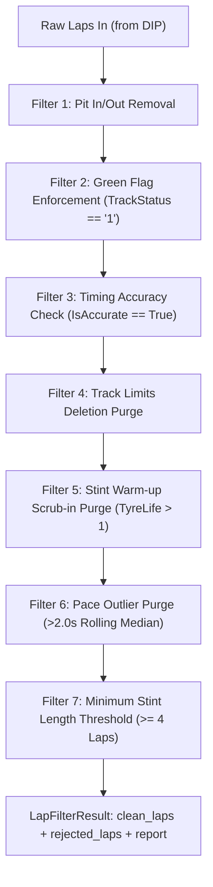

# Preprocessing Pipeline (PIP): In-Depth Architecture

> **Module Location**: [`src/pip/preprocessing.py`](file:///c:/Users/daksh/Projects/Trackshiftv2/src/pip/preprocessing.py) & [`src/pip/__init__.py`](file:///c:/Users/daksh/Projects/Trackshiftv2/src/pip/__init__.py)  
> **Role in TrackShift**: Second Stage (DIP -> **PIP** -> IEP -> DEP -> CMP). The "quality control filter" that purges operational noise, pit stops, yellow flags, and traffic so that downstream physics models only see **pure, green-flag tyre degradation**.

---

## 1. How Data Goes In (The Exact Inputs)

The Preprocessing Pipeline takes a single primary input: **`laps_df`**, which comes directly from the `SessionDataset.laps` produced by Component 1 (`DIP`).

### The Input Table Schema
When raw laps enter `PIP`, each row represents one completed lap by a driver, formatted as follows:

| Column Name | Type | Example Value | Description |
| :--- | :--- | :--- | :--- |
| `lap_number` | `int` | `14` | The lap index in the session |
| `driver` | `str` | `"HUL"` | Driver 3-letter abbreviation |
| `team` | `str` | `"Haas F1 Team"` | Team name |
| `stint` | `int` | `2` | Stint counter (1st tyre set, 2nd tyre set, etc.) |
| `compound` | `str` | `"MEDIUM"` | Tyre specification (`SOFT`, `MEDIUM`, `HARD`) |
| `tyre_life` | `float` | `8.0` | Number of laps already driven on this set of rubber |
| `lap_time_s` | `float` | `81.452` | Total lap time in float seconds |
| `track_status` | `str` | `"1"` | FIA track flag (`1`=Green, `4`=SC, `6`=VSC) |
| `is_accurate` | `bool` | `True` | Official FIA transponder timing integrity flag |
| `pit_in_time_s` | `float` | `NaN` (or `2412.5`) | Timestamp when car crossed pit entry line |
| `pit_out_time_s` | `float` | `NaN` (or `2434.1`) | Timestamp when car crossed pit exit line |
| `deleted` | `bool` | `False` | True if FIA deleted lap for track limits |

---

## 2. What Happens Inside: The 7 Sequential Motorsport Filters

Raw F1 timing data contains dozens of laps where the car was artificially slowed down by non-tyre events. If you feed those laps into a machine learning or tyre wear model, the model will falsely think the tyre was ruined.

`PIP` runs **7 sequential boolean filters**. Every single lap must pass all 7 to be considered a "Clean Racing Lap":



---

### Filter 1: Pit In / Pit Out Removal
* **The Rule**: `not (has_pit_in or has_pit_out)`
* **Why it exists**: When a driver enters or leaves the pits, the pit lane speed limiter (80 km/h) adds 15 to 25 seconds of artificial delay. 
* **How it works**: If `pit_in_time_s` or `pit_out_time_s` is not null, the lap is instantly discarded.

### Filter 2: Green Flag Enforcement
* **The Rule**: `track_status == "1"`
* **Why it exists**: Under Safety Car (`4`), Virtual Safety Car (`6`), Yellow Flags (`2`, `3`), or Red Flags (`5`), drivers drive 30 to 40 seconds slower to respect delta times.
* **How it works**: Only laps under pure green flag (`TrackStatus == '1'`) across all sectors are allowed through.

### Filter 3: Timing Accuracy Check
* **The Rule**: `is_accurate == True` AND `50.0s <= lap_time_s <= 180.0s`
* **Why it exists**: Sometimes a timing transponder misses a loop, causing an impossible 40-second or 4-minute lap.
* **How it works**: Enforces FIA official transponder validation and bounds lap times within physically plausible thresholds.

### Filter 4: Track Limits Deletion Purge
* **The Rule**: `deleted == False`
* **Why it exists**: If a driver cuts a chicane or runs wide across white lines, the lap is invalid in FIA competition.
* **How it works**: Drops any lap flagged as deleted by FIA race control.

### Filter 5: Stint Warm-up / Scrub-in Filter
* **The Rule**: `tyre_life > 1.0`
* **Why it exists**: On Lap 1 of a fresh set of tyres, the rubber is cold (entering at ~65°C from blankets instead of the 100°C operating window) and coated in shiny mold-release compound. Lap 1 is always non-representative scrub-in.
* **How it works**: Discards Lap 1 of every tyre set so the model only learns from tyres operating in steady-state thermal equilibrium.

### Filter 6: Non-Racing Pace Outlier Purge (Rolling Median)
* **The Rule**: `(lap_time_s - rolling_median_s) <= 2.0s`
* **Why it exists**: Even under green flags, a driver might lock up, run wide into the gravel, let a faster car pass under blue flags, or recharge their hybrid battery (ERS lift-and-coast).
* **How it works**:
  1. Groups laps by `driver` and `stint`.
  2. Calculates a **5-lap centered rolling median** of valid pace.
  3. If a lap is more than **2.0 seconds slower** than the rolling median, it is flagged as an operational outlier (traffic/mistake) and purged.

### Filter 7: Minimum Stint Length Threshold
* **The Rule**: `valid_laps_in_stint >= 4`
* **Why it exists**: If a driver pits after only 2 or 3 laps (e.g. due to a puncture or front-wing damage), fitting a degradation curve to 2 laps will cause mathematical slope instability (infinite or inverted degradation slopes).
* **How it works**: If a stint has fewer than 4 clean laps surviving Filters 1–6, the entire stint is discarded from training.

---

## 3. How Data Comes Out (The Exact Outputs)

The method `PreprocessingPipeline.process(laps_df)` returns a single, strongly typed object: **`LapFilterResult`**.

```python
@dataclass
class LapFilterResult:
    clean_laps: pd.DataFrame      # Only laps that passed ALL 7 filters
    rejected_laps: pd.DataFrame   # Laps discarded, annotated with failure reasons
    report: FilteringReport       # Comprehensive audit statistics
```

### Output 1: `clean_laps` (The Golden Dataset)
This DataFrame contains only the surviving, pristine racing laps. It retains all original columns plus a master boolean:
* `is_clean_racing_lap = True`
* **Destination**: Handed directly to Component 3 (`IEP`) for physics proxy calculation and fuel burn correction.

### Output 2: `rejected_laps` (The Audit Trail)
Unlike lazy scripts that delete rows silently, `PIP` preserves every single discarded lap in `rejected_laps` with 7 diagnostic boolean columns:
* `pass_pit` (`True` or `False`)
* `pass_track_status` (`True` or `False`)
* `pass_timing_accuracy` (`True` or `False`)
* `pass_track_limits` (`True` or `False`)
* `pass_warmup` (`True` or `False`)
* `pass_pace_outlier` (`True` or `False`)
* `pass_stint_length` (`True` or `False`)

An engineer can inspect any discarded lap and immediately see: *"Lap 23 was rejected because `pass_pace_outlier == False` (traffic jam, +3.2s delta)."*

### Output 3: `FilteringReport` (The Executive Summary)
`PIP` generates a complete audit summary detailing attrition at each step:

```text
============================================================
TrackShift Preprocessing Pipeline (PIP) - Audit Summary
============================================================
Raw Laps Ingested:    66
Clean Laps Retained:  52
Laps Excluded:        14
Overall Retention:    78.79%
------------------------------------------------------------
Filter Name                      | Rejected | Remaining | Retention
------------------------------------------------------------
Filter 1: Pit In/Out Removal     | 4        | 62        |  93.94%
Filter 2: Green Flag Enforcement | 3        | 59        |  95.16%
Filter 3: Timing Accuracy Check  | 0        | 59        | 100.00%
Filter 4: Track Limits Deletion  | 1        | 58        |  98.31%
Filter 5: Stint Warm-up          | 2        | 56        |  96.55%
Filter 6: Pace Outliers (>2.0s)  | 4        | 52        |  92.86%
Filter 7: Minimum Stint Length   | 0        | 52        | 100.00%
============================================================
```

---

## 4. Summary: The Pipeline Handoff

```text
[DIP Output: Raw SessionDataset]
       │
       │ (passes laps_df: 66 mixed laps with timedeltas, pit stops, yellow flags)
       ▼
[PIP Preprocessing Engine]
       │
       ├─► Rejected: 14 noisy laps stored in `rejected_laps` with failure tags
       │
       └─► Handed Off: 52 pristine green-flag laps in `clean_laps`
               │
               ▼
[Component 3 (IEP): Ready for Fuel & Rubber Decoupling]
```
